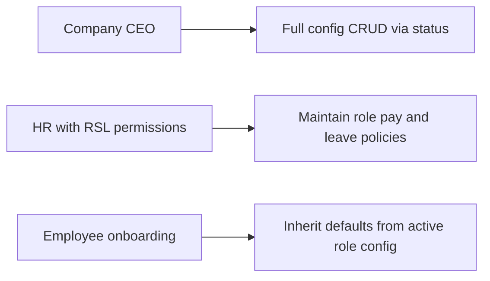
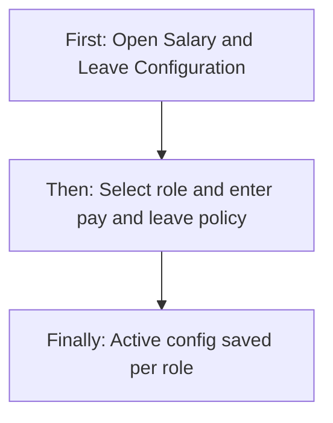
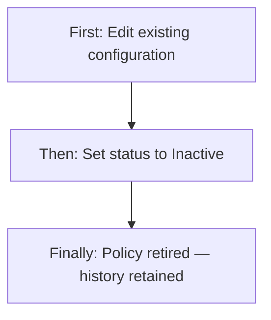
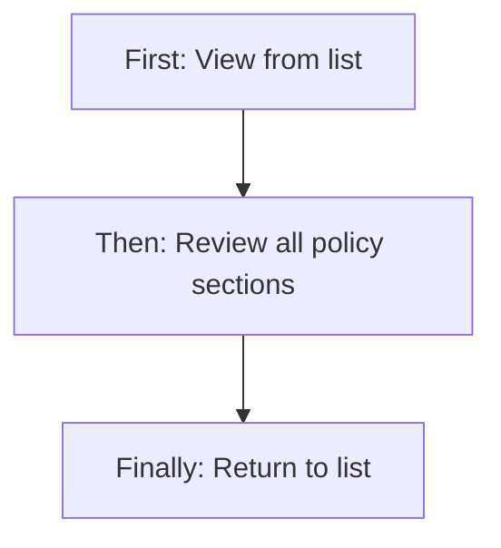
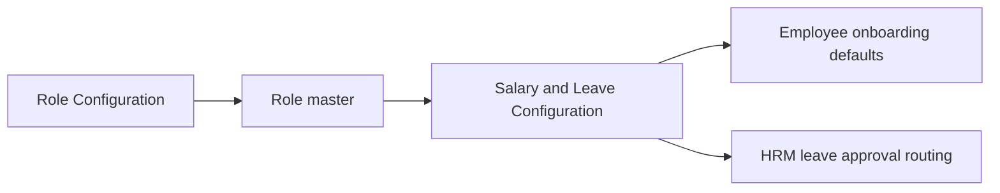
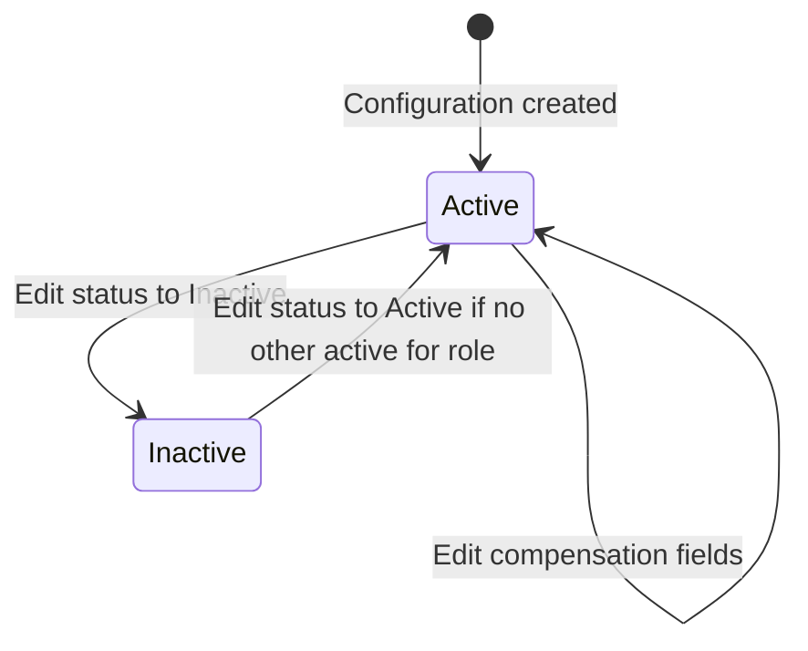

# Salary & Leave Configuration — Product & Business Documentation

## 1. Purpose & Business Need

After company roles are defined (who can access the system), each role often needs a **standard compensation and leave policy**: salary structure, statutory deductions, overtime/holiday incentives, and leave entitlements with an approval authority. **Salary & Leave Configuration** is where HR and administrators define these **role-based policies** so new employees can inherit sensible defaults during onboarding.

Each configuration record ties **one role** to a bundled package of:
- **Salary details** (type, basic pay, allowances, deductions, PF/ESI/TDS flags)
- **Incentive & overtime rules** (optional holiday work and overtime settings)
- **Leave entitlements** (casual, sick, paid, annual allocation, carry-forward, reset cycle, and which role approves leave)

**Outcomes today:** create and maintain role compensation profiles; one active configuration per role at a time; deactivate via status instead of hard delete; list with search and pagination; view read-only detail; policies available for employee creation prefill elsewhere in the product.

**Not the same as Role Configuration (RBAC):** Role Configuration (`/role-configuration`) defines **access permissions**. Salary & Leave Configuration (`/salary-leave-config`) defines **pay and leave policy per role**. The add/edit routes use names like `add-role-configuration` for historical reasons — they belong to **this** module, not RBAC.

---

## 2. Users & Roles (who uses this and why)

### 2.1 Company CEO / Owner

Has full access to salary and leave configuration without needing explicit RSL permissions. Sets company-wide compensation standards per role.

### 2.2 Authorized company staff (RSL Management permissions)

Employees granted **Role Salary and Leave Management** permissions can view, add, or edit configurations according to their matrix (Read, Add, Edit). There is no Delete permission wired to any endpoint — deactivation is done by setting status to Inactive.

### 2.3 HR / payroll administrators

Typically receive RSL Management Read/Add/Edit to maintain policies that downstream HRM, attendance, and salary modules rely on.

---

## 3. Access Control (RBAC)

### 3.1 How access works

Access is controlled by the **RSL Management** module permissions on the user’s login profile, unless the user is **CEO** (full access):

| Permission | Allows |
|------------|--------|
| **Read** | Open list, view detail, view row actions |
| **Add** | **Add Configuration** button and create form |
| **Edit** | Edit row action and edit form |
| **Delete** | **Not implemented** — no API or UI delete |

The sidebar item **Salary & Leave Configuration** appears when the user has RSL Management **Read** (or CEO / Super Admin bypass).

**Important permission mismatch:** The list screen and its buttons use **RSL Management**, but the add/edit/view **page routes** are currently mapped to **Role Management** in the route guard. A user with only RSL permissions may see the list but be blocked when opening add/edit/view. A user with only Role Management permissions may reach those URLs directly without seeing the sidebar item or list actions. See section 13.

### 3.2 Role × action matrix (RSL Management module)

| Role | View list | View detail | Add | Edit | Inactive / Delete | Submit request | Receive / act | Approve | Reject |
|------|-----------|-------------|-----|------|-------------------|----------------|---------------|---------|--------|
| Company CEO | Yes | Yes | Yes | Yes | Inactive only (via edit) | No | No | No | No |
| Staff with RSL Read | Yes | Yes | No | No | No | No | No | No | No |
| Staff with RSL Add | Yes | Yes | Yes | No | No | No | No | No | No |
| Staff with RSL Edit | Yes | Yes | No | Yes | Inactive only (via edit) | No | No | No | No |
| Staff without RSL | No | No | No | No | No | No | No | No | No |

**Record-level rules:**
- Only **one Active configuration per role** at a time. Creating or reactivating a second active config for the same role is rejected.
- On **edit**, the **target role cannot be changed** — only compensation fields and status update.
- **Leave approval role** must reference an existing role in the company.

**This module does not use request/approve workflows** for configuration changes. The **leave approval role** field designates which role approves employee leave applications in HRM — not an in-module approval queue.

---

## 4. Capabilities & Features

### 4.1 Configuration list

Paginated table of role compensation records with server-side search. Columns include role name, effective dates, status, salary type, basic salary, salary effective dates, and leave approval authority. Row actions: View and Edit (no Delete).

### 4.2 Add configuration

Full-page form to assign salary, incentive/overtime, and leave settings to **one or more roles** in a single save (each selected role gets its own configuration record).

### 4.3 Edit configuration

Same form prefilled from the selected record. Role selection is locked. Status can be set to Inactive to retire a policy without removing history.

### 4.4 View configuration

Read-only detail page showing all salary, incentive, overtime, and leave fields plus audit metadata (created by, last modified).

### 4.5 Active configuration by role

A dedicated lookup returns the active configuration for a given role. Used internally when creating employees (not exposed as a button on this module’s screens).

### 4.6 Deactivate (not delete)

Configurations are never hard-deleted. Setting **Inactive** on edit retires the policy. Historical records remain for audit.

---

## 5. CRUD Operations

### 5.1 Create (Add)

**Who:** CEO, or staff with RSL Management **Add**.

**First:** User opens Salary & Leave Configuration and clicks **Add Configuration**.

**Then:** User selects one or more **roles**, sets effective dates and status, completes salary details (required), optional incentive/overtime section, and required leave details including **leave approval authority** and **leave reset cycle**. On add, effective-from date cannot be in the past (UI validation).

**Finally:** One configuration record is created per selected role (each with a unique configuration ID such as `RHC-XXXXXX`). User returns to the list with a success message. If any selected role already has an **Active** configuration, the save is rejected.

### 5.2 Read — List

**Who:** CEO, or staff with RSL Management **Read**.

**First:** User opens Salary & Leave Configuration from the sidebar.

**Then:** Table loads with pagination (default 10 rows). User may search by configuration ID or role name (server-side, debounced). Status, salary type, and effective-date filters apply **client-side on the current page only**.

**Finally:** User can open View or Edit from row actions.

### 5.3 Read — Detail / Get details

**Who:** Same as list.

**First:** User clicks **View** on a list row.

**Then:** Read-only page loads full configuration by ID — basic details, salary, incentives, overtime, leave, and audit fields.

**Finally:** User reviews and navigates back. There is no Edit button on the detail page.

### 5.4 Update (Edit)

**Who:** CEO, or staff with RSL Management **Edit**.

**First:** User clicks **Edit** on a list row.

**Then:** Form opens with role **locked**. User updates effective dates, status, salary, incentive, or leave fields and saves.

**Finally:** Configuration updates. Reactivating to **Active** is blocked if another active configuration already exists for that role.

### 5.5 Inactive / Delete

**Delete:** Not available — no delete API, no delete button on list.

**Inactive:** User edits the configuration and sets status to **Inactive**, then saves. Record remains in the list and database.

**Reactivation:** Edit the inactive record and set status back to **Active**, subject to the one-active-per-role rule.

---

## 6. Request & Approval Flows

**This module does not use request/approve for configuration changes.**

The **Leave Approval Authority** field is a **policy setting**: it stores which **role** should approve employee leave requests in HRM workflows. It does not create a pending approval for the configuration itself.

---

## 7. Forms — Add vs Edit Field Access

| Field (business name) | On Add | On Edit | Notes |
|----------------------|--------|---------|-------|
| Role(s) | Editable / Required (multi-select) | **Locked** | One config per role; role cannot change on edit |
| Status | Editable / Required | Editable | Active / Inactive |
| Effective From | Editable / Required | Editable | Add: cannot be past date |
| Effective To | Editable / Optional | Editable | Add: min today on date picker |
| Salary Type | Editable / Required | Editable | CTC, Fixed, Hourly |
| Basic Salary | Editable / Required | Editable | |
| HRA | Editable / Optional | Editable | |
| Other Allowance | Editable / Optional | Editable | |
| Incentive (salary block) | Editable / Optional | Editable | Part of salary details |
| Deductions | Editable / Optional | Editable | |
| PF Applicable | Editable toggle | Editable | |
| ESI Applicable | Editable toggle | Editable | |
| TDS Applicable | Editable toggle | Editable | |
| Salary Effective From / To | Editable / Optional | Editable | |
| Holiday Work Incentive | Editable toggle | Editable | Optional section |
| Holiday Work Type | Editable when on | Editable when on | Fixed, Per Day, Per Hour |
| Holiday Work Amount | Editable when on | Editable when on | |
| Overtime Applicable | Editable toggle | Editable | |
| Overtime Type | Editable when on | Editable when on | Per Hour, Per Shift |
| Overtime Shift Type | Editable when Per Shift | Editable when Per Shift | Night, Normal, Custom |
| Custom shift times | Shown when Custom | Shown when Custom | **Not bound to form** — hardcoded on save |
| Overtime shift incentive / per-hour pay | Editable when on | Editable when on | Depends on overtime type |
| Max overtime hours per month | Editable when on | Editable when on | Per Hour type |
| Casual Leave | Editable / Optional | Editable | Defaults to 0 |
| Sick Leave | Editable / Optional | Editable | |
| Paid Leave | Editable / Optional | Editable | |
| Annual Leave Allocation | Editable / Optional | Editable | |
| Carry Forward Allowed | Editable toggle | Editable | |
| Max Carry Forward Days | Editable when on | Editable when on | |
| Leave Approval Authority | Editable / Required | Editable | Dropdown of active roles |
| Leave Reset Cycle | Editable / Required | Editable | Yearly, Monthly, Custom |
| Leave Reset From / To | Editable when Custom | Editable when Custom | Required when cycle is Custom |

---

## 8. Lists, Dropdowns, Details & Data Rendering

### 8.1 List rendering

| Element | Behavior |
|---------|----------|
| Columns | Role, Effective From, Effective To, Status, Salary Type, Basic Salary, Salary Eff. From, Salary Eff. To, Leave Approval |
| Search | Server-side; debounced; matches configuration ID or role name |
| Status filter | Client-side chip: Active / Inactive |
| Salary Type filter | Client-side multi-select: CTC, Fixed, Hourly |
| Effective date range filter | Client-side on Effective From column |
| Pagination | Server-side; page number and page size |
| Sort | Column headers marked sortable but **sort is not wired** to API |
| Row actions | View (Read), Edit (Edit); Delete hidden |
| Currency | Basic salary shown with ₹ formatting |

### 8.2 Dropdowns & lookups

| Dropdown | Where used | Options source |
|----------|------------|----------------|
| Roles (multi-select) | Add form only | Active roles from role dropdown API |
| Leave Approval Authority | Add / Edit | Same active roles list |
| Status | Add / Edit | Active, Inactive (radio) |
| Salary Type | Add / Edit | CTC, Fixed, Hourly (radio) |
| Holiday Work Incentive Type | Add / Edit when enabled | Fixed, Per Day, Per Hour |
| Overtime Type | Add / Edit when enabled | Per Hour, Per Shift |
| Overtime Shift Type | When Per Shift | Night, Normal, Custom |
| Leave Reset Cycle | Add / Edit | Yearly, Monthly, Custom (radio) |

If the role dropdown API fails, the UI falls back to hardcoded placeholder role names (not recommended for production use).

### 8.3 Detail / get-details rendering

The view page loads configuration by ID and displays grouped read-only sections:

- **Header:** Role name, configuration ID, effective period, status badge, created by, last modified
- **Salary Details:** Type, basic, HRA, allowances, incentive, deductions, PF/ESI/TDS flags, salary effective dates
- **Incentive & Overtime:** Holiday work and overtime blocks when applicable
- **Leave Details:** CL/SL/PL/annual allocation, carry-forward, approval authority name, reset cycle and dates

No edit or delete controls on the detail page.

---

## 9. How It Works (end-to-end user flows)

### 9.1 HR administrator — Set policy for a new role

**First:** After a role exists in Role Configuration, HR opens Salary & Leave Configuration and clicks **Add Configuration**.

**Then:** They select the role, set salary type and basic pay, configure leave days and pick **Leave Approval Authority** (e.g., HR Manager role), set status Active, and save.

**Finally:** The policy appears in the list. When employees with that role are onboarded, defaults can be prefilled from the active configuration.

### 9.2 HR administrator — Retire an outdated policy

**First:** User finds the active configuration in the list and clicks **Edit**.

**Then:** They change status to **Inactive** (or adjust dates/amounts) and save.

**Finally:** The role no longer has an active configuration until a new one is created or this record is reactivated.

### 9.3 HR viewer — Review configuration

**First:** User with Read permission opens the list and clicks **View**.

**Then:** They review salary, incentive, overtime, and leave sections on the detail page.

**Finally:** They navigate back to the list. No changes are made.

---

## 10. Cross-Module Interactions

| Related area | Connection |
|--------------|------------|
| **Role Configuration (RBAC)** | Configurations attach to **roles** created in Role Configuration. Both use the active **role dropdown**. Different modules: RBAC = access; RSL = pay/leave policy. |
| **Employee User Management** | Active role configuration can prefill salary and leave defaults when adding employees (via active-by-role lookup). |
| **HRM — Leave** | **Leave approval role** from this configuration routes employee leave approvals to users holding that role. |
| **HRM — Salary / Attendance** | Shares enums and concepts (salary type, leave reset cycle); operational salary runs are separate screens also guarded by RSL Management on some routes. |
| **Role dropdown API** | Target roles and leave approval roles both come from the shared active roles list. |

---

## 11. Data the Business Cares About

| Attribute | Business meaning |
|-----------|------------------|
| Configuration ID | Unique identifier (e.g., RHC-XXXXXX) |
| Target role | Which job role this policy applies to |
| Status | Active (in use) or Inactive (retired) |
| Effective From / To | When the overall configuration applies |
| Salary Type | CTC, Fixed, or Hourly |
| Basic Salary | Core pay amount |
| Allowances & deductions | HRA, other allowance, incentive line, deductions |
| Statutory flags | PF, ESI, TDS applicability |
| Salary effective dates | Pay structure validity window |
| Holiday work rules | Whether holiday work incentive applies and how it is calculated |
| Overtime rules | Per hour or per shift; shift type; caps |
| Casual / Sick / Paid leave | Entitlement days per cycle |
| Annual leave allocation | Total annual leave pool |
| Carry forward | Whether unused leave carries forward and max days |
| Leave approval role | Which role approves leave for employees on this policy |
| Leave reset cycle | Yearly, Monthly, or Custom date range |
| Audit | Created by, updated by, timestamps |

---

## 12. Rules, Validations & Constraints

- At least **one role** must be selected on create.
- **Effective from** is required.
- **Status** is required (Active or Inactive).
- **Salary details** block is required; **basic salary** and **salary type** are required within it.
- **Leave details** block is required; **leave approval role** and **leave reset cycle** are required within it.
- Only **one Active configuration per role** — duplicate active configs are rejected on create and on reactivation.
- **Target role** and **leave approval role** must exist in the role master.
- **Role link is immutable on edit** — cannot reassign configuration to a different role via update.
- **No hard delete** — lifecycle managed through Inactive status.
- Add form rejects **past effective-from dates**; edit form does not enforce the same rule in the UI.

---

## 13. Loopholes, Gaps & Current Limitations

1. **Route permission mismatch:** List uses RSL Management; add/edit/view routes use Role Management in the route guard — users may be inconsistently authorized.
2. **Save button unguarded:** Add/Edit save buttons do not check Add/Edit permissions separately from route access.
3. **No delete:** Only Inactive status; no purge or archive workflow.
4. **Filters not sent to API:** Status, salary type, and date filters are client-side on the current page despite API support for server filters.
5. **Sort non-functional:** Sortable column headers without backend sort handler.
6. **Custom overtime shift times:** UI shows time fields but save uses fixed placeholder times (20:00–23:00), not user input.
7. **Role dropdown fallback:** Hardcoded placeholder roles if API fails.
8. **Naming collision:** Routes `add-role-configuration`, `edit-role-configuration`, `view-role-configuration` sound like RBAC but belong to this module.
9. **View page has no Edit shortcut:** Must return to list to edit.
10. **Multi-role create:** Add allows multiple roles in one save; edit is always single-role locked.
11. **Overtime type mapping:** Possible display/save drift between Per Day and Per Shift labels on edit load.
12. **Unused mock data:** View component contains unused sample data block in code (not shown to users when API loads).
13. **RSL Delete permission exists in platform** but has no endpoint or UI.

---

## 14. Existing Functionality Summary

**Available today:**
- Paginated list with server-side search
- Add configuration (multi-role on create)
- Edit configuration (role locked, status inactive supported)
- View read-only detail
- One active config per role enforcement
- Salary + optional incentive/overtime + leave in one payload
- Leave approval role assignment
- CEO bypass on all RSL endpoints

**Not available:**
- Hard delete
- Request/approve for configuration changes
- Analytics or summary dashboards in this module
- Dedicated dropdown API (uses role master dropdown)
- Consistent RSL route guards on add/edit/view pages
- Functional column sort
- Server-side list filters from UI

---

## 15. Reference — APIs, Screens & UI Actions

### 15.1 APIs

| Method | Path | Purpose (plain language) | Used by (screen/flow) |
|--------|------|--------------------------|------------------------|
| POST | `/api/v1/role-compensations` | Create one config per selected role | Add form |
| PUT | `/api/v1/role-compensations/update?configId=` | Update configuration | Edit form |
| GET | `/api/v1/role-compensations?configId=` | Get configuration detail | Edit, View |
| GET | `/api/v1/role-compensations/get-all` | Paginated list with search/filters | List |
| GET | `/api/v1/role-compensations/role/active?roleId=` | Active config for a role | Employee onboarding (external) |
| GET | `/api/v1/role/dropdown` | Active roles for selectors | Add, Edit, List role name map |

### 15.2 Frontend Screen Routes

| Route | Screen purpose | Primary users |
|-------|----------------|---------------|
| `/salary-leave-config` | Configuration list | CEO, RSL Read+ |
| `/add-role-configuration` | Add configuration | CEO, RSL Add (route guard: Role Management Read — mismatch) |
| `/edit-role-configuration/:id` | Edit configuration | CEO, RSL Edit (route guard mismatch) |
| `/view-role-configuration/:id` | View configuration detail | CEO, RSL Read (route guard mismatch) |

### 15.3 Click Events, Filters, Search & Controls

| Screen / Route | Control | Type | What happens |
|----------------|---------|------|--------------|
| `/salary-leave-config` | Add Configuration | Button | Navigate to add form (RSL Add permission) |
| `/salary-leave-config` | Search | Text input | Server-side search after debounce |
| `/salary-leave-config` | Status filter | Chip filter | Client-side on current page |
| `/salary-leave-config` | Salary Type filter | Multi-select | Client-side on current page |
| `/salary-leave-config` | Effective date filter | Date range | Client-side on current page |
| `/salary-leave-config` | Pagination | Page controls | Server-side refetch |
| `/salary-leave-config` | View | Row action | Navigate to view page |
| `/salary-leave-config` | Edit | Row action | Navigate to edit page |
| Add / Edit form | Role multi-select | Dropdown | Toggle roles (add only) |
| Add / Edit form | Leave Approval Authority | Dropdown | Select approver role |
| Add / Edit form | PF / ESI / TDS | Toggles | Statutory applicability |
| Add / Edit form | Holiday / Overtime sections | Toggles + fields | Optional incentive rules |
| Add / Edit form | Carry Forward | Toggle | Shows max days when on |
| Add / Edit form | Leave Reset Cycle | Radio | Shows custom dates when Custom |
| Add / Edit form | Cancel | Button | Navigate back |
| Add / Edit form | Save Changes | Button | Create or update API call |
| View page | Back | Button | Return to previous screen |
