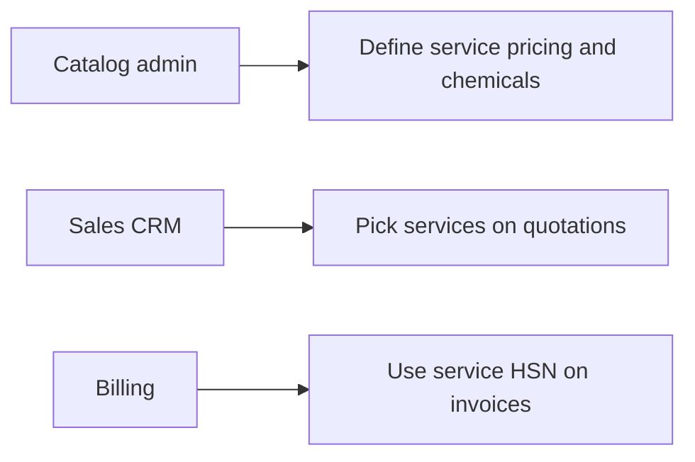
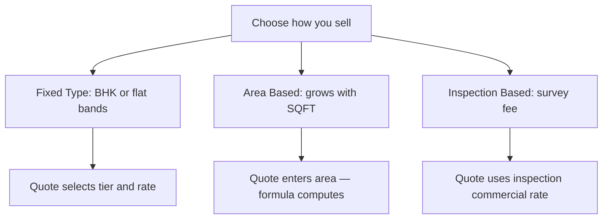
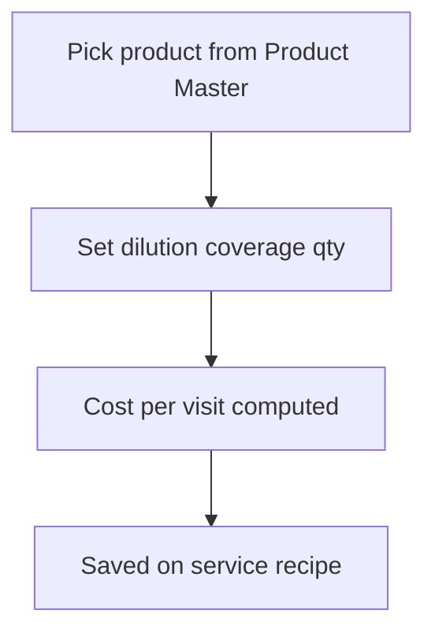
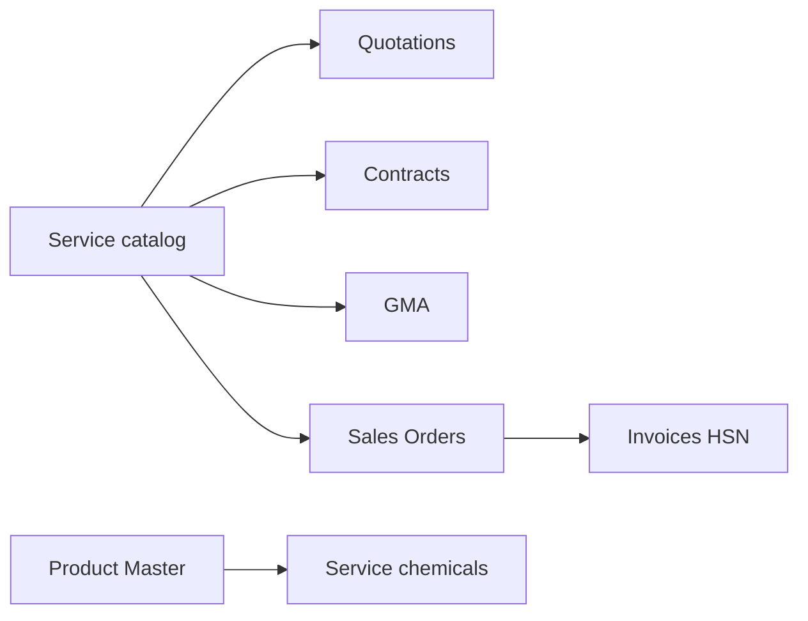
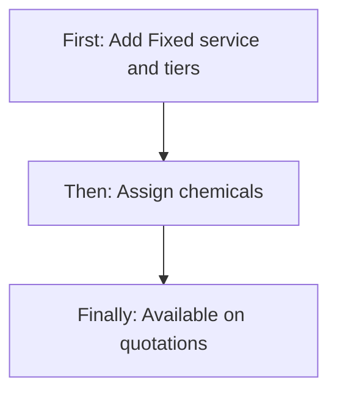
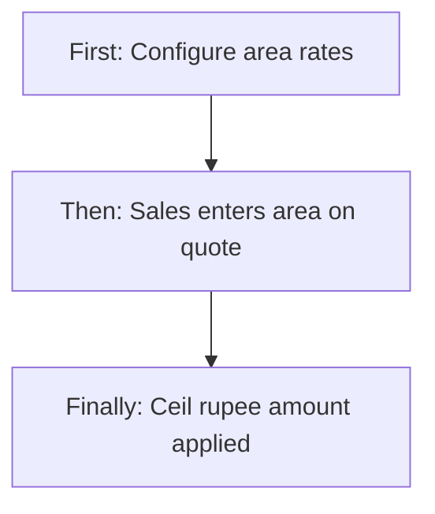
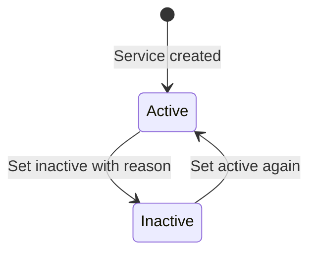

# Service Management — Product & Business Documentation

## 1. Purpose & Business Need

Pest-control companies sell **services** (cockroach control, termite treatment, inspection, etc.), not only products. **Service Management** (menu: Inventory & Services → Service Management) is the **service catalog**: what is sold, how it is priced (fixed tier, area-based, or inspection), which pests/treatments apply, which **chemicals/products** are used, and tax (HSN) for invoicing.

Quotations, contracts, GMA sheets, sales orders, and invoice drafts **pick services from this catalog**. Without accurate service definitions, commercial pricing and chemical cost estimates drift across CRM and billing.

**Outcomes today:**
- Create/update Active or Inactive services
- Three price types: **Fixed**, **Area Based**, **Inspection**
- Configurable masters: categories, pest types, treatments, pricing tiers, custom pricing blocks
- Assign **inventory products/chemicals** with dilution, coverage, qty, cost per visit/month
- Soft deactivate with reason + audit history
- Downstream use in Quotation, Contract, GMA, Sales Order, Invoice HSN resolution

**What this module is not:** It does not create quotations, contracts, or invoices itself. It does not run request/approve. It does not hard-delete services.

---

## 2. Users & Roles (who uses this and why)

### 2.1 Company CEO / Owner

Full access without granular permissions. Defines the commercial service menu and pricing standards.

### 2.2 Service / operations catalog administrators

Staff with **Service Management** Read / Add / Edit maintain the catalog, masters, and chemical recipes.

### 2.3 Sales / CRM users

Do not need Service Management write access to **use** services on quotations and contracts — they select Active services from dropdowns in CRM screens.

### 2.4 Billing / invoicing users

Invoice drafts resolve HSN/tax from the service catalog when lines reference a service type.

---

## 3. Access Control (RBAC)

### 3.1 How access works

Access uses **Service Management** permissions, unless the user is **CEO**:

| Permission | Allows |
|------------|--------|
| **Read** | Service list, view detail, audit logs |
| **Add** | **+ Add Service** and create |
| **Edit** | Edit from list (opens add form in edit mode) |

**Delete / Approve / Request** permissions exist in the platform catalog but are **not used** by Service Management screens or APIs. There is no delete button; inactive is done via status on edit.

Sidebar **Service Management** appears with Service Management **Read**.

Master create/list endpoints (categories, pest types, pricing masters) are callable when authenticated; they are not separately gated by Service Management permissions on the API.

### 3.2 Role × action matrix

| Role | View list | View detail | Add | Edit | Inactive / Delete | Submit request | Receive / act | Approve | Reject |
|------|-----------|-------------|-----|------|-------------------|----------------|---------------|---------|--------|
| Company CEO | Yes | Yes | Yes | Yes | Inactive via edit | No | No | No | No |
| Staff with Service Read | Yes | Yes | No | No | No | No | No | No | No |
| Staff with Service Add | Yes | Yes | Yes | No | No | No | No | No | No |
| Staff with Service Edit | Yes | Yes | No | Yes | Inactive via edit | No | No | No | No |
| Staff without Service Management | No | No | No | No | No | No | No | No | No |

**Record-level:** Dropdowns used by CRM return **Active**, non-draft services only.

---

## 4. Capabilities & Features

### 4.1 Service list (Service Dashboard)

Paginated catalog with search, status/category/pest/price-type/date filters, View and Edit actions (no Delete).

### 4.2 Add / Edit service

Single form for create and update: identity, categories, pests, treatments, species, chemicals, **price type + pricing rows**, warranty, free revisits, HSN/tax, status.

### 4.3 View service

Read-only sections including chemicals, pricing, warranty, system info, audit history. Go Back only (no Edit button on view).

### 4.4 Configurable masters (dynamic dropdowns)

Inline or master APIs create values that appear as dropdowns/chips on the service form:

| Master | Purpose | Creatable from Service UI? |
|--------|---------|----------------------------|
| Service Category | Group services (e.g. Residential) | Yes — Add Custom Service Category |
| Service Sub-Category | Internal / External (seeded) | No create API / no inline create |
| Pest Type | Cockroach, Termite, etc. | Yes — Add Custom Pest Type |
| Treatment Method | Spray, Gel, Bait, etc. | Yes — Add Custom Treatment |
| Fixed pricing tiers | 1BHK, 2BHK, Villa… | Yes — Add Custom {Category} Type |
| Area pricing rows | Base + per SQFT + increment | Yes — Add Area Based Type |
| Inspection fee rows | Inspection fee | Yes — Add Inspection Tier |
| Custom pricing blocks | Extra named field/price pairs | Yes — under Inspection path |
| Pest Species | Common + scientific name | Yes — Add Species on service |

### 4.5 Chemicals / products used

Link Product Master SKUs as the chemical recipe for the service (dilution, coverage, required qty, price per UOM, cost per visit / month).

### 4.6 Soft inactive

Set status Inactive with mandatory reason; audit records deactivate.

---

## 4A. Pricing Scenarios (in depth)

Service Management supports **exactly three** price types. There is **no package price type** in the catalog.

| Price type | UI label | What you configure on the service | How money is calculated later |
|------------|----------|-----------------------------------|-------------------------------|
| **FIXED** | Fixed Type | Fixed tiers + **price per tier on this service** | Quotation/contract uses selected tier / rate per visit |
| **AREA_BASED** | Area Based | Link area master rows (base, per SQFT, increment) | Runtime: area formula × visits (CRM) |
| **INSPECTION** | Inspection Based | Link inspection fee masters (+ optional custom blocks) | Fee stored; commercial rate still entered on quote line |

### Scenario 1 — Fixed Type (property / package-like tiers)

**Business idea:** Sell by property band (1 BHK, 2 BHK, Villa) at a flat price per visit (or per agreed commercial unit).

**How configuration works:**
1. Ensure Service Category (and Sub-Category) selected.
2. Choose Price Type = **Fixed Type**.
3. Add tiers (e.g. “3 BHK”) — creates/links a fixed-tier master (tier **name** only on master).
4. Enter **₹ price amount on the service** for each linked tier (price lives on the service–tier link, not only on the master).

**Example:**
- Tier: 2 BHK  
- Service price amount: ₹1,500 per visit  

On a quotation, sales selects this service + fixed tier; **rate per visit** is typically ₹1,500; line total ≈ rate × total visits.

**Important:** Fixed masters do **not** store the commercial price anymore — the **service assignment** carries `priceAmount`.

---

### Scenario 2 — Area Based (sqft formula)

**Business idea:** Price grows with treated area.

**How configuration works:**
1. Price Type = **Area Based**.
2. Add Area Based Type with:
   - **Base Price** (minimum / starting amount)
   - **Price of SQFT** (rate per block)
   - **Area (SQFT)** in the UI when creating the band (stored with **sqft increment**, default **100** if not supplied on create)

**Runtime commercial formula** (used by Quotation / Contract / GMA — not recalculated inside Service save):

> **Amount = Base Price + (Price per SQFT × (Area SQFT ÷ SQFT Increment))**  
> Result is **rounded up to the next whole rupee**.

**Example:**
| Input | Value |
|-------|-------|
| Base Price | ₹500 |
| Price per SQFT | ₹10 |
| SQFT Increment | 100 |
| Customer area | 250 SQFT |

Units = 250 ÷ 100 = 2.5  
Variable = 10 × 2.5 = 25  
Amount = 500 + 25 = **₹525** (already whole rupees; otherwise ceil)

Quotation then typically does **line total = area amount × total visits** (for multi-visit quotes).  
Contracts may multiply by annual frequency for contract mode, or use one-time sale value for one-time mode.

**Unit:** Square feet only in this module (no m²/acre enum).

---

### Scenario 3 — Inspection Based

**Business idea:** Charge an inspection fee (survey before treatment).

**How configuration works:**
1. Price Type = **Inspection Based**.
2. Add Inspection Tier with **Inspection Fee**.
3. Optionally add **Custom Category Pricing** blocks (extra named fields with prices).

**Runtime:** Inspection fee is stored and linked. Quotation still expects a **rate per visit** on the line — Service Management does **not** auto-push inspection fee into that rate with a dedicated formula. Treat inspection fee as catalog reference; sales must align the quote rate accordingly.

---

### Scenario 4 — Custom pricing blocks (configurable fields)

**What they are:** Named blocks with dynamic **Field Name + Price** rows (e.g. extra add-ons).

**Where configured:** Mainly under the Inspection path in the UI (“Custom Category Pricing”), with category/sub-category multi-select and Add Field / Save Block.

**Downstream:** Custom blocks are **saved and shown on service detail**, but **Quotations and Contracts do not consume them** in code today. They are catalog-only until CRM is wired.

---

### Scenario 5 — Chemical cost vs commercial price (two layers)

Do not confuse:

| Layer | Meaning | Example |
|-------|---------|---------|
| **Commercial price** | What customer pays (Fixed / Area / Inspection) | ₹1,500 / visit or area formula |
| **Chemical cost** | Internal recipe cost from products | Qty × Price/UOM = Cost/Visit; × visits/month ≈ monthly chemical cost |

Chemical totals on the service (`total chemical cost per visit / month`) are **estimates for operations**, not the customer-facing price type.

---

### Pricing scenario decision guide

---

## 4B. Dynamic Dropdowns & Configurable Fields (how handled)

### How values appear on the form

1. On open, form loads masters from list APIs (Active masters).
2. User can **Add Custom…** for category, pest type, treatment, pricing tiers — creates master then selects it.
3. On save, service stores **IDs** of selected masters (and fixed-tier price amounts).
4. Non-draft services require at least one **category, sub-category, pest type, and treatment**.

### Validation rules for configured fields

| Field group | Rule |
|-------------|------|
| Categories / pests / treatments | IDs must exist; required when not draft |
| Fixed tiers on service | IDs exist; no duplicates; price ≥ 0 |
| Area / inspection links | IDs must exist |
| Custom block fields | Field name required; price required on create |
| Chemicals | Product must exist in Product Master; dilution/coverage/qty required in UI |
| HSN | Optional; if set must be valid length and active with tax types |
| Inactive | Reason required |

### Draft behavior

Backend supports `draft=true` to skip category/pest/treatment required checks. The UI has draft state/handlers but **no Save as Draft button** — operators normally save complete Active/Inactive services.

### Sub-category limitation

Sub-categories are **seeded** (e.g. Internal / External). There is **no create API** and no “Add Custom Sub-Category” on the form.

---

## 4C. Product / Chemical Assignment (in depth)

### What you assign

Each chemical row links one **inventory product** (from Product Master dropdown) and stores operational usage:

| Field | Meaning |
|-------|---------|
| Product Name / Code | From Product Master |
| UOM | Usually from product Base UOM; editable |
| Dilution | Mix ratio (e.g. 1:100) |
| Coverage (SQFT) | Area one mix covers |
| Required Qty | Quantity per visit |
| Price / UOM | Cost rate (can hydrate from product base price; editable — not auto-locked to stock) |
| Cost / Visit | **Required Qty × Price/UOM** (computed) |
| Est. Cost / Month | Cost/Visit × visits per month (default 1; visits field often not shown on form) |

### How it works end-to-end

**First:** User clicks Add Chemical and picks a product.  
**Then:** System loads product details; user enters dilution, coverage, qty; costs compute.  
**Finally:** On save, service stores product links. Recipe can be used by Tasks / Sales Order chemical lines / ops planning.

**Rules:**
- At least one chemical/product required on save (UI)
- Inventory product must exist
- Soft reference with restrict-on-delete at database level

**Not automatic:** Assigning a chemical does **not** reserve stock. Stock consumption happens in Stock / Task / Sales execution modules later.

---

## 4D. How Services Link to CRM, Contracts & Invoicing

Service Management is the **source of truth for catalog**. Commercial documents **reference** service IDs.

| Downstream | How service is used | Pricing behavior |
|------------|---------------------|------------------|
| **Quotations** | Service line with service id, price type, fixed tier id and/or area SQFT, rate per visit, visits | AREA_BASED: area formula can overwrite rate; FIXED: tier name/id enriched; total ≈ rate × visits |
| **Contracts** | Site services hold service type id/name; sale value computed | Area calculator on write; contract vs one-time frequency handling |
| **GMA** | Service type id on GMA services | May use area pricing utility |
| **Sales Orders** | Site services / chemicals can reference service type and chemical recipe | Operational + commercial follow-through |
| **Invoices** | Draft mapping can resolve **HSN** from service definition | Tax classification from service HSN + tax types |
| **Customers** | **No direct link** | Only via quote/contract/SO |

**Fixed vs Area in CRM (summary):**
- **Fixed:** Sales picks tier → uses configured service tier price as rate guidance.
- **Area:** Sales enters area SQFT → system computes amount with base + per-sqft × (area ÷ increment), ceil rupee.
- **Inspection:** Catalog fee available; quote still carries an explicit commercial rate.

**Custom blocks:** Not yet applied inside Quotation/Contract totals.

---

## 5. CRUD Operations

### 5.1 Create (Add)

**Who:** CEO or Service Management **Add**.

**First:** Open Service Management → Add Service.  
**Then:** Fill name, description, categories, pests, treatments, chemicals, choose price type and configure tiers/fees, warranty, HSN, status Active.  
**Finally:** Service saved with generated Service Code (e.g. SRV-…); appears in list and CRM dropdowns if Active.

### 5.2 Read — List

**Who:** Read permission.  
Columns: Service ID, Name, Category (+ sub), Pest Type, Price Type, Duration, Warranty, Status.  
Search server-side; filters for status, category, pest, price type, created date; pagination server-side.

### 5.3 Read — Detail

**Who:** Read.  
View Service loads full definition + audit logs. Sections for species, treatment, chemicals, pricing, warranty, system info.

### 5.4 Update (Edit)

**Who:** Edit permission.  
From list Edit → same form with Service Code locked. Associations (species, products, pricing links) replaced/merged on save. Price updates can notify interested parties.

### 5.5 Inactive / Delete

**Hard delete:** Not available.  
**Inactive:** Set Status = Inactive + reason → soft deactivate with audit. Reactivate by setting Active again on edit. Inactive services drop out of Active CRM dropdowns.

---

## 6. Request & Approval Flows

**This module does not use request/approve.** Services are created and updated directly by authorized catalog users.

---

## 7. Forms — Add vs Edit Field Access

| Field (business name) | On Add | On Edit | Notes |
|----------------------|--------|---------|-------|
| Service Name | Editable / Required | Editable | Unique |
| Service Code | Hidden (generated) | **Locked** | System id/code |
| Category | Editable / Required* | Editable | *Required when not draft |
| Sub-Category | Editable / Required* | Editable | Seeded list only |
| Pest Type | Editable / Required* | Editable | |
| Description | Editable / Required | Editable | |
| Duration value + UOM | Editable | Editable | Minutes / Hours (UI may also show Days) |
| Status | Editable | Editable | Active / Inactive |
| Inactive Reason | If Inactive | If Inactive | Required when Inactive |
| HSN + tax checkboxes | Editable | Editable | Optional HSN |
| Pest Species | Editable | Editable | |
| Treatments | Editable | Editable | |
| Chemicals / Products | Editable / Required (≥1) | Editable | From Product Master |
| Price Type | Editable / Required | Editable | Fixed / Area / Inspection |
| Fixed tier prices | Editable when Fixed | Editable | Per-tier ₹ |
| Area base / SQFT / rate | Editable when Area | Editable | |
| Inspection fee | Editable when Inspection | Editable | |
| Custom pricing blocks | Editable (Inspection path) | Editable | Not used by CRM yet |
| Warranty months | Editable | Editable | |
| Free revisit included / qty | Editable | Editable | |
| Visits per month | Hidden in UI (defaults) | Hidden | Affects chemical monthly estimate |
| Display order / draft | Hidden | Hidden | Backend supports draft |
| Audit fields | Hidden | Hidden on form | Shown on View |

---

## 8. Lists, Dropdowns, Details & Data Rendering

### 8.1 List rendering

Service Dashboard table with View/Edit; no Delete. Empty state when no rows. Status badges Active/Inactive.

### 8.2 Dropdowns & lookups

| Control | Options source |
|---------|----------------|
| Service Category / Sub / Pest / Treatment | Master APIs + inline create (except sub) |
| Fixed / Area / Inspection tiers | Pricing master APIs + Swal create |
| Products for chemicals | Inventory products dropdown + product by id |
| HSN | Tax HSN dropdown → tax rate rows |
| Price Type | Fixed radios |
| CRM service picker | Active services dropdown (separate quotation helper may cap results) |

### 8.3 Detail rendering

View hydrates master names for categories, pests, treatments, pricing tiers, chemical rows, HSN/taxes, audit timeline. Area view may show base and per-sqft more completely than all SQFT fields.

---

## 9. How It Works (end-to-end user flows)

### 9.1 Catalog admin — Create Fixed residential service

**First:** Add Service; select Residential category; Price Type Fixed; add tiers 1BHK/2BHK with prices.  
**Then:** Add chemicals from Product Master with dilution and qty.  
**Finally:** Save Active — sales can quote those tiers.

### 9.2 Catalog admin — Create Area Based termite service

**First:** Price Type Area Based; add base ₹500, ₹10/SQFT, increment 100.  
**Then:** Link pests/treatments/chemicals; save Active.  
**Finally:** On quotation, enter 250 SQFT → system computes ₹525 (then × visits as designed).

### 9.3 Sales — Use service on quotation (cross-module)

**First:** Open Quotation; pick Active service.  
**Then:** Choose Fixed tier or enter area; set visits.  
**Finally:** Line total follows service price type rules; later SO/Invoice can use service HSN.

### 9.4 Catalog admin — Deactivate obsolete service

**First:** Edit service; set Inactive + reason.  
**Then:** Save.  
**Finally:** Service remains for history but leaves Active dropdowns.

---

## 10. Cross-Module Interactions

| Module | Interaction |
|--------|-------------|
| **Product Master** | Chemical rows reference inventory products |
| **Tax / HSN** | Service HSN + tax types for invoicing |
| **Quotations** | Service lines, fixed tier, area formula, visits |
| **Contracts** | Site service type + sale value from pricing |
| **GMA** | Service type reference |
| **Sales Orders** | Service type / chemical continuity |
| **Invoices** | HSN resolution from service |
| **Stock** | No auto stock hit when assigning chemicals on service |

Service screens do **not** navigate out to CRM/Invoice; consumption is inbound via dropdowns.

---

## 11. Data the Business Cares About

| Attribute | Meaning |
|-----------|---------|
| Service Code / Name | Catalog identity |
| Categories / Sub / Pests / Treatments / Species | What service covers and how |
| Price Type | Fixed / Area / Inspection |
| Fixed tier + price amount | Flat commercial bands |
| Area base / per SQFT / increment | Area formula inputs |
| Inspection fee | Survey fee catalog |
| Custom field/price rows | Extra catalog amounts (not yet in CRM math) |
| Chemicals recipe | Product, dilution, coverage, qty, cost/visit |
| Visits per month | Chemical monthly estimate factor |
| Duration / Warranty / Free revisits | Delivery promises |
| HSN / taxes | Billing classification |
| Status / inactive reason | Active catalog vs retired |
| Audit log | Create / update / deactivate history |

---

## 12. Rules, Validations & Constraints

- Service name unique; code system-generated and unique.
- Non-draft: ≥1 category, sub-category, pest type, treatment.
- Price amounts ≥ 0 for fixed links.
- Inactive requires reason.
- Chemical product must exist in inventory.
- HSN if present: valid length and active tax mapping.
- Area formula: missing inputs → no computed amount (caller falls back); increment ≤ 0 treated as 1; negative area treated as 0; result ceil to rupee.
- No hard delete of services.
- Price type is **not** strictly validated against “must have at least one pricing row” — a Fixed service can be saved with empty tiers (gap).

---

## 13. Loopholes, Gaps & Current Limitations

1. **List route casing:** Sidebar uses `/services` while list may be registered as `/Services` — navigation can miss the list.
2. **No Edit on View** — must use list Edit; View’s edit handler unused.
3. **No hard delete**; Delete permission unused.
4. **No request/approve** for service changes.
5. **Save as Draft** not exposed in UI despite backend draft support.
6. **Visits per month / display order** affect data but lack form controls.
7. **Cannot remove pricing tiers** in UI (remove handler unbound).
8. **Sub-category not creatable** via API/UI.
9. **Custom pricing blocks unused** by Quotation/Contract.
10. **No package price type**.
11. **Inspection fee** not auto-mapped into quotation rate by a dedicated formula.
12. **Master APIs** lack fine-grained Service Management permission checks.
13. **Price type vs empty pricing lists** not enforced.
14. **Contract** may compute area sale value at write without persisting all rate components.
15. **No outbound links** from Service screens to CRM documents.
16. Chemical monthly cost uses default visits when UI hides visits-per-month.

---

## 14. Existing Functionality Summary

**Available today:**
- Service list with search/filters/pagination
- Add/Edit/View service catalog
- Fixed, Area Based, Inspection pricing configuration
- Dynamic masters (category, pest, treatment, pricing tiers, custom blocks)
- Chemical/product assignment from Product Master with cost/visit
- Soft inactive + audit log
- HSN/tax on service for invoicing
- CRM/Contract/GMA/SO consumption of Active services
- Area formula (base + per-sqft × area/increment, ceil) in commercial docs

**Not available:**
- Hard delete / approve workflow
- Package pricing type
- Custom blocks in quote/contract totals
- Reliable Save as Draft UX
- Sub-category create
- Automatic stock reservation from chemical recipe
- Direct customer link on service

---

## 15. Reference — APIs, Screens & UI Actions

### 15.1 APIs

| Method | Path | Purpose (plain language) | Used by |
|--------|------|--------------------------|---------|
| GET | `/api/v1/services` | Paginated service list | List |
| GET | `/api/v1/services/by-id?id=` | Service detail | Add/Edit, View |
| POST | `/api/v1/services` | Create service | Add |
| PUT | `/api/v1/services/update?id=` | Update service | Edit |
| GET | `/api/v1/services/dropdown` | Active services for other modules | CRM / SO / etc. |
| GET | `/api/v1/services/audit-logs?serviceId=` | Audit history | View |
| GET/POST | `/api/v1/service-categories` | List / create categories | Form, filters |
| GET | `/api/v1/service-sub-categories` | List sub-categories | Form |
| GET/POST | `/api/v1/service-pest-types` | List / create pest types | Form, filters |
| GET/POST | `/api/v1/service-treatments` | List / create treatments | Form |
| GET/POST | `/api/v1/service-category-fixed` | Fixed tier masters | Pricing |
| GET/POST | `/api/v1/service-category-area` | Area pricing masters | Pricing |
| GET/POST | `/api/v1/service-category-inspection` | Inspection fee masters | Pricing |
| GET/POST | `/api/v1/service-custom-pricing-blocks` | Custom field/price blocks | Pricing |
| GET | `/api/v1/inventory-products/dropdown` | Products for chemicals | Chemicals |
| GET | `/api/v1/inventory-products/by-id` | Hydrate chemical product | Chemicals |

### 15.2 Frontend Screen Routes

| Route | Screen purpose | Primary users |
|-------|----------------|---------------|
| `/Services` (registered) / `/services` (nav) | Service list | Read+ |
| `/add-services` | Add or Edit service | Add / Edit |
| `/services/view/:id` | View service | Read |

### 15.3 Click Events, Filters, Search & Controls

| Screen | Control | Type | What happens |
|--------|---------|------|--------------|
| List | Add Service | Button | Open add form |
| List | Search | Text | Server search |
| List | Status / Category / Pest / Price Type / Date | Filters | Refine list |
| List | View / Edit | Row actions | Open view or edit form |
| Add/Edit | Price Type radios | Radio | Switch Fixed / Area / Inspection UI |
| Add/Edit | Add Custom Category / Pest / Treatment | Actions | Create master + select |
| Add/Edit | Add Custom Fixed / Area / Inspection tier | Actions | Create pricing master + amounts |
| Add/Edit | Add Chemical | Button | New product recipe row |
| Add/Edit | Product searchable select | Dropdown | Load product + default price/UOM |
| Add/Edit | HSN select | Dropdown | Load tax checkboxes |
| Add/Edit | Custom block Add Field / Save Block | Actions | Configurable field prices |
| Add/Edit | Save / Update | Button | Persist service |
| View | Go Back | Button | Return to list |
