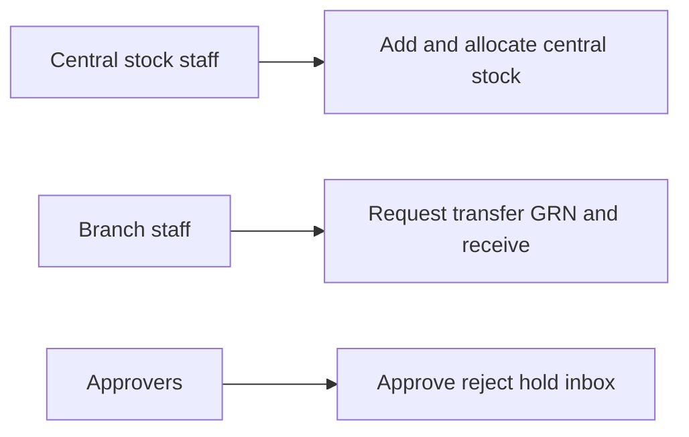
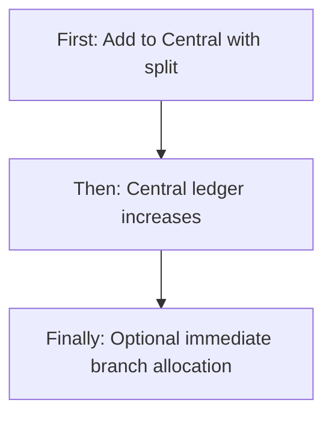
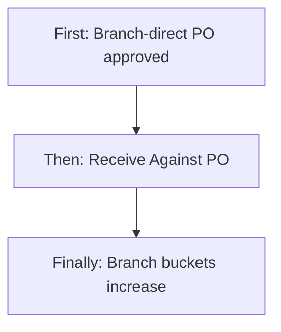
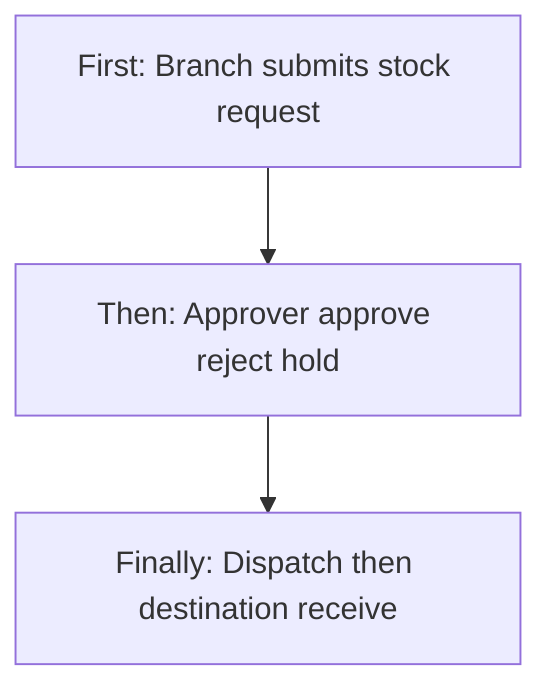
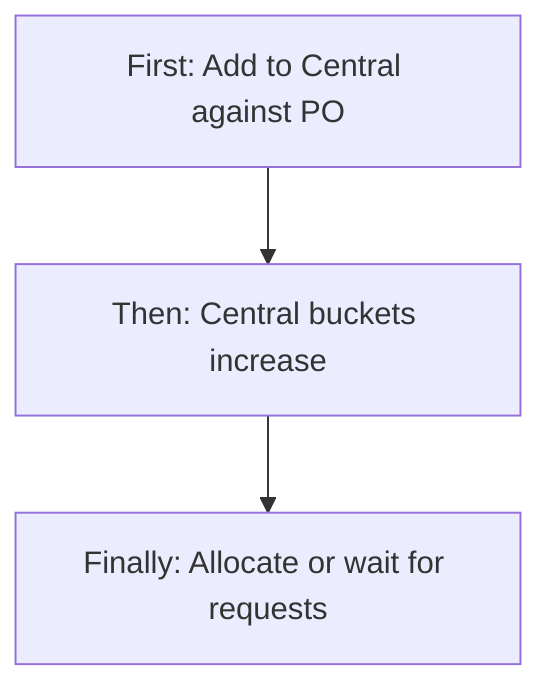
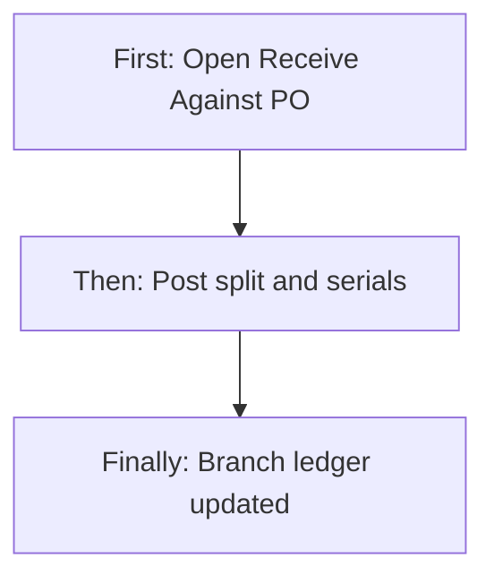
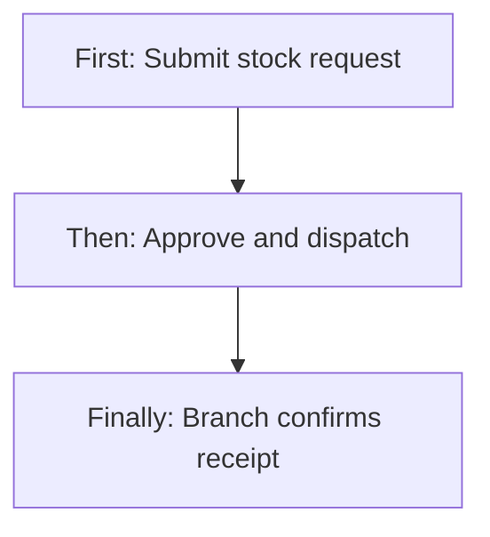
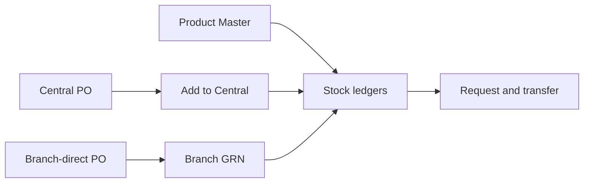
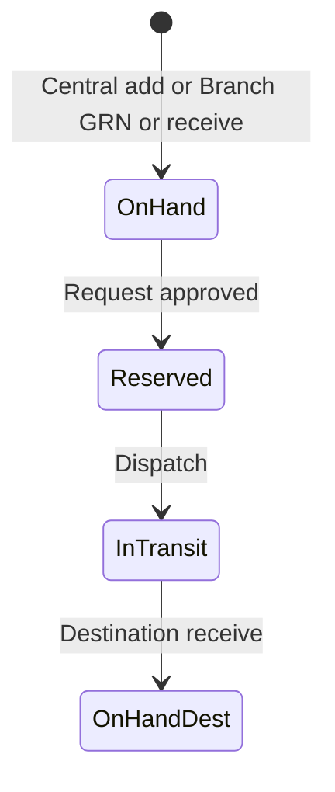

# Stock Management (Inventory) — Product & Business Documentation

## 1. Purpose & Business Need

Multi-branch pest-control operations need one place to **see on-hand quantity**, **receive goods**, **allocate or request stock to branches**, **move stock branch-to-branch**, and **prove that goods arrived**. **Stock Management** (menu: Inventory & Services → Stock Management) is that operational layer on top of Product Master.

**Receiving goods now has two inbound doors.** Which door is legal depends on how the Purchase Order was created (Central vs Branch-direct). Stock Management still owns Central inbound, requests, transfers, ledger, and receive-from-transfer. Branch-direct PO receive lives on the **Purchase Order Receive Against PO** screen but **posts the same branch ledger buckets**.

| Inbound door | When to use | Where qty lands |
|--------------|-------------|-----------------|
| **Add to Central Stock** | PO (or purchase) created in **Central** receipt mode, or stock with no PO / a Central PO reference | **Central** warehouse ledger |
| **Receive Against PO (Branch GRN)** | PO created in **Branch-direct** mode | **That branch’s** ledger (not Central) |

Without this module, branches cannot see available quantity, Central cannot track reserved or shipped stock, and sales/tasks cannot reliably consume inventory.

**Outcomes today:**
- Add stock into **Central** with a **manual** Assets / Consumable / Resell split, batch, manufacturing/expiry, optional PO reference, optional immediate branch allocation
- **Block** Central inbound when the PO is branch-direct (tenant setting, on by default)
- Immediate **Central → Branch initial allocation** (no approval)
- Branch **stock request** from Central (request → approve → dispatch → in-transit → receive)
- **Branch → Branch transfer** (create → approve at source → dispatch → in-transit → receive)
- **Ledger** with quantity buckets and movement history
- Approver **inbox** and requester **My Requests**
- Soft deactivate of central entries
- Same three qty buckets on **Branch GRN** as on Central inbound (default from **primary** product category, or typed by the user)

**What this module is not:** Product catalog (Product Master), a second product-category engine (extra categories do **not** auto-split qty), or Central GRN documents (Central still uses a stock entry + PO reference string, not a Branch GRN record).

---

## 2. Users & Roles (who uses this and why)

### 2.1 Company CEO / Owner

Full access. Can add central stock, approve any request/transfer, view all branches, receive transfers/requests, and (via PO permissions overlap) post Branch GRN.

### 2.2 Central / Head Office inventory staff

Add central stock, run initial allocations, approve branch requests from Central, export invoice copies, watch overall ledger. Must **not** dump branch-direct POs into Central when the block is on.

### 2.3 Branch managers / branch inventory staff

Request stock for their branch, initiate branch transfers, receive goods when status is Dispatch or In Transit, view branch-scoped stock. On branch-direct tenants they also **Receive Against PO** (if they have Stock Add, Stock Request, or PO Approve and belong to the PO branch).

### 2.4 Approvers (Stock Management Approve + branch assignment)

**Received Requests** inbox: approve / reject / hold stock requests and transfers. For direct transfers, approval is expected at the **source branch**.

### 2.5 Requesters (Stock Management Request)

**My Request:** draft, submit, revoke, later **Receive** stock for their branch.

---

## 3. Access Control (RBAC)

### 3.1 How access works

Access is controlled by **Stock Management** permissions, unless the user is **CEO**:

| Permission | Allows |
|------------|--------|
| **Read** | Stock Dashboard, product detail, ledger, transfer/request view |
| **Add** | Add to Central Stock, initial allocation, create transfer; create request; **Branch GRN** (with other GRN grants) |
| **Edit** | Edit central entry, update request/transfer, dispatch / mark in-transit; receive gate on some UI actions; transfer approve/reject/hold (with Approve) |
| **Delete** | Soft-deactivate central entry; revoke visibility |
| **Request** | My Requests, submit, recipients, revoke, receive; **Branch GRN** |
| **Approve** | Received Requests inbox, approve/reject/hold |
| **Export** | Download central entry invoice copy |

**Branch GRN** is also allowed with Purchase Order **Approve**. It is **not** gated on Stock Approve.

Sidebar shows **Stock Management** with Stock Management **Read** (or CEO bypass). Receive Against PO is reached from **Purchase Orders**.

**Recipient routing (stock requests):** receivers come from users whose roles are configured as **request receivers** for Stock Management. If none are configured, fallback role names such as CEO / Admin / Branch Manager may be used.

### 3.2 Role × action matrix

| Role | View list | View detail | Add | Edit | Inactive / Delete | Submit request | Receive / act | Approve | Reject |
|------|-----------|-------------|-----|------|-------------------|----------------|---------------|---------|--------|
| Company CEO | Yes | Yes | Yes | Yes | Yes (central soft inactive) | Yes | Yes (request/transfer + GRN) | Yes | Yes |
| Staff with Stock Read | Yes | Yes | No | No | No | No | No | No | No |
| Staff with Stock Add | Yes | Yes | Yes (central / transfer / GRN) | Limited | No | Create request | GRN yes; list Receive often needs Edit | No | No |
| Staff with Stock Edit | Yes | Yes | No | Yes | No | No | Yes (UI often gates Receive on Edit) | Transfer approve path | Transfer reject path |
| Staff with Stock Request | Yes | Yes | Request create; GRN | Own drafts | Revoke | Yes | Yes (receive + GRN) | No | No |
| Staff with Stock Approve | Yes | Yes | No | Approval draft | No | No | Inbox; request receive | Yes | Yes |
| Staff with Stock Delete | Yes | Yes | No | No | Central deactivate | No | No | No | No |
| PO Approve (no Stock) | — | Via PO | No | No | No | No | **Branch GRN only** | No (stock inbox) | No |

**Record-level rules:**
- Branch users typically see stock filtered to their branches; Central option appears for users with Add.
- Transfer approval at source: approver should belong to the **from branch** (CEO/Admin bypass).
- Receive of **requests/transfers** is allowed only when status is **Dispatch** or **In Transit**.
- Branch GRN: non-CEO must belong to the **PO branch**.

---

## 4. Capabilities & Features

### 4.1 Stock Dashboard

Unified product stock list with branch filter (including Central), search, filters, and links into ledger / central entry.

Tabs:
- **Stock Dashboard** — balances
- **My Request** — requester’s documents (Request permission)
- **Received Requests** — approver inbox (Approve permission)

Add Stock menu: Add to Central vs create a stock request, by permission.

### 4.2 Add / Edit / View Central Stock

Inbound lot into Central Warehouse: **user-typed** quantity split (Assets / Consumable / Resell), vendor, PO reference (free text), invoice, batch, manufacturing/expiry, optional asset ID generation, optional **initial allocations** to branches.

If the PO reference is a **branch-direct** PO and the tenant blocks Central inbound, save is **rejected** with a message to use Receive Against PO.

### 4.3 Product Ledger

Movement history and running totals for a product (and branch scope): added, reserved, in-transit, received, allocated. Category shown is the product’s **primary** category.

### 4.4 Stock Request (Branch ← Central)

Branch asks Central for stock. Goes through submit → approve → dispatch → in-transit → receive. Approver may choose another branch or purchase-order shortage path as alternative source (that path does **not** post a Branch GRN by itself).

### 4.5 Branch Transfer (Branch → Branch)

Direct transfer between branches with source approval, then dispatch / in-transit / receive. Can also be spawned from a stock request when the approver chooses **Other Branch**.

### 4.6 Approval inbox

Approvers Hold / Reject / Approve (full or partial), set logistics (dispatch date, carrier, LR), and optionally split fulfillment from Central vs another branch.

### 4.7 Receive Stock (request / transfer)

Destination confirms goods arrived (Confirm Receipt or Report Issue) for **stock requests and transfers**. This is separate from **Branch GRN**.

### 4.8 Branch GRN (PO inbound at branch)

Documented fully in Purchase Order Management. From a stock point of view: it **adjusts the branch ledger** in Assets / Consumable / Resell, writes a movement typed as PO branch GRN, and may create **asset units** at the branch. Central warehouse quantity does **not** increase.

### 4.9 Quantity buckets (everywhere)

| Bucket | Meaning |
|--------|---------|
| **Assets** | Tracked serialized/units (asset IDs) |
| **Consumable** | Consumable qty |
| **Resell** | Resale qty |
| **Reserved** | Approved but not yet dispatched |
| **In-Transit** | Dispatched / moving; still on source ledger until receive |
| **Available pool** | Total (A+C+R) minus Reserved minus In-Transit |

### 4.10 How product categories affect split (deep — read this)

Product Master now allows **extra categories** (second, third labels). **Stock does not read those extras** to decide buckets.

| Event | Who decides Assets / Consumable / Resell |
|-------|------------------------------------------|
| Add to Central Stock | **The user**, every time. Checkboxes + numbers must sum to Total Qty. Choosing a Chemical that was also tagged Asset does **nothing** until the user types Assets qty. |
| Branch GRN, user types split | **The user**. Same three numbers must sum to qty received now. |
| Branch GRN, user leaves split blank | **Primary category only:** Resale → all Resell; Asset, Sprayer, Electric pump, Machine, Trap, Tool → all Assets; anything else (Chemical, Consumable, Other, …) → all Consumable. |
| Request / transfer receive | Line still carries the three buckets from the approved document, not from extra categories. |

**Training rule:** Extra categories help people **find** a SKU. They never secretly move 10 bottles into Assets because someone also tagged Asset. Mixed lots are always a **conscious split** on the receive form.

---

## 4A. All Major Scenarios (how stock moves)

### Scenario 1 — Add stock into Central (Central-mode procurement inbound)

**First:** Central staff opens Add to Central Stock, selects product, enters Total Qty and **ticks/types** Assets / Consumable / Resell so they sum to Total Qty, optional batch/mfg/expiry, vendor/PO/invoice.

**Then:** System writes the **Central** ledger and a central stock entry. If PO ref is a Central PO, the PO may become Partially Received / Received from summed entries.

**Finally:** Central available qty rises. Optional initial allocation can move qty to branches immediately (no approval).

### Scenario 2 — Branch-direct PO received at the branch (new)

**First:** Branch PO is Approved (auto or named approver). User opens **Receive Against PO**, not Add to Central.

**Then:** User posts GRN qty + split (+ serials if Assets). Attempting Add to Central with that PO number is **blocked**.

**Finally:** **Branch** ledger increases; Central does not. PO status follows GRN remaining qty.

### Scenario 3 — Wrong door: Central inbound for a branch-direct PO

**First:** User pastes the BD PO number on Add to Central Stock.

**Then:** Save fails (when block is on) with guidance to use Branch GRN.

**Finally:** No Central qty is created. User switches to Purchase Orders → Receive.

### Scenario 4 — Branch stock request from Central

**First:** Branch user creates and submits a request (lines in Assets / Consumable / Resell).

**Then:** Approver approves (full/partial), dispatch, in-transit.

**Finally:** Destination **Receives** on the stock receive screen. Reserved/in-transit clear; branch on-hand rises. This is **not** a PO GRN.

### Scenario 5 — Branch to branch transfer

**First:** Source branch creates a transfer.

**Then:** Source approver approves; dispatch / in-transit.

**Finally:** Destination receives. Qty leaves source available pool and lands at destination.

### Scenario 6 — Extra category does not auto-split

**First:** Catalog SKU is Chemical (primary) + Asset (extra). User GRNs 10 without typing a split.

**Then:** Default puts **10 in Consumable** (primary Chemical).

**Finally:** If 2 units should be serialized assets, the user must type Assets 2 + Consumable 8 **before** posting. Saving extras on Product Master will not fix already-posted stock.

---

## 5. CRUD Operations

### 5.1 Create (Add to Central)

**Who:** CEO or Stock **Add**.

**First:** Open Add to Central Stock.

**Then:** Product, total qty, three-way split, dates/batch as required, optional PO ref / vendor / invoice, optional allocations.

**Finally:** Central entry exists; ledger updated; PO status may sync if the PO is Central-mode.

### 5.2 Read — List (Dashboard)

**Who:** Stock **Read**.

Columns: product, quantities by bucket, branch scope, filters including stock type Assets/Consumable/Resell. Search by product. Pagination as built.

Empty state when no rows match.

### 5.3 Read — Detail / Ledger / Central view

Opening a product/branch combination loads ledger movements. Opening a central entry shows the inbound lot, split, batch, allocations.

Opening a GRN is on Purchase Order routes, not the stock dashboard.

### 5.4 Update (Edit central entry)

**Who:** Stock **Edit**.

Allowed fields follow the edit screen (typically metadata; quantity rules are strict once movements exist — follow on-screen validation). Branch GRNs are **not** edited from Stock Edit.

### 5.5 Inactive / Delete

**Who:** Stock **Delete**.

Soft-deactivate a **central entry** so it drops from operational lists. This is not a GRN reverse. Request/transfer documents are revoked or rejected, not “deleted” as catalog rows.

---

## 6. Request & Approval Flows

This module **does** use request/approve for **stock requests and branch transfers**. Branch-direct **PO** approval is in Purchase Order Management, not this inbox.

### 6.1 Submit request

**Who:** Stock Request (submit); Add or Request to create.

**First:** User opens Add Stock Request, branch, lines, qty split.  
**Then:** Picks recipients (stock request receivers) and submits.  
**Finally:** Document appears in approver Received Requests; requester sees it under My Request.

### 6.2 Receive / inbox / pending actions

Approvers with Stock **Approve** use **Received Requests**. They can Hold, Reject, or Approve (with logistics). Transfer inbox uses the transfer approval screens.

### 6.3 Approve / Reject / Return

Stock requests: Approve / Reject / Hold (Hold is not a PO “Return for correction”). After approve: dispatch → in-transit → destination Receive.

---

## 7. Forms — Add vs Edit Field Access

### Central stock

| Field (business name) | On Add | On Edit | Notes |
|----------------------|--------|---------|-------|
| Product | Required | Typically locked | From Product Master |
| Total qty | Required | Follow edit rules | Must equal split |
| Assets / Consumable / Resell | Required (user typed) | Follow edit rules | **No** auto from extra categories |
| Batch | As required by type | Same | |
| Manufacturing / expiry | Consumable pair rules | Same | Both empty or both set; expiry after mfg |
| Vendor / invoice | Optional | Same | |
| PO reference | Optional free text | Same | BD PO blocked when setting on |
| Initial allocations | Optional | N/A after post | Immediate, no approval |
| Asset IDs | If Assets qty > 0 | Follow screen | Generate / preview |

### Stock request

| Field | On Add | On Edit | Notes |
|-------|--------|---------|-------|
| To branch | Required | Locked after submit | |
| Lines / splits | Editable | Own drafts | |
| Recipients | On submit | — | Stock request receivers |

Branch GRN field access is on the PO Receive screen (see Purchase Order doc).

---

## 8. Lists, Dropdowns, Details & Data Rendering

### 8.1 List rendering

Dashboard: product rows, bucket columns, branch filter including Central, stock-type filters, search, pagination, links to ledger / view central / requests.

My Request / Received Requests: document lists with status and actions (view, approve, receive).

### 8.2 Dropdowns & lookups

| Dropdown | Source | Notes |
|----------|--------|-------|
| Product | Active products | Extra categories may be on the payload; split UI does not use them |
| Branch | User branches + Central when Add | |
| Stock type filter | Assets / Consumable / Resell | Filters qty columns, not extra categories |
| Vendor | Vendors | Central inbound |
| Recipients | Stock request receivers | Submit modal |
| PO reference | Typed (Central); true GRN uses PO id on PO module | |

### 8.3 Detail / get-details rendering

Ledger: chronological movements with deltas per bucket and running totals.

Central view: inbound header + split + allocations + invoice download if Export.

Receive Stock: lines with remaining qty and issue/confirm actions.

GRN detail: PO receive document (Purchase Order module).

---

## 9. How It Works (end-to-end user flows)

### 9.1 Central storekeeper — Receive a Central PO

**First:** PO is Ordered in Central mode.  
**Then:** Add to Central Stock, type split, save with PO reference.  
**Finally:** Central qty up; PO Partial/Received; later allocate or wait for branch requests.

Wait, mermaid error - two labels on cstkLed. Fix in file... I'll fix after write.

### 9.2 Branch storekeeper — Receive a branch-direct PO

**First:** PO Approved in branch-direct mode.  
**Then:** Receive Against PO; confirm split and serials.  
**Finally:** Branch qty up; do **not** add the same PO at Central.

### 9.3 Branch user — Request from Central

**First:** Create and submit stock request.  
**Then:** Approver approves and dispatch happens.  
**Finally:** Branch receives on Receive Stock; available qty at branch.

### 9.4 Approver — Inbox

**First:** Open Received Requests.  
**Then:** Approve (partial/full), hold, or reject; set carrier/LR if approving.  
**Finally:** Source reserved/in-transit updates; destination can receive later.

### 9.5 CEO — Wrong inbound blocked

**First:** Tenant is branch-direct; PO already exists.  
**Then:** Add to Central with that PO ref fails.  
**Finally:** Use GRN; settings can only be changed by CEO if the company truly wants both doors.

---

## 10. Cross-Module Interactions

| Related area | Connection |
|--------------|------------|
| **Product Master** | Product ID, HSN, UOM copied; **primary** category for GRN default and ledger category; extra categories stored but unused for split |
| **Purchase Order** | Central: PO ref string + status sync. Branch-direct: GRN posts branch ledger; Central sync skipped; inbound blocked |
| **Asset units** | Created on Central inbound and on GRN when Assets qty > 0 |
| **Sales / tasks** | Consume available branch/central qty (other modules) |
| **Vendor** | On central entry / GRN invoice fields |
| **Notifications** | Stock request submit/approve; PO GRN notifications live on PO |

---

## 11. Data the Business Cares About

| Attribute | Business meaning |
|-----------|------------------|
| Branch (or Central) | Which warehouse bucket |
| Product ID | SKU |
| Assets / Consumable / Resell qty | Physical split |
| Reserved / In-transit | Promised or moving |
| Available pool | What can still be given out |
| Batch / mfg / expiry | Lot identity (receipt, not product master) |
| PO reference vs GRN id | Two different inbound proofs |
| Movement type | Why qty changed (central add, GRN, request, transfer) |
| Asset serial / assignment | Branch pool vs employee |
| Request / transfer status | Draft through received |

---

## 12. Rules, Validations & Constraints

- Central split: Assets + Consumable + Resell = Total Qty; all required on create.
- Branch GRN split: same equality to qty received now; default from **primary** category if omitted.
- Consumable mfg/expiry: both empty or both set; expiry after manufacturing.
- BD PO + block setting → Central create rejected.
- Request receive only in Dispatch / In Transit.
- Transfer approve expected at source branch.
- Soft inactive central entry ≠ reverse GRN.
- Extra categories never change these math rules.

---

## 13. Loopholes, Gaps & Current Limitations

1. **Extra categories ignored** for split, dashboard category, and ledger category. Mixed asset+consumable must be typed.
2. **Two inbound UIs** (Central vs GRN). Training is mandatory; the block setting is the safety net.
3. **Central has no GRN document** — only a stock entry + PO text ref.
4. **List Receive** for requests/transfers is often gated on **Edit** in the UI while the API also allows Request/Approve (gap).
5. **No GRN reverse** from Stock.
6. **Initial allocation** may move ledger qty without the same asset-location story as GRN serial assignment — treat asset custody carefully (see existing asset caveats).
7. **Customer asset allocation** is still missing if it was missing before.
8. **Stock Approve** cannot post Branch GRN unless the user also has Add, Request, PO Approve, or CEO.
9. Dashboard category filter is primary product category, not extras.

---

## 14. Existing Functionality Summary

**Available today:**
- Dashboard, ledger, Central add/edit/view, invoice export
- Manual three-way qty split on Central inbound
- Branch GRN three-way split (default or typed) posting **branch** stock
- Block Central inbound for branch-direct POs
- Requests, transfers, approve/hold/reject, dispatch, in-transit, receive
- Initial allocation from Central
- Soft deactivate central entries
- Asset serials on Central and GRN when Assets qty > 0

**Not available:**
- Auto-split from extra product categories
- Central GRN entity equal to Branch GRN
- Reverse GRN from Stock
- Product Master holding live qty

---

## 15. Reference — APIs, Screens & UI Actions

### 15.1 APIs

| Method | Path | Purpose (plain language) | Used by (screen/flow) |
|--------|------|--------------------------|------------------------|
| POST | `/api/v1/stock/central-entries` | Create Central inbound | Add to Central Stock |
| GET/PUT | `/api/v1/stock/central-entries` (as implemented) | List/update/view central | Dashboard, Edit, View |
| GET | `/api/v1/stock/ledger` (dashboard/ledger as implemented) | Balances and movements | Dashboard, Ledger |
| GET | `/api/v1/stock/requests/my` | My requests | My Request tab |
| GET | `/api/v1/stock/requests/received` | Approver inbox | Received Requests |
| POST | `/api/v1/stock/requests` / upsert / submit | Create and submit request | Add Stock Request |
| POST | `/api/v1/stock/requests/revoke` | Revoke | My Request |
| POST | `/api/v1/stock/requests/receive` | Confirm request receipt | Receive Stock |
| POST | `/api/v1/stock/approval/approve` (and reject/hold) | Decide request | Approval screens |
| POST | `/api/v1/stock/transfers` | Create transfer | Branch Transfer |
| POST | `/api/v1/stock/transfers/approve` (reject/hold/dispatch/receive) | Transfer lifecycle | Transfer / Receive |
| POST | `/api/v1/purchase-orders/{id}/grn` | Branch inbound | Receive Against PO |
| GET | `/api/v1/procurement-settings` | Whether Central inbound blocked | Add to Central validation |

### 15.2 Frontend Screen Routes

| Route | Screen purpose | Primary users |
|-------|----------------|---------------|
| `/stock-dashboard` | Balances + request tabs | Stock Read+ |
| `/add-to-central-stock` | Central inbound | Stock Add |
| `/edit-central-stock` | Edit central entry | Stock Edit |
| `/view-central-stock` | View central entry | Stock Read |
| `/stock-ledger` | Movements | Stock Read |
| `/add-stock-request` | Create/submit request | Request / Add |
| `/view-stock-request/:id` | View request | Request / Read |
| `/receive-stock/:id` | Receive request or transfer | Request / Edit / Approve |
| `/add-request-approval` | Approve request | Approve |
| `/add-transfer-approval` | Approve transfer | Approve / Edit |
| `/branch-transfer/new` | Create transfer | Add |
| `/purchase-orders/receive/:poId` | Branch GRN | Stock Add/Request or PO Approve |
| `/purchase-orders/grn/:grnId` | GRN view | Same |

### 15.3 Click Events, Filters, Search & Controls

| Screen / Route | Control | Type | What happens |
|----------------|---------|------|--------------|
| Stock Dashboard | Branch filter | Dropdown | Scopes list including Central |
| Stock Dashboard | Search | Text | Finds products |
| Stock Dashboard | Stock type | Filter | Assets / Consumable / Resell columns |
| Stock Dashboard | Tabs | Tabs | Dashboard / My Request / Received |
| Stock Dashboard | Add Stock | Menu | Central add or new request |
| Add to Central | Split checkboxes + qty | Inputs | Must sum to total |
| Add to Central | PO reference | Text | Blocked if BD PO and setting on |
| Add to Central | Save | Button | Posts Central ledger |
| My Request | Submit / Revoke / Receive | Actions | Request lifecycle |
| Received Requests | Approve / Reject / Hold | Actions | Inbox |
| Receive Stock | Confirm / Report issue | Actions | Closes in-transit |
| Receive Against PO | Qty + three buckets + serials | Form | Posts **branch** ledger (PO module) |
