# Stock Management (Inventory) — Product & Business Documentation

## 1. Purpose & Business Need

Multi-branch pest-control operations need one place to **receive goods into Central Warehouse**, **allocate or request stock to branches**, **move stock branch-to-branch**, and **prove that goods arrived**. **Stock Management** (menu: Inventory & Services → Stock Management) is that operational layer on top of Product Master.

Without it, branches cannot see available quantity, Central cannot track what was reserved or shipped, and sales/tasks cannot reliably consume inventory.

**Outcomes today:**
- Add stock into **Central** (with assets / consumable / resell split, batch, manufacturing/expiry)
- Immediate **Central → Branch initial allocation** (no approval)
- Branch **stock request** from Central (request → approve → dispatch → in-transit → receive)
- **Branch → Branch transfer** (create → approve at source → dispatch → in-transit → receive)
- **Ledger** with quantity buckets and movement history
- Approver **inbox** and requester **My Requests**
- Soft deactivate of central entries

**What this module is not:** Product catalog (Product Master), purchase-order goods receipt as a formal GRN document, or automatic PO→stock posting without a central entry.

---

## 2. Users & Roles (who uses this and why)

### 2.1 Company CEO / Owner

Full access. Can add central stock, approve any request/transfer, view all branches, and receive.

### 2.2 Central / Head Office inventory staff

Add central stock, run initial allocations, approve branch requests from Central, export invoice copies, watch overall ledger.

### 2.3 Branch managers / branch inventory staff

Request stock for their branch, initiate branch transfers, receive goods when status is Dispatch or In Transit, view branch-scoped stock.

### 2.4 Approvers (by Stock Management Approve permission + branch assignment)

See **Received Requests** inbox, approve / reject / hold stock requests and transfers. For direct transfers, approval is expected at the **source branch**.

### 2.5 Requesters (Stock Management Request permission)

Use **My Request** to draft, submit, revoke, and later **Receive** stock for their branch.

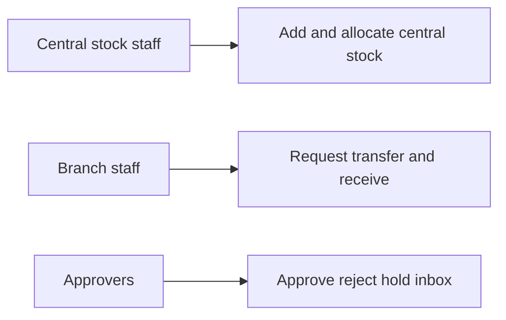

---

## 3. Access Control (RBAC)

### 3.1 How access works

Access is controlled by **Stock Management** permissions, unless the user is **CEO**:

| Permission | Allows |
|------------|--------|
| **Read** | Stock Dashboard, product detail, ledger, transfer/request view |
| **Add** | Add to Central Stock, initial allocation, create transfer; also create request |
| **Edit** | Edit central entry, update request/transfer, dispatch / mark in-transit; receive gate on some UI actions; transfer approve/reject/hold (with Approve) |
| **Delete** | Soft-deactivate central entry; revoke visibility |
| **Request** | My Requests, submit, recipients, revoke, receive |
| **Approve** | Received Requests inbox, approve/reject/hold |
| **Export** | Download central entry invoice copy |

Sidebar shows **Stock Management** with Stock Management **Read** (or CEO bypass).

**Recipient routing:** When a requester submits, receivers are chosen from users whose roles are configured as **request receivers** for Stock Management (from the role permission matrix). If none are configured, fallback role names such as CEO / Admin / Branch Manager may be used.

### 3.2 Role × action matrix

| Role | View list | View detail | Add | Edit | Inactive / Delete | Submit request | Receive / act | Approve | Reject |
|------|-----------|-------------|-----|------|-------------------|----------------|---------------|---------|--------|
| Company CEO | Yes | Yes | Yes | Yes | Yes (central soft inactive) | Yes | Yes | Yes | Yes |
| Staff with Stock Read | Yes | Yes | No | No | No | No | No | No | No |
| Staff with Stock Add | Yes | Yes | Yes (central / transfer) | Limited | No | Create request | No* | No | No |
| Staff with Stock Edit | Yes | Yes | No | Yes | No | No | Yes (UI often gates Receive on Edit) | Transfer approve path | Transfer reject path |
| Staff with Stock Request | Yes | Yes | Request create | Own drafts | Revoke | Yes | Yes (receive) | No | No |
| Staff with Stock Approve | Yes | Yes | No | Approval draft | No | No | Inbox | Yes | Yes |
| Staff with Stock Delete | Yes | Yes | No | No | Central deactivate | No | No | No | No |

\*Receive may also be allowed by Request / Approve / Edit depending on API; list **Receive** button is gated by **Edit** in the UI today (gap).

**Record-level rules:**
- Branch users typically see stock filtered to their branches; Central option appears for users with Add.
- Transfer approval at source: approver should belong to the **from branch** (CEO/Admin bypass).
- Receive is allowed only when status is **Dispatch** or **In Transit**.

---

## 4. Capabilities & Features

### 4.1 Stock Dashboard

Unified product stock list with branch filter (including Central), search, filters, and links into ledger / central entry.

Tabs:
- **Stock Dashboard** — balances
- **My Request** — requester’s documents (Request permission)
- **Received Requests** — approver inbox (Approve permission)

### 4.2 Add / Edit / View Central Stock

Inbound lot into Central Warehouse: quantity split (Assets / Consumable / Resell), vendor, PO reference, invoice, batch, manufacturing/expiry, optional asset ID generation, optional **initial allocations** to branches.

### 4.3 Product Ledger

Movement history and running totals for a product (and branch scope): added, reserved, in-transit, received, allocated.

### 4.4 Stock Request (Branch ← Central)

Branch asks Central for stock. Goes through submit → approve → dispatch → in-transit → receive.

### 4.5 Branch Transfer (Branch → Branch)

Direct transfer between branches with source approval, then dispatch / in-transit / receive. Can also be spawned from a stock request when approver chooses **Other Branch** as alternative source.

### 4.6 Approval inbox

Approvers Hold / Reject / Approve (full or partial), set logistics (dispatch date, carrier, LR), and optionally split fulfillment from Central vs another branch.

### 4.7 Receive Stock

Destination confirms goods arrived (Confirm Receipt or Report Issue). This is the operational goods-receipt step — **not** a separate professional GRN/GTR document (see §4E and §13).

### 4.8 Quantity buckets (everywhere)

| Bucket | Meaning |
|--------|---------|
| **Assets** | Tracked serialized/units (asset IDs) — see **§4F** for branch / employee / gaps |
| **Consumable** | Consumable qty |
| **Resell** | Resale qty |
| **Reserved** | Approved but not yet dispatched |
| **In-Transit** | Dispatched / moving; still on source ledger until receive |
| **Available pool** | Total (A+C+R) minus Reserved minus In-Transit |

### 4.9 Asset custody (summary)

Assets support **Branch Pool** and **Employee** custody via create / transfer / receive. **Customer allocation is missing.** Manual Asset ID entry does not create units. Initial branch allocation may update ledger qty without moving unit location — details in **§4F**.

---

## 4A. All Major Scenarios (how stock moves)

### Scenario 1 — Add stock into Central (procurement inbound)

**First:** Central staff opens Add to Central Stock, selects product, enters Total Qty and splits into Assets / Consumable / Resell, optional batch/mfg/expiry, vendor/PO/invoice.

**Then:** Save creates a central stock entry and increases the **Central ledger** (action like Central Stock Added).

**Finally:** Central available stock rises. Optional initial allocations can move qty to branches immediately (Scenario 2).

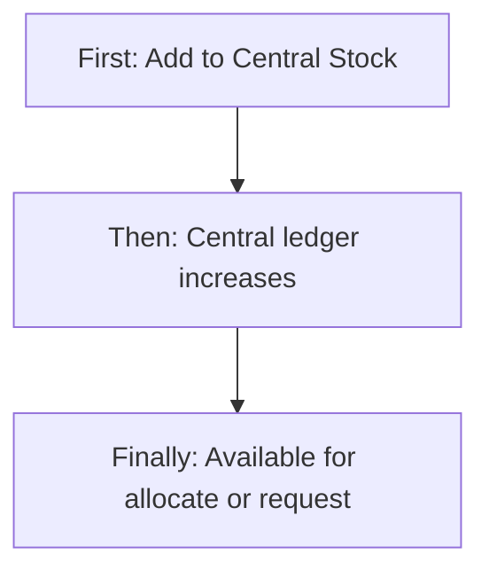

---

### Scenario 2 — Central → Branch **immediate allocation** (no approval)

Used when Head Office already decided to push stock to branches at intake time.

**First:** On Add/Edit Central Stock (or Initial Allocations action), staff picks destination branches and quantities (within the entry’s A/C/R split).

**Then:** System **decrements Central** and **increments each branch ledger** (Initial Allocation in / out).

**Finally:** Branch **ledger** stock is available immediately. No request, no dispatch, no receive.

**Critical asset caveat:** Initial allocation moves **quantity on the ledger only**. It does **not** move serialized **asset unit** records to the branch — those units often remain tagged at Central until a proper transfer/receive (or employee assignment path) updates each asset ID. See **§4F**.

**Who is involved:** Central staff with Add (and Edit for later allocations). Branch does not approve.

---

### Scenario 3 — Central → Branch via **Stock Request** (full approval lifecycle)

This is the main controlled replenishment path.

**Who submits:** Branch user with Request permission (My Request → Add Request).  
**Requesting Branch** = destination of goods. **Request To** = Central Warehouse.

**Who receives the request (approver inbox):** Users selected as recipients on submit, or users whose roles are Stock Management request receivers (often Central / HO / Branch Manager / CEO). They see **Received Requests**.

**Who approves:** User with Approve permission in that inbox → Request Approval screen (Approve / Reject / Hold).

**Who receives goods:** Branch requester (or user with Receive rights) on **Receive Stock** when status is Dispatch or In Transit.

#### Step-by-step

| Step | Status | Ledger effect |
|------|--------|---------------|
| 1. Save Draft | Draft | None |
| 2. Submit (+ recipients) | Pending Approval | None |
| 3. Approve (+ logistics, approved qtys) | Approved / Partially Approved | **Reserve** qty on **Central** |
| 4. Dispatch (scheduler when dispatch date due, or ops trigger) | Dispatch | **Reserved → In-Transit** on Central |
| 5. In-Transit (day after dispatch date via scheduler, or manual mark on transfers) | In Transit | Still in-transit on Central |
| 6. Confirm Receipt at branch | Received | Central −qty & −in-transit; **Branch +qty** |

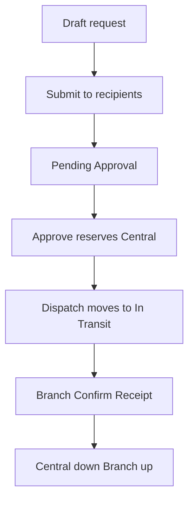

**Reject:** Pending/Hold → Rejected (no ledger reserve).  
**Hold:** Pending → Hold (approver pauses).  
**Revoke:** Requester can revoke Draft / Pending Approval.

**Alternative source on approval:**
- **None / Central** — fulfill from Central
- **Other Branch** — creates/links a **branch transfer** draft from a chosen supply branch (then that transfer follows Scenario 4)

---

### Scenario 4 — Branch → Branch **direct transfer**

**Who creates:** User with Add → Add Stock → Direct Branch Transfer.  
**Who approves:** Source-branch approver (Approve/Edit) on Branch Transfer Approval.  
**Who receives:** Destination branch user via Receive Stock.

#### Step-by-step

| Step | Status | Ledger effect |
|------|--------|---------------|
| 1. Create transfer (From / To / products / qtys / assets) | Pending Approval (or Draft) | None |
| 2. Source approves (+ logistics, asset lines) | Approved | **Reserve** at **source branch** |
| 3. Dispatch | Dispatch | Reserved → In-Transit at source; assets marked in transit |
| 4. In-Transit | In Transit | Manual **Mark In Transit** (API exists; UI button missing) **or** scheduler day after dispatch date |
| 5. Destination Confirm Receipt | Received | Source −qty & −in-transit; Dest +qty |

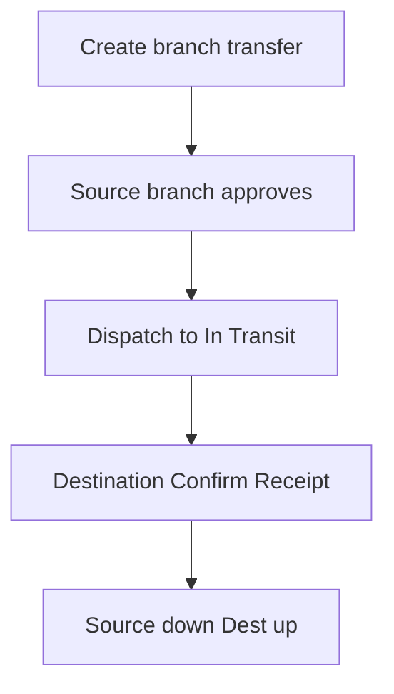

---

### Scenario 5 — Branch → Branch via Stock Request + Other Branch

Branch A requests from Central, but approver fulfills from Branch B:

1. Request submitted as usual  
2. Approver sets Alternative Source = Other Branch + supply branch + transfer qtys  
3. System creates linked transfer draft  
4. Source (Branch B) approval / dispatch / receive proceeds like Scenario 4  
5. Request and transfer statuses stay in sync  

---

## 4B. Who Gets the Request, Who Approves, Who Receives (summary)

| Moment | Who | Where in product |
|--------|-----|------------------|
| Submit stock request | Requester (Request permission) | My Request → Submit |
| See pending request | Configured receiver users / roles | Received Requests tab |
| Approve / Reject / Hold | Approver (Approve permission) | Request Approval / Transfer Approval |
| Dispatch / In-Transit | System scheduler (and ops/manual for transfers) | Background + status on document |
| Confirm goods arrived | Destination user (Request / Edit / Approve on API; UI Receive often needs Edit) | Receive Stock → Confirm Receipt |
| Report problem on arrival | Same receive user | Receive Stock → Report Issue |

**Important:** Approver inbox is **not** where goods are received. Comment in product: received-requests table is for **approve**, never receive.

---

## 4C. How the Ledger Works (in depth)

### What the ledger is

There are **two balance stores**:
- **Central ledger** — one balance row per product at Central
- **Branch ledger** — one balance row per product per branch  

A combined view supports dashboard/ledger reads. Every meaningful change writes a **movement log** (who/what/how much/reference document).

### Buckets on every ledger row

Assets + Consumable + Resell = on-hand total.  
**Reserved** and **In-Transit** reduce what is **available** to allocate or approve again.

### Example — Branch requests 5 consumables from Central

| Step | Central on-hand | Reserved | In-Transit | Branch on-hand |
|------|-----------------|----------|------------|----------------|
| After central add 100 | 100 | 0 | 0 | 0 |
| Approve 5 | 100 | 5 | 0 | 0 |
| Dispatch | 100 | 0 | 5 | 0 |
| Receive GOOD | 95 | 0 | 0 | 5 |

Until receive, physical A/C/R still “sit” on the source side while In-Transit tracks the shipment. Receive finally moves on-hand from source to destination and clears In-Transit.

### Initial allocation example

Central 100 → allocate 20 to HYD: Central becomes 80, HYD becomes 20, with movement logs Initial Allocation Out / In. No reserved/in-transit.

### Asset units (overview)

Serialized assets are individual units with status (Available, In Transit, Quarantine, etc.). Transfer/receive can move specific asset IDs. **Full deep dive:** branch pool vs employee assignment, ID generation, and gaps (including missing customer allocation) are in **§4F**.

---

## 4D. In-Transit — Automatic vs Manual

| Trigger | What happens |
|---------|----------------|
| **Automatic scheduler** | Runs periodically (default every few minutes). On/after **dispatch date**: Approved → Dispatch (and reserved → in-transit). **Day after** dispatch date: Dispatch → In Transit. |
| **Manual mark in-transit (transfers)** | API exists to mark a transfer In Transit when status is Dispatch. **No dedicated button** on current Stock UI — operators rely on scheduler or ops endpoint. |
| **Ops run-dispatch** | Privileged “run scheduler now” action exists for administrators. |
| **UI visibility** | Dashboard **In-Transit** column; ledger In-Transit Qty; document status badge; Receive allowed in Dispatch or In Transit. |

**Who marks received:** Destination confirms on Receive Stock — that is the handoff that clears in-transit and posts destination stock.

---

## 4E. Good Transfer Receipt (GTR) / GRN — What Exists vs Professional ERP Gap

### What exists today (operational receive)

- Screen: **Receive Stock**
- Actions: **Confirm Receipt** (with “I confirm…” checkbox) or **Report Issue**
- Captures: received date, package condition (Good / Damaged / Missing Items), line quantities, asset receipts, optional receipt photo (transfers)
- For **Good** condition, quantities must **exactly match** approved/dispatched amounts (no partial receive posting)

This is a **confirmation step on the same request/transfer document**, not a new numbered goods-receipt voucher.

### What a professional ERP usually has (and is missing here)

| Professional ERP practice | In Seravion Stock today |
|---------------------------|-------------------------|
| Separate **Goods Transfer Receipt / GRN** document with its own number | **Missing** — no GTR/GRN master |
| Receive against transfer creating a receipt voucher linked to transfer | Only status → Received on same document |
| **Partial receive** (receive 7 of 10, remainder stays in transit) | **Missing** — status Partially Received exists in vocabulary but is **never set**; Good receive requires exact match |
| Reject / return in-transit shipment back to source | **Missing** — Report Issue does not reverse ledger / clear in-transit properly as a return |
| Multi-step QC → Quarantine → Accept | Only limited asset assignment to Quarantine on receive |
| Printable GRN / signed delivery note as legal receipt | Invoice copy on central entry only; receive photo optional |
| PO GRN auto-posts stock | PO reference on central entry; PO may sync status — **not** a full GRN→stock engine |

**Bottom line:** The product has **receive confirmation**, but **not** a professional **Good Transfer Receipt** document flow. That is a deliberate current limitation for teams expecting SAP/Oracle-style GTR/GRN.

---

## 4F. Asset Allocation Deep Dive (Branch, Employee, Gaps)

Consumable and Resell stock are quantity-only. **Assets** are different: each piece is a **named unit** (Asset ID) that can sit in a branch pool, sit with an employee, move in transit, or go to quarantine. This section explains how that works today — and what is still missing for a professional asset lifecycle (especially **customer allocation** and **manual Asset ID** workflows).

### 4F.1 What an Asset Unit is

Each asset record carries roughly:

| Attribute | Business meaning |
|-----------|------------------|
| **Asset ID** | Unique tag (e.g. `PESTO/1001`) |
| **Product** | Which catalog SKU this unit is |
| **Branch** | Where the unit currently sits (Central or a branch) |
| **Status** | Available, In Transit, Quarantine, Maintenance, Retired, Issued (Issued exists in language but is rarely set) |
| **Condition** | New, Good, Fair, Damaged, Needs Repair |
| **Assignment mode** | Branch Pool vs Employee (and related strings) |
| **Assigned employee** | User id + display name when given to a person |

**There is no Customer field** on the asset unit. You cannot allocate a sprayer or machine **to a customer site / contract customer** in Stock Management today.

### 4F.2 How Asset IDs are created

| Mode | What the business expects | What actually happens |
|------|---------------------------|------------------------|
| **AUTO** | System generates sequential IDs | **Works.** Format `{prefix}/{####}` (e.g. `PESTO/1001`). Requires Assets Qty > 0, AUTO mode, and a prefix. Units start **Available**, usually at **Central**, condition Good. Preview exists before save. |
| **MANUAL** | Staff type or paste their own Asset IDs | **Broken / incomplete.** Backend accepts MANUAL as a configuration value, but **does not create asset unit rows** for MANUAL. Central Add UI only offers **AUTO** — no free-text Asset ID grid. |

**Approval “Manual Assignment”** (on stock-request approval) means something else: “do not auto-pick which units to ship” / pick transfer lines yourself — **not** “create new Asset IDs by typing them.”

**Gap to fill — Manual Asset ID creation:**
- No screen to enter a list of physical barcode IDs already printed on machines
- No import/mapping of manufacturer serial numbers → Asset ID
- No repair of orphan ledger asset qty without unit rows
- Teams with pre-tagged hardware cannot onboard those tags without AUTO regenerating different IDs

### 4F.3 Allocation to Branch level (Branch Pool)

“Branch pool” means: the asset belongs to the **branch inventory pool**, not to a named employee. Anyone at that branch with access can later transfer or assign it.

#### Path A — Mark as Branch Pool at Central intake

On **Add to Central Stock**, Assignment Type can be **Branch Pool**.

**First:** Staff creates assets with AUTO IDs.  
**Then:** Units are created at **Central**, assignment mode Branch Pool (or equivalent label).  
**Finally:** Units are available at Central for later transfer to branches.

#### Path B — Initial allocation quantities to branches (ledger only)

On central entry, **Initial Allocations** push Assets / Consumable / Resell **quantities** to branch ledgers immediately.

**What moves:** Branch ledger Assets Qty ↑, Central ledger ↓.  
**What does not move:** Each `AssetUnit`’s **branch** often stays **CENTRAL**.

So the dashboard can show “HYD has 5 assets” on the **ledger** while the five serialized Asset IDs still list Central as home. That is a **cross-compatibility gap** between quantity ledger and unit register.

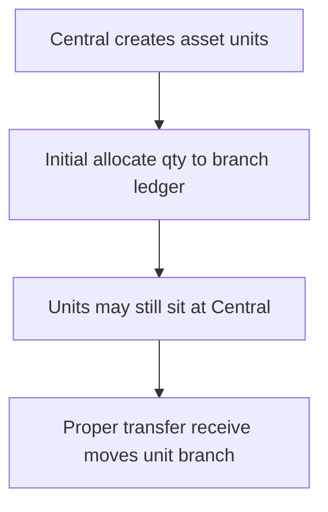

#### Path C — Branch pool after transfer / receive

When assets are transferred and destination receives with assignment **Branch Pool**:

**Finally:** Unit `branch` = destination branch; employee fields cleared; status Available.

This is the path that correctly places serialized units at branch level.

### 4F.4 Allocation to Employee level

Employee allocation means a specific person is responsible for that Asset ID (field technician’s sprayer, laptop, pump, etc.).

#### Path 1 — Direct to Employee at Central create

**UI label:** Direct to Employee (with Branch / Role / Person pickers).  
**Intended backend:** Direct-to-employee assignment with assignee branch + user.

**First:** Central intake marks assets for an employee.  
**Then:** Units should be created against the assignee’s branch with employee name/id filled.  
**Finally:** Asset shows as assigned to that person.

**Gap — mapping / cross-compatibility:** The Add form field names and labels do not always match what the service expects for assignee branch/user. Direct-to-employee at create can fail silently or store inconsistent assignment mode strings (e.g. display label instead of a clean Branch Pool / Employee code). Treat “Direct to Employee on Add Central” as **fragile** until mapping is aligned.

#### Path 2 — Assign / reassign on unit update

Backend supports updating central assets with employee assignment (Branch Pool / Employee / Quarantine).  
**Gap:** Stock UI does **not** call this update screen today — no day-to-day “reassign this Asset ID to another employee” form on the dashboard.

#### Path 3 — On branch transfer (dispatch)

When building a transfer, each asset line has **Transfer With**:

| Option | Meaning |
|--------|---------|
| **Reassign at Destination** | Decide employee vs pool when receiving |
| **Assign to Employee** | Destination employee chosen at dispatch (must belong to To Branch) |
| **Branch Pool** | Goes to destination pool |

Dispatch marks units **In Transit**.

#### Path 4 — On Receive Stock

Destination sets assignment per asset:

| Option in UI | Result |
|--------------|--------|
| **Branch Pool** | Available at destination branch; clear employee |
| **Employee** | Available + assigned to chosen user |

Backend also supports **Quarantine** on receive (status Quarantine, clear employee).  
**Gap:** Receive UI options omit Quarantine — only Branch Pool and Employee are offered.

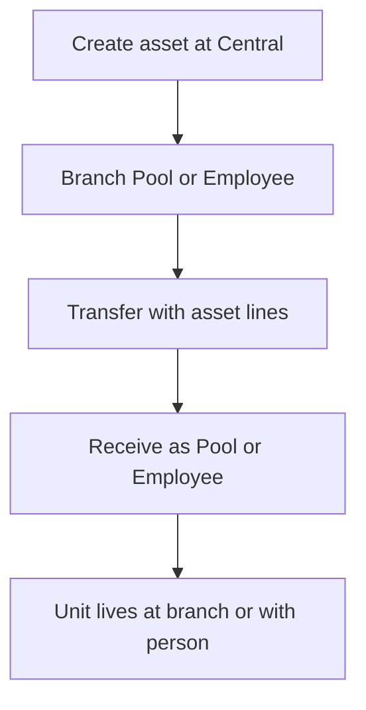

### 4F.5 What “Issued” means today

Language includes an **Issued** status (typical ERP meaning: issued to field / customer). In practice, assigning to an employee usually leaves status **Available** with assignment mode Employee. **Issued is not systematically set**, so reports that filter “Issued assets” will look empty even when people hold equipment.

### 4F.6 Customer allocation — MISSING (in depth)

Professional field-service / pest-control ERPs often need:

| Need | Why | In Seravion Stock today |
|------|-----|-------------------------|
| Allocate asset to **Customer** | Machine installed at customer site | **Missing** — no customer on asset unit |
| Allocate to **Customer site / contract** | Multi-site accounts | **Missing** |
| Return from customer to branch pool | Swap / de-install | **Missing** as a first-class flow |
| Customer-facing asset register | Audit which device is where | **Missing** |
| Link asset to service task / AMC | Technician services that serial | Not driven from Stock asset assignment |

**Impact:**
- You can know “which branch / which employee has the sprayer”
- You **cannot** know “which customer premises holds the trap/machine” from Stock assets
- Customer Module and Stock Asset register are **not cross-wired** for custody

**Gap to fill (product direction, not built):**
1. Customer (and optionally Site) on Asset Unit  
2. Assignment mode **Customer** alongside Branch Pool / Employee  
3. Issue-to-customer and return-from-customer documents  
4. Compatibility with Contracts / Service / Tasks so the same Asset ID appears in field jobs  

Until then, any customer custody must be tracked **outside** Stock (spreadsheet, notes, or another module) — it will **not** stay in sync with Asset ID status.

### 4F.7 Cross-compatibility gaps (ledger vs units vs modules)

| Area | What works | What breaks |
|------|------------|-------------|
| **Ledger Assets Qty vs Asset Unit count** | Both exist | Initial allocation changes ledger without moving units → counts disagree by location |
| **Central UI ↔ service contracts** | AUTO create works | Direct-to-Employee field mapping fragile; assignment mode may store UI labels |
| **Transfer available assets** | Lists Available units at From Branch | “Current Assignment” column often cannot read API fields → falls back to “Branch Pool” even when an employee is set |
| **Asset history** | History API exists | Movements are logged under entry/transfer/request types — **not** as Asset-referenced history; UI does not show a usable asset timeline |
| **Per-asset edit API** | Can set Employee / Pool / Quarantine | **No Stock screen** uses it |
| **Quarantine** | Backend on receive | **Not in Receive UI** |
| **Manual IDs** | Config flag exists | **No unit creation / no UI** |
| **Customer / CRM** | Customers exist elsewhere | **Zero asset custody link** |
| **Product Master** | Product id on unit | Batch/expiry stay on central lot, not per asset serial |

### 4F.8 End-to-end asset journeys (as built)

#### Journey A — Pool asset to a branch (correct serialized path)

**First:** Add Central Stock with Assets Qty + AUTO IDs + Branch Pool.  
**Then:** Create Branch Transfer (or request fulfillment) selecting those Asset IDs; source approves; dispatch.  
**Finally:** Destination Confirm Receipt with Branch Pool → units’ branch = destination.

#### Journey B — Give asset to an employee at receive

**First:** Same as A until Receive.  
**Then:** On Receive Stock, set Assignment = Employee and pick the person.  
**Finally:** Unit Available at branch, named employee filled.

#### Journey C — What people think Initial Allocation does (mismatch)

**First:** Allocate 5 assets qty to HYD on central entry.  
**Then:** HYD ledger shows 5 assets.  
**Finally:** Serialized IDs may still show Central — **not** a complete branch-level asset allocation.

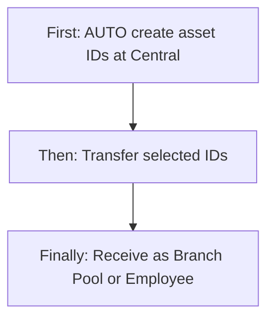

### 4F.9 Gaps checklist — what still needs to be filled

1. **Manual Asset ID creation and import** — type/paste/import real serials; map manufacturer barcode → Asset ID  
2. **Ledger ↔ Unit sync** — initial allocation (or a dedicated “move units” step) must relocate Asset Unit branch, not only qty  
3. **Stable assignment vocabulary** — one set of codes (Branch Pool / Employee / Quarantine) shared by UI and service  
4. **Working Direct-to-Employee on Add** — align Branch / Role / Person with assignee branch + user  
5. **Day-to-day reassignment UI** — change pool ↔ employee ↔ quarantine without a full transfer  
6. **Quarantine on Receive UI** — expose backend capability  
7. **Asset history that records ASSET references** — usable timeline per Asset ID  
8. **Customer (and Site) allocation** — full custody to customer; return flows; cross-link Customers / Contracts / Tasks  
9. **Issued status usage** — set Issued when employee/customer holds the unit, if reports need it  
10. **Available-for-transfer display** — show real current assignee, not a false Branch Pool fallback  

Until these are filled, treat Assets as: **AUTO-tagged units that move reliably mainly through Transfer + Receive**, with **employee assignment at receive** as the practical custody model — and **no customer custody** inside Stock.

---

## 5. CRUD Operations

### 5.1 Create (Add)

**Central stock:** Who = CEO / Add. First open Add to Central Stock → Then enter product, qty split, optional batch/expiry/allocations → Finally Central ledger increases.

**Stock request:** Who = Request (or Add). First Add Request → Then fill branch, items, priority, dates → Save Draft or Submit.

**Branch transfer:** Who = Add. First Direct Branch Transfer → Then From/To, products, qtys → Submit for approval.

### 5.2 Read — List

Stock Dashboard (products), My Request, Received Requests, Product Ledger movements. Search and filters vary by tab (status, branch, category, stock type, dates). Pagination is server-side on dashboard/request lists.

### 5.3 Read — Detail

View Central Stock Entry; View Stock Request (timeline); View Request Approval; Product Ledger detail cards.

### 5.4 Update (Edit)

**Central:** Edit allowed fields (batch/expiry/media/assignment); qty/vendor/PO often locked after create.  
**Request:** Only Draft / Pending editable.  
**Transfer:** Only Draft / Approved editable in service rules.  
**Approval draft:** Approver can save Pending Update then re-finalize.

### 5.5 Inactive / Delete

**Central entry Delete** = soft **Inactive** (not hard purge). Does not automatically reverse historical ledger allocations.  
**Request Revoke** for Draft/Pending.  
No hard delete of ledger history as a normal user action.

---

## 6. Request & Approval Flows

### 6.1 Submit request

**Who:** Requester.  
**First:** Complete request and choose recipients (or default receiver roles).  
**Then:** Status → Pending Approval; appears in Received Requests.  
**Finally:** Waiting for approver decision.

### 6.2 Receive / inbox / pending actions

**Who:** Approvers with Approve permission.  
**Inbox:** Received Requests (stock requests + transfers needing approval).  
**Actions:** Open Request Approval or Branch Transfer Approval.

### 6.3 Approve / Reject / Hold / Return

| Decision | Effect |
|----------|--------|
| **Approve** (full/partial) | Status Approved or Partially Approved; ledger **reserved** at supply point; logistics required |
| **Reject** | Rejected; no reserve |
| **Hold** | Hold; waiting |
| **Save approval draft** | Pending Update (approver-side) |
| **Revoke** (requester) | Revoked before approval completes |

There is no separate “return to requester for edit” beyond revoke (pre-approval) or approver Pending Update.

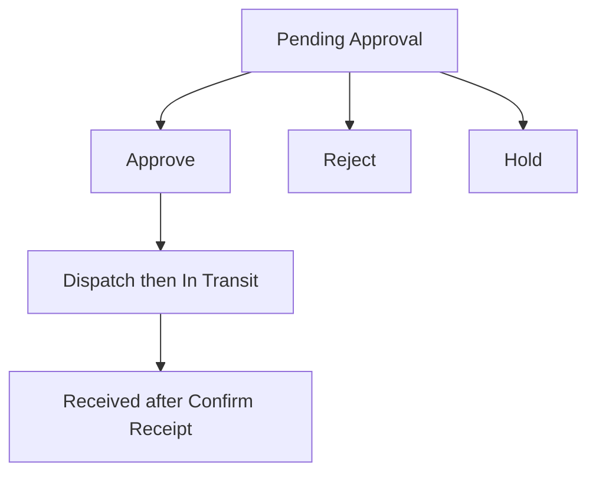

---

## 7. Forms — Add vs Edit Field Access

### Central Stock

| Field | On Add | On Edit | Notes |
|-------|--------|---------|-------|
| Product | Editable / Required | Loaded | |
| Product Code / HSN / Current Central / Base UOM | Locked | Locked | From Product Master |
| Total Qty + A/C/R split | Editable / Required | **Locked** | |
| Asset ID prefix / sequence | Editable | **Locked** | |
| Vendor / PO / Invoice # date amount | Editable | **Locked** | |
| Tax / Total with tax | Locked auto | Locked | |
| Batch / Mfg / Expiry | Editable | Editable | Product Master does not store these |
| Invoice copy | Editable | Editable | |
| Initial allocation branches | Editable | **Locked** on form | Separate allocate API may still apply |
| Assignment type | Editable | Editable | |
| Status delete | Hidden | Soft delete available | |

### Stock Request

| Field | On Add | On Edit | Notes |
|-------|--------|---------|-------|
| Request ID | Locked | Locked | System |
| Requesting Branch | Editable / Required | Editable if allowed | Destination of goods |
| Request To | Locked | Locked | Central Warehouse |
| Priority / dates / purpose | Editable | Editable in draft/pending | |
| Line products + A/C/R qtys | Editable | Editable in draft/pending | |

### Branch Transfer

| Field | On Add | On Edit | Notes |
|-------|--------|---------|-------|
| From / To Branch | Editable / Required | Per rules | From ≠ To |
| Transfer Type | Editable | Editable | Regular / Emergency / Scheduled |
| Products + transfer qtys | Editable | Editable | Availability from source |
| Asset picks / conditions | Editable | Editable | |
| Remarks | Editable | Editable | |

### Receive Stock

| Field | Access | Notes |
|-------|--------|-------|
| Confirm receipt checkbox | Required to confirm | Cannot undo messaging |
| Received date | Editable | Not future |
| Package condition | Editable | Good / Damaged / Missing |
| Received qtys / assets | Editable | Good requires exact match |
| Report Issue | Action | Does not complete a professional return-to-source GTR |

---

## 8. Lists, Dropdowns, Details & Data Rendering

### 8.1 List rendering

| List | Columns / focus | Filters |
|------|-----------------|---------|
| Stock Dashboard | Product, quantities, in-transit, status | Branch, status, category, stock type, dates |
| My Request | Request id, type, status, branches, dates | Status, type, priority, branch, dates |
| Received Requests | Approver inbox rows | Status, type, branch, dates |
| Product Ledger | Movements + running totals | Client-limited; large page fetch |

### 8.2 Dropdowns & lookups

| Dropdown | Source |
|----------|--------|
| Product | Active inventory products |
| Branch | Branch master / user branches |
| Vendor | Vendor master (central entry) |
| Recipients | Candidate users by receiver roles |
| Priority / Transfer type / Package condition | Fixed lists |
| Alternative source | None / Central / Other Branch |

### 8.3 Detail rendering

Central view shows entry header, splits, batch/expiry, allocations, assets.  
Request view shows timeline (Draft → … → Received) and line items.  
Approval view shows planned vs requested qtys and logistics.

---

## 9. How It Works (end-to-end user flows)

### 9.1 Central staff — Receive purchase into Central and push to branches

**First:** Add to Central Stock for a chemical (batch + expiry).  
**Then:** Enter initial allocations to HYD and BLR.  
**Finally:** Central down, branches up — no request cycle.

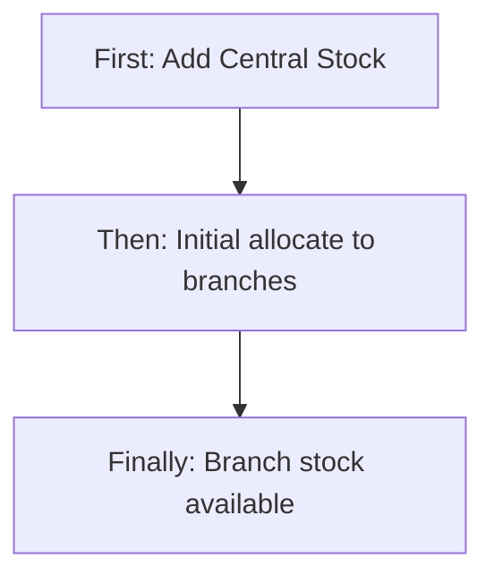

### 9.2 Branch manager — Request from Central and receive

**First:** My Request → Add Request for consumables.  
**Then:** Submit to Central approvers; wait for Approve → Dispatch → In Transit.  
**Finally:** Open Receive Stock → Confirm Receipt → branch ledger increases.

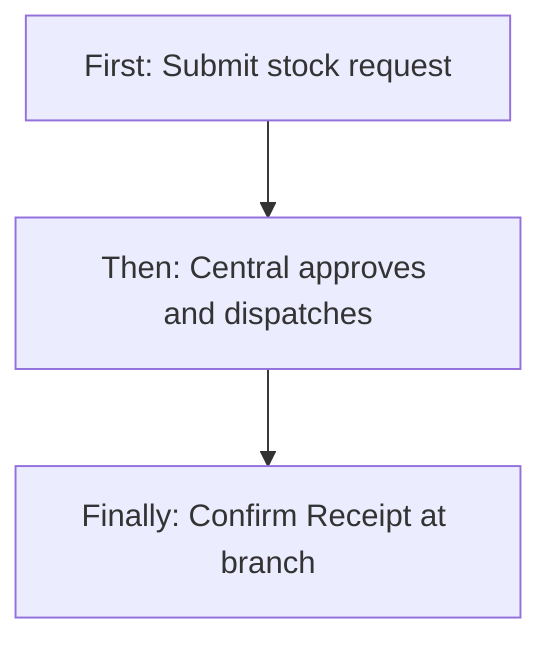

### 9.3 Source branch — Approve transfer and destination receives

**First:** Peer creates Direct Branch Transfer from HYD to BLR.  
**Then:** HYD approver Approves; system dispatches / moves to in-transit.  
**Finally:** BLR Confirm Receipt.

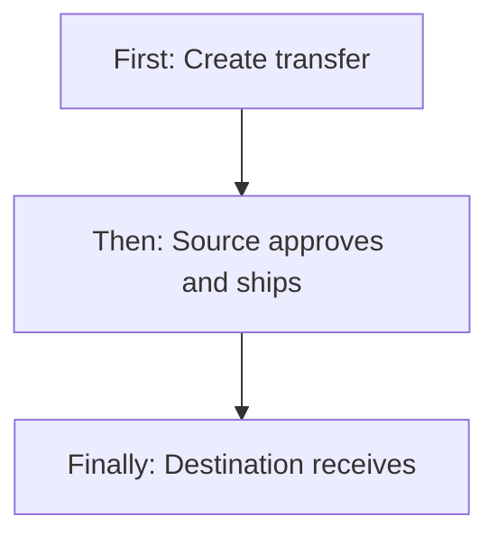

### 9.4 Approver — Reject or Hold

**First:** Open Received Requests.  
**Then:** Hold (wait) or Reject with reason.  
**Finally:** Requester sees Rejected/Hold; no stock reserved on Reject.

---

## 10. Cross-Module Interactions

| Module | Interaction |
|--------|-------------|
| **Product Master** | Every line needs an Active product ID; Base UOM/HSN copied; batch/expiry live on **central stock**, not product |
| **Branch Management** | Branch IDs on ledgers, requests, transfers |
| **Purchase Order** | Optional PO reference on central entry; PO status may sync from received central qty — not full GRN |
| **Vendor** | Supplier on central entry |
| **Role Configuration** | Request **receiver roles** for Stock Management drive who gets submit notifications / inbox eligibility |
| **Bills** | Free-text GRN reference on bills is **not** wired to stock receive |
| **Notifications** | Transfer pending/approved, low stock alerts |

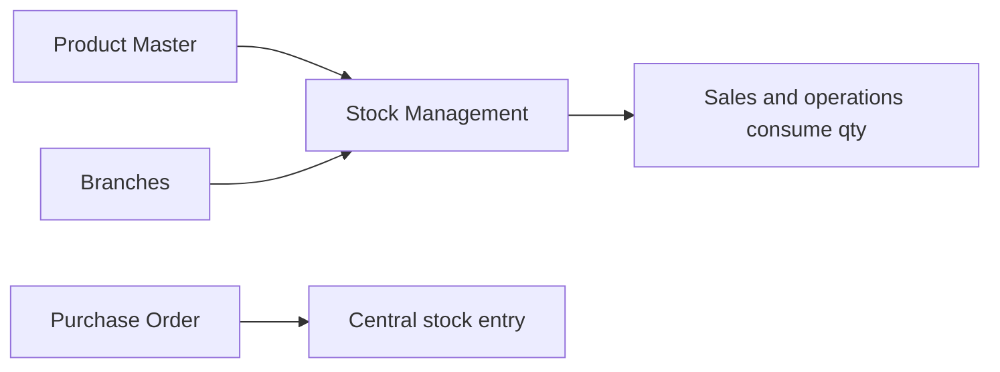

---

## 11. Data the Business Cares About

| Attribute | Meaning |
|-----------|---------|
| Central entry ID | Inbound lot (e.g. CSTK-…) |
| Product / Branch | What and where |
| Assets / Consumable / Resell qty | Stock type split |
| Asset ID / condition / status | Serialized unit identity |
| Asset assignment | Branch Pool or Employee (**not** Customer — missing) |
| Asset branch location | Where the unit currently sits (may disagree with ledger after initial allocate) |
| Reserved / In-Transit | Pipeline qty |
| Available pool | What can still be approved/allocated |
| Batch / Mfg / Expiry | Lot quality dates (central entry) |
| Request / Transfer ID | Movement documents |
| Status | Draft → … → Received / Rejected / Revoked |
| Logistics | Dispatch date, carrier, LR number |
| Package condition on receive | Good / Damaged / Missing |
| Movement log | Audit of every ledger change |

---

## 12. Rules, Validations & Constraints

- Assets + Consumable + Resell must equal Total on central entry.
- Cannot approve more than **available pool** at supply point.
- Dispatch requires enough **reserved**.
- Receive (Good): quantities must **exactly** match approved/dispatched; confirm checkbox required; received date not in future.
- Transfer From branch ≠ To branch.
- Requests to Central: supply = Central; destination = requesting branch.
- Soft delete central entry → Inactive.
- Partially Received status exists in language but **is not applied** by current receive logic.

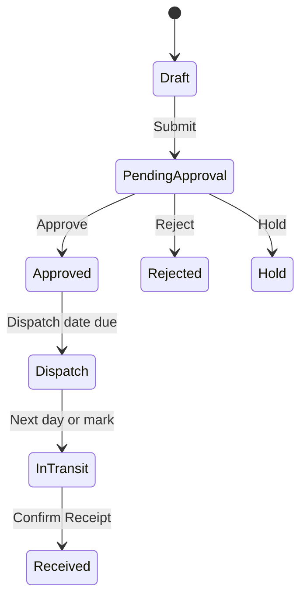

---

## 13. Loopholes, Gaps & Current Limitations

1. **No professional Good Transfer Receipt / GRN document** — only Confirm Receipt on the same request/transfer.
2. **No partial receive** — cannot accept part of a shipment and leave remainder in transit (enum unused).
3. **Report Issue does not reverse in-transit ledger** like a formal return-to-source.
4. **Mark In Transit / Dispatch APIs exist without UI buttons** — operators depend on scheduler.
5. **Receive button on lists gated by Edit**, while API also allows Request/Approve — permission mismatch.
6. **Branch Transfer route** mapped under Branch Management in route guard while feature is Stock — access confusion.
7. **Dead edit links** to missing `/edit-stock-request` route.
8. **Orphan receiving mode** on view request never linked from navigation.
9. **Initial allocation** is instant and irreversible via simple UI undo; for **assets** it moves ledger qty **without** moving Asset Unit branch (see §4F).
10. **Central delete** does not auto-roll back allocations.
11. **Batch/expiry** only on central entries — not on every branch transfer line or per Asset ID.
12. **PO ≠ automatic stock** without creating a central entry.
13. Stock Ledger filters/pagination weaker than dashboard (large client fetch).

### Asset-specific gaps (see §4F for full depth)

14. **Manual Asset ID creation missing in practice** — MANUAL does not insert units; Central UI only offers AUTO; no serial import/mapping.
15. **Customer allocation missing** — no customer/site on Asset Unit; cannot issue/return assets to customers from Stock.
16. **Ledger ↔ Unit location mismatch** after initial allocation to branches.
17. **Direct-to-Employee on Add** field mapping fragile across UI and service.
18. **No day-to-day asset reassignment screen** (pool ↔ employee ↔ quarantine) despite API support.
19. **Quarantine on receive** supported in service, omitted in Receive UI.
20. **Asset history API unused / empty** for Asset-referenced timeline.
21. **Available-for-transfer “Current Assignment”** often shows false Branch Pool.
22. **Issued status** rarely set when employee holds a unit.
23. **No cross-module custody** with Customers / Contracts / Tasks for the same Asset ID.

---

## 14. Existing Functionality Summary

**Available today:**
- Central stock add/edit/view/soft-deactivate
- Initial Central → Branch allocation
- Stock request lifecycle with recipients, approve/reject/hold
- Branch → Branch transfer with source approval
- Scheduler-driven dispatch and in-transit
- Receive Stock confirmation (exact qty)
- Ledger buckets + movement history
- Asset unit tracking for transfers (AUTO IDs; Branch Pool / Employee on receive)
- Dashboard + My Request + Received Requests tabs
- RBAC Read/Add/Edit/Delete/Request/Approve/Export

**Not available:**
- Standalone GTR/GRN voucher
- Partial receive / partial in-transit close
- Formal reject-in-transit return workflow
- UI buttons for manual mark-in-transit / dispatch (API only)
- Full QC quarantine document chain
- **Manual Asset ID create/import** and manufacturer serial mapping
- **Customer / site asset allocation** and return-from-customer
- Guaranteed ledger↔unit sync on initial branch allocation
- Day-to-day asset reassignment UI and usable per-asset history

---

## 15. Reference — APIs, Screens & UI Actions

### 15.1 APIs

| Method | Path | Purpose (plain language) | Used by |
|--------|------|--------------------------|---------|
| GET | `/api/v1/stock/dashboard` | Product stock list | Stock Dashboard |
| GET | `/api/v1/stock/dashboard/detail` | Product stock detail | Detail drills |
| GET | `/api/v1/stock/ledger` | Movement ledger | Product Ledger |
| POST/PUT/GET/DELETE | `/api/v1/stock/central-entries` | Central entry CRUD (delete=inactive) | Add/Edit/View Central |
| POST | `/api/v1/stock/central-entries/initial-allocations` | Push Central → Branch now | Allocation |
| GET | `/api/v1/stock/requests/my` | My requests | My Request tab |
| GET | `/api/v1/stock/requests/received` | Approver-related list | Inbox support |
| POST | `/api/v1/stock/requests` / upsert / submit / revoke | Create/submit/revoke request | Add Stock Request |
| POST | `/api/v1/stock/requests/receive` | Confirm request receipt | Receive Stock |
| GET/POST | `/api/v1/stock/approval/requests/*` | Inbox, approve, reject, hold | Approval screens |
| POST | `/api/v1/stock/transfers` | Create transfer | Branch Transfer |
| POST | `/api/v1/stock/transfers/approve|reject|hold` | Transfer decisions | Transfer Approval |
| POST | `/api/v1/stock/transfers/dispatch` | Manual dispatch | API; little/no UI |
| POST | `/api/v1/stock/transfers/mark-in-transit` | Manual in-transit | API; no UI button |
| POST | `/api/v1/stock/transfers/receive` | Confirm transfer receipt | Receive Stock |
| POST | `/api/v1/stock/ops/requests/run-dispatch-scheduler` | Run dispatch job now | Ops/admin |

### 15.2 Frontend Screen Routes

| Route | Screen purpose | Primary users |
|-------|----------------|---------------|
| `/stock-dashboard` | Main stock hub + tabs | All stock users |
| `/add-to-central-stock` | Add central stock | Central / Add |
| `/edit-central-stock/:id` | Edit central entry | Edit |
| `/view-central-stock/:id` | View central entry | Read |
| `/stock-ledger` | Product ledger | Read |
| `/add-stock-request` | Create/edit request | Request |
| `/view-stock-request/:id` | View request timeline | Request / Read |
| `/receive-stock/:id` | Confirm receipt | Destination |
| `/add-request-approval` | Approve stock request | Approve |
| `/edit-request-approval/:id` | Edit approval draft | Approve |
| `/view-request-approval/:id` | View approval | Approve / Read |
| `/branch-transfer/new` | Create branch transfer | Add |
| `/add-transfer-approval` | Approve branch transfer | Approve |

### 15.3 Click Events, Filters, Search & Controls

| Screen | Control | Type | What happens |
|--------|---------|------|--------------|
| Stock Dashboard | Add Stock | Menu | Add to Central / Direct Branch Transfer |
| Stock Dashboard | Branch filter | Filter | Scope Central vs branch |
| Stock Dashboard | Search / filters | Filter | Refine product list |
| Stock Dashboard | My Request tab | Tab | Requester documents |
| Stock Dashboard | Received Requests tab | Tab | Approver inbox |
| My Request | Add Request | Button | Open request form |
| My Request | Receive | Row action | Open Receive Stock if Dispatch/In Transit |
| My Request | Revoke | Action | Cancel draft/pending |
| Received Requests | Approve | Row action | Open approval form |
| Request Approval | Approve / Reject / Hold | Buttons | Decision + ledger reserve on approve |
| Branch Transfer | Submit for approval | Button | Create pending transfer |
| Transfer Approval | Approve / Reject / Hold | Buttons | Source decision |
| Receive Stock | Confirm Receipt | Button | Post destination stock; clear in-transit |
| Receive Stock | Report Issue | Button | Flag issue (limited ledger impact) |
| Central Stock | Initial allocation | Section | Immediate Central → Branch push |
| Product Ledger | Add Stock Entry | Button | Navigate to central add when permitted |
