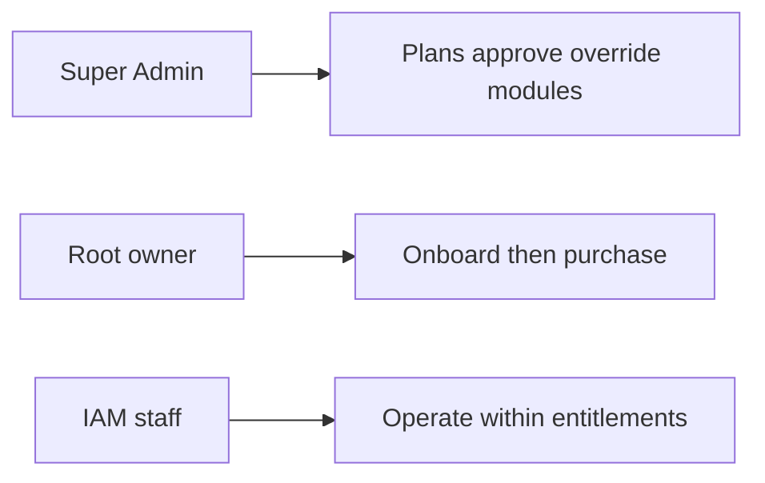
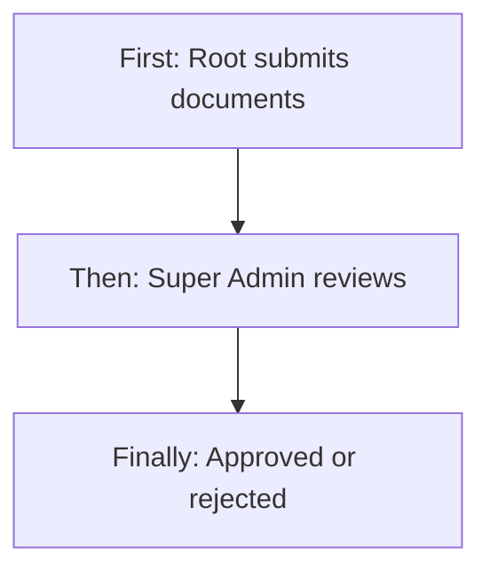
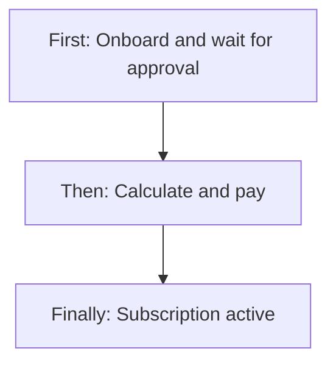
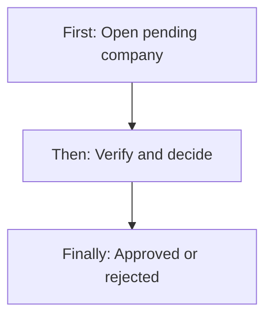
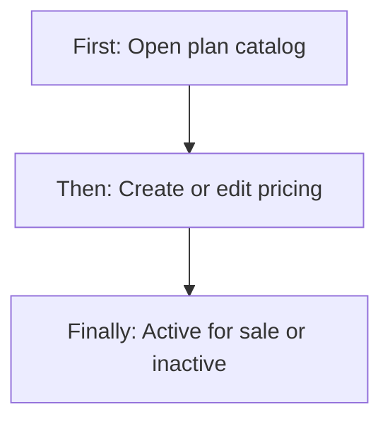
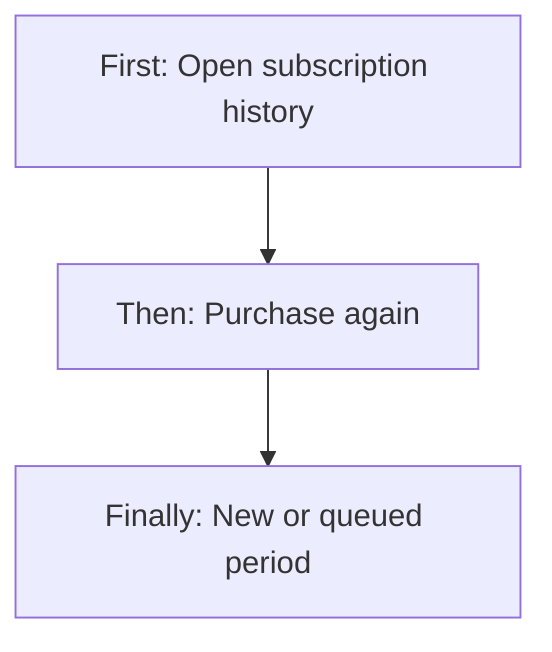
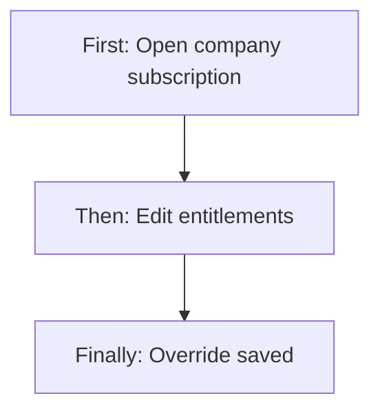
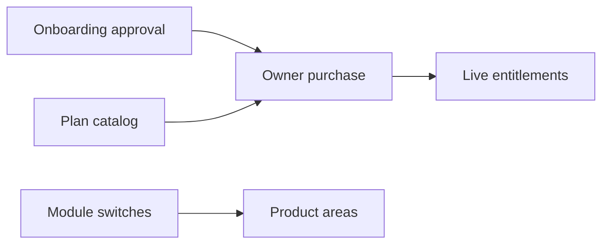
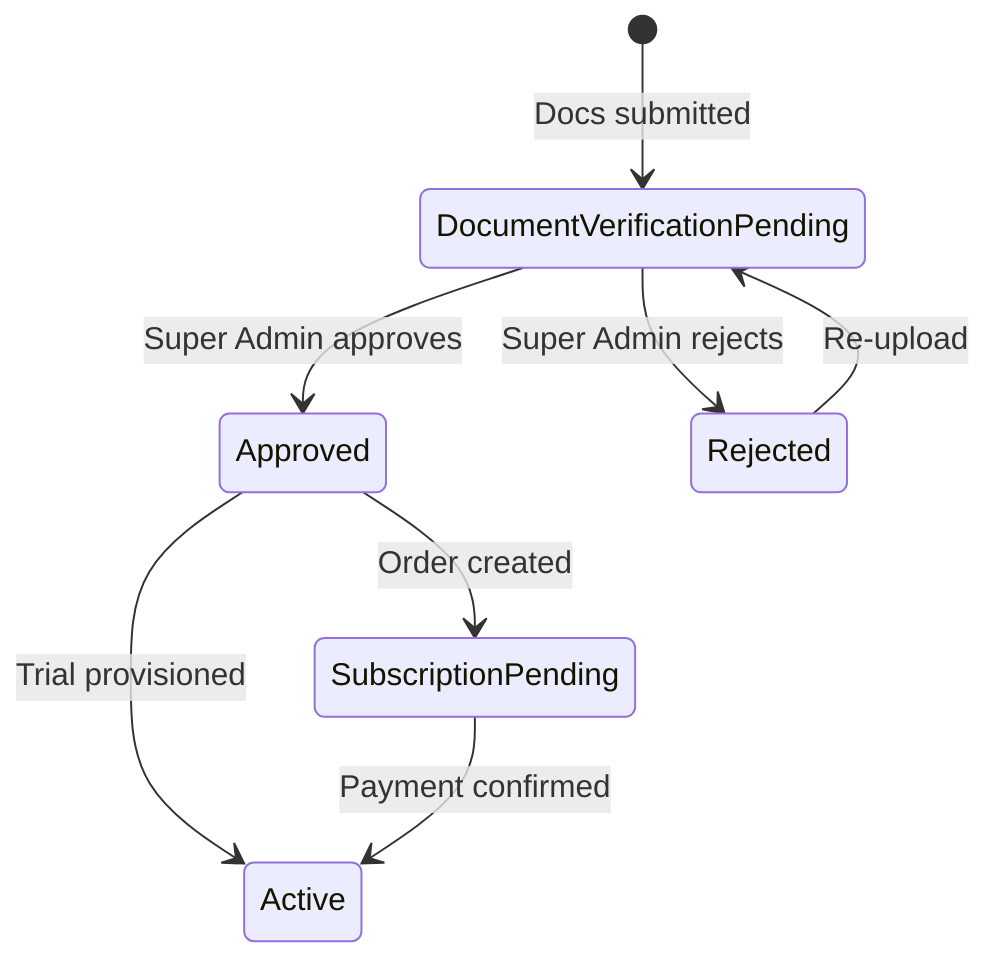
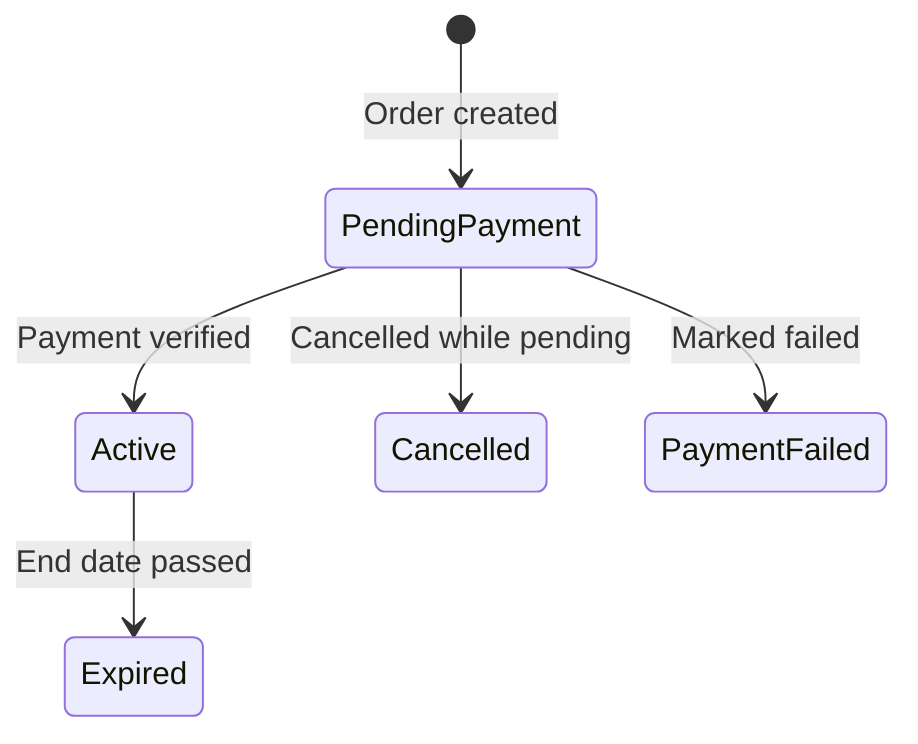

# Subscription Management, User Onboarding (Access Grant) & Super Admin Commercial Control — Product & Business Documentation

## 1. Purpose & Business Need

Seravion Connect sells **company access and capacity**. A new company cannot buy or run a subscription until it has completed **user onboarding** (company profile and documents) and received a **Super Admin access decision**. After that, the company owner purchases (or receives trial) capacity — branches, technicians, users, optional customer apps and chatbot — while Super Admin maintains the **plan catalog**, overrides live entitlements, and allocates product modules.

This document stays inside that commercial and Super Admin boundary:

- **User onboarding → approval** as the gate to subscription (submit documents; Super Admin approve/reject).
- **Subscription plan CRUD** (create, list, detail, update, soft inactivate).
- **Company subscription purchase lifecycle** (calculate, pay, activate, history, repurchase).
- **Super Admin company commercial tools** (subscription history, override, modules, email config, documents, overview).

It does **not** restate employee hiring, tenant Role Configuration matrices, or day-to-day ERP module operations beyond how entitlements and module switches affect access.

**Outcomes today:** dynamic plans; multi-period pricing with overages and add-ons; owner checkout after approval; trial at approval; overrides without a full new checkout; module allocation per company; clear pending → active → expired commercial states. Growth is handled by **new plans**, **buying again**, and **overrides** — not by a separate prorated upgrade engine or silent auto-charge renewal.

---

## 2. Users & Roles (who uses this and why)

### 2.1 Seravion Super Admin

Creates and retires subscription plans; reviews onboarding submissions; approves or rejects companies; enables trial; views and overrides company subscriptions; assigns modules; maintains company documents and email settings on the approved-company view.

### 2.2 Root user (company CEO / owner)

Completes onboarding (profile + documents), waits for approval, then calculates and pays for plans, views purchase history, and starts another purchase when capacity or period must continue. Cannot create platform plans.

### 2.3 IAM / tenant staff

Do **not** purchase subscriptions or manage the plan catalog. They work inside limits set by the company’s **active entitlements** and by modules Super Admin turned on for that company.

---

## 3. Access Control (RBAC)

### 3.1 How access works in this scope

Access here is **login-role based**, not a fine-grained “Subscription Management” module matrix on every button:

| Access level | Who | What they may do here |
|--------------|-----|------------------------|
| **Platform Super Admin** | Seravion login | Full Super Admin company and plan screens; all company-management commercial APIs |
| **Company owner (CEO / Root)** | Root login | Onboarding submit; plan dropdown and purchase APIs; own subscription list/detail; cannot mutate global plans |
| **IAM employee** | IAM login + Account ID | No plan create/purchase screens; constrained by active paid entitlements when creating capacity (branches/users/etc.) |

Super Admin UI bypasses ordinary tenant module checks. Owner purchase actions require the **company owner** role path. Staff permissions for Inventory/HR/etc. are outside this document; commercially, staff inherit **capacity limits** from the active subscription snapshot and **product areas** from Super Admin module assignment.

### 3.2 Role × action matrix (subscription & onboarding grant)

| Role | View list | View detail | Add | Edit | Inactive / Delete | Submit request | Receive / act | Approve | Reject |
|------|-----------|-------------|-----|------|-------------------|----------------|---------------|---------|--------|
| Super Admin | Yes (companies, plans, company subs) | Yes | Yes (plans) | Yes (plans, overview, override, modules, email, docs) | Soft-inactivate plans | No (reviewer, not requester) | Yes (pending companies) | Yes (onboarding) | Yes (onboarding) |
| Root / CEO | Yes (own purchases; active plans dropdown) | Yes (own sub detail; plan by id) | Yes (create payment order / purchase) | No plan catalog edit | Cancel/fail pending order in engine (limited UI) | Yes (onboarding docs = await approval) | No SA inbox | No company approve | No company approve |
| IAM staff | No commercial purchase lists | No | No | No | No | No | No | No | No |

**Record-level:** owners only act on **their** company subscription; Super Admin acts on **any** company. Plan catalog is global.

---

## 4. Capabilities & Features

### 4.1 User onboarding gate (before subscription)

Root submits company information and documents. Status moves to document verification pending. Super Admin receives the company in Pending, verifies documents, and **Approves** (optional trial) or **Rejects** (owner re-uploads). Subscription purchase is allowed only when the company is approved or already in subscription-pending / active commercial paths as designed.

### 4.2 Dynamic subscription plan catalog

Super Admin creates plans with included counts, validity, active/inactive, pricing matrix (monthly/quarterly/yearly/custom + extras), and optional Customer App / Chatbot add-ons. Edit updates the catalog; soft inactivate retires the plan from **new** sales without wiping historical purchases.

### 4.3 Purchase, pricing, billing

Owner selects an active plan and period, raises quantities above included bases, toggles add-ons, **calculates** (extras + tax), **pays**, then activation marks the subscription active and the company commercially active (and provisions workspace if still needed).

### 4.4 Lifecycle & repurchase (“upgrade” as built)

Statuses: pending payment → active → expired; pending may become cancelled or payment failed. Buying again (including UI labeled Upgrade) reuses the purchase screen; a new period can start after the current end when an active sub still exists. Auto-renew preference is stored but does not auto-charge.

### 4.5 Super Admin commercial control on a company

Subscription history, live **override** (end date, counts, add-ons), **modules** on/off, email provider config, document replace, overview edit — all on the approved-company view.

### 4.6 Feature allocation (two layers)

| Layer | Configured by | Controls |
|-------|---------------|----------|
| Commercial entitlements | Plan + purchase + override | Branch / tech / user / app counts; chatbot purchased |
| Product modules | Super Admin Modules tab | Which product areas exist for that company (independent of plan row) |

### 4.7 Super Admin shell extras (in scope lightly)

- **Subscription Plans** nav — plan CRUD (core).
- **Company Management** nav — onboarding approval + commercial tabs (core).
- **Reports** — placeholder only (no live subscription reports).
- Platform Role Management exists in the same shell but is **not expanded here** (see auth/RBAC documentation).

---

## 5. CRUD Operations

### 5.1 Create (Add)

**Onboarding package (Root)**  
**First:** Complete company information and upload documents.  
**Then:** Submit; status becomes verification pending.  
**Finally:** Item appears in Super Admin Pending list (awaiting approve/reject).

**Subscription plan (Super Admin)**  
**First:** Open Subscription Plans → Add Plan.  
**Then:** Enter name, limits, validity, status, pricing matrix, add-ons.  
**Finally:** Save; active plans appear in owner dropdowns.

**Company subscription / order (Root)**  
**First:** Open Subscription after approval; choose plan and quantities.  
**Then:** Calculate → Pay Now → complete checkout.  
**Finally:** Pending payment record created; on verify/webhook → Active subscription.

### 5.2 Read — List

| List | Rendering |
|------|-----------|
| Plans (SA) | Cards/grid; search; stats total/active/inactive; Edit / Inactivate actions |
| Companies (SA) | Search (≥3 chars), Pending/Approved/Rejected chips, pagination; commercial date columns |
| Purchases (Root) | Table + filters (including plan); View detail; Purchase New Plan |
| Company subscriptions (SA tab) | Current + past tables |

Empty states when no matches.

### 5.3 Read — Detail / Get details

| Record | What loads |
|--------|------------|
| Plan (edit page / owner select) | Full limits, prices, add-on flags |
| Pending company | Profile + documents for decision |
| Approved company tabs | Overview, docs, subscription snapshot, email, modules |
| Subscription detail | Plan, resources, pricing, payment refs, dates, auto-renew display |
| Calculate result | Subtotal, tax, total, derived dates |

### 5.4 Update (Edit)

| Record | Who | What changes |
|--------|-----|--------------|
| Plan | Super Admin | All catalog fields on edit page; save updates list prices for **future** buys |
| Company overview / docs / email / modules | Super Admin | Tab edits on approved view |
| Subscription override | Super Admin | End date, counts, customer app/chatbot flags |
| Onboarding after reject | Root | Re-upload documents (status back to verification pending) |
| Pending order status | Owner path in engine | Cancel / payment failed only from pending (limited UI exposure) |

### 5.5 Inactive / Delete

| Record | Behavior |
|--------|----------|
| Plan | **Soft inactivate** — removed from new sales; existing company subscriptions remain; confirmation shows companies still on plan |
| Custom offer plans | Can auto-inactivate when offer validity ends |
| Active subscription | **Expires** when end date passes (scheduled); not a user “delete” |
| Pending payment | Cancelled or payment failed — not a hard purge of history lists |
| Company | Reject / approve — no generic “delete company” in this commercial flow |
| Reactivate plan | Edit plan and set status Active again (or create a new plan) |

---

## 6. Request & Approval Flows

### 6.1 User onboarding approval (required before / alongside subscription)

This **is** the request/approve workflow for commercial access.

**Submit request:** Root submits company profile and documents → verification pending.

**Receive / inbox:** Super Admin Company Management → Pending → open details.

**Approve / Reject / Return:**

- **Approve** — verified documents; optional trial; unlocks subscription purchase and may provision workspace when trial is enabled.
- **Reject** — reason required; Root must re-upload (return path). There is no separate “Returned” status name.
- UI “Pending” as a save status is not a reliable onboarding status (see Gaps).

### 6.2 Subscription purchase

**This module does not use a second request/approve queue for paying.** Calculate → create order → pay → verify/webhook activates. Super Admin does not “approve” each payment; the payment provider confirmation does.

### 6.3 Plan catalog

**This module does not use request/approve for plans.** Super Admin creates, edits, and inactivates plans directly.

---

## 7. Forms — Add vs Edit Field Access

### 7.1 Subscription plan (Super Admin)

| Field (business name) | On Add | On Edit | Notes |
|----------------------|--------|---------|-------|
| Plan name | Required, editable | Editable | Unique across catalog |
| Description | Optional | Editable | |
| Branch / technician / user counts | Required (>0) | Editable | Included base capacity |
| Customer app count | Optional | Editable | Can imply Customer App enabled |
| Valid from / valid to | Required | Editable | Offer window |
| Status Active / Inactive | Selectable | Selectable | Sales availability |
| Pricing matrix (period × resource + extra) | Required filled | Editable | Drives calculate |
| Customer App toggle + prices | Optional | Editable | Add-on |
| Chatbot toggle + prices | Optional | Editable | Add-on (no extra column in UI) |

### 7.2 Owner purchase form

| Field (business name) | On first purchase | On repurchase / “upgrade” | Notes |
|----------------------|-------------------|---------------------------|-------|
| Plan | Required dropdown | Same | Active plans only |
| Billing period | Monthly/Quarterly/Yearly | Same | Custom period supported in engine, not in these tabs |
| Quantities | Steppers ≥ included | Same | |
| Customer App / Chatbot | If plan allows | Same | |
| Auto-renew | Sent as on | Same | Displayed later; not a charge engine |
| Pay Now | Creates new order | Creates **another** order | Not in-place edit of old sub |

### 7.3 Subscription override (Super Admin)

| Field (business name) | Access | Notes |
|----------------------|--------|-------|
| Subscription ID | Locked | Identifies current sub |
| New end date | Editable | Extends/moves period |
| Branch / technician / user counts | Editable (>0) | Live entitlements |
| Customer App switch + count | Editable | |
| Chatbot switch | Editable | |

### 7.4 Onboarding approval (Super Admin)

| Field (business name) | On approval Save | Notes |
|----------------------|------------------|-------|
| Document verified ticks | Required for approve | |
| Approve / Reject | Required | |
| Rejection reason | Required on reject | |
| Enable trial + dates | Optional | |
| Admin comment | Optional | |
| Profile fields on page | Not saved by Approve | Use Overview edit after |
| Branch/tech steppers on page | Not on approval save contract | Operator context |

---

## 8. Lists, Dropdowns, Details & Data Rendering

### 8.1 List rendering

- **Plans:** Newest/catalog cards; search by name/description; active/inactive stats; inactivate confirms impact count.
- **Companies:** Status chips; search; pagination; row routing to pending details vs approved view.
- **Purchases:** Current vs past; filters; detail modal with Upgrade / purchase-again CTA.

### 8.2 Dropdowns & lookups

| Dropdown | Options | Dependents |
|----------|---------|------------|
| Plan (owner) | Active plans | Loads plan detail → sets minimum steppers and add-on visibility |
| Plan (purchase filters) | Plans for history filter | Narrows purchased list |
| Billing period tabs | Monthly / Quarterly / Yearly | Recalculates price |
| Company status chips | Pending / Approved / Rejected | Reloads company list |
| Modules (SA) | Platform module catalog | Toggles per company |

### 8.3 Detail / get-details rendering

Selecting a plan fills included counts and prices. Opening a pending company fills profile + docs for decision. Opening subscription detail fills commercial snapshot (quantities, tax, payment ids, dates). Override form prefills from current subscription. Module tab shows switches (read-only until Edit). Calculate response fills totals used at Pay Now (prefer over local breakdown modal).

---

## 9. How It Works (end-to-end user flows)

### 9.1 Root — Onboard then purchase

**First:** Submit company profile and documents; wait for Super Admin.  
**Then:** After approval, open Subscription, configure plan and quantities, pay.  
**Finally:** Subscription active; continue to email config / dashboard as offered.

1. Company information → documents → pending.  
2. If rejected → re-upload → pending again.  
3. Approved → Subscription → plan/period/qty → Pay Now.  
4. Payment success → configuration → live use under entitlements.

### 9.2 Super Admin — Approve onboarding (access grant)

**First:** Open Pending company.  
**Then:** Verify documents; choose Approve (optional trial) or Reject.  
**Finally:** Save; owner can buy (or use trial path); rejected owners re-upload.

### 9.3 Super Admin — Plan CRUD

**First:** Open Subscription Plans; Add or Edit.  
**Then:** Configure limits and pricing; Save.  
**Finally:** Active plan is sellable; or Mark Inactive to stop new sales.

### 9.4 Root — Repurchase / continue capacity

**First:** Open purchased list or detail.  
**Then:** Purchase New Plan / Upgrade Plan (same purchase screen).  
**Finally:** New paid period activates (or queues after current end).

### 9.5 Super Admin — Override entitlements

**First:** Approved company → Subscription tab → Edit override.  
**Then:** Change end date and/or counts/add-ons.  
**Finally:** Save Override; live entitlements update without checkout.

---

## 10. Cross-Module Interactions

| Interaction | Handoff |
|-------------|---------|
| Onboarding approve | Unlocks subscription purchase UI |
| Approve + trial | May provision company workspace before payment |
| Payment activate | Company commercially ACTIVE; workspace if still needed |
| Active entitlements | Cap branch/user/tech/app style operations |
| SA modules tab | Which product areas exist for the company |
| Plan inactivate | Stops new dropdown selection only |
| Email config | Adjacent go-live after payment success |

---

## 11. Data the Business Cares About

| Attribute | Meaning |
|-----------|---------|
| Onboarding status | Pending details/docs/verification, approved, rejected, subscription pending, active |
| Document verification | Super Admin ticks per file |
| Trial flags / dates | Temporary access at approval |
| Plan name, included counts, prices, add-ons, validity, active/inactive | Catalog |
| Purchase quantities, dates, tax, total, payment refs, status | Company subscription |
| Auto-renew preference | Stored intent |
| Override end date / counts | Live commercial adjustment |
| Assigned modules | Product surface for company |

---

## 12. Rules, Validations & Constraints

### Onboarding → commercial

### Subscription purchase lifecycle

### Rules

- Unique plan names; included branch/tech/user > 0; validity end after start; meaningful pricing required.
- Owner purchase requires approved (or eligible active) company; plan must be Active; steppers ≥ included bases.
- GST applied in calculate; checkout currency INR in current billing.
- Inactivate plan ≠ expire existing purchases.
- Override counts must stay positive where the form requires.
- Approve requires verified docs in UI; reject requires reason.
- IAM users cannot run purchase APIs.
- Only Super Admin mutates global plans and company overrides/modules.

---

## 13. Loopholes, Gaps & Current Limitations

1. **Upgrade = repurchase** — no prorated mid-cycle upgrade/downgrade wizard.  
2. **Auto-renew does not auto-charge.**  
3. **Custom billing** in engine; owner UI tabs omit Custom.  
4. **Yearly “Save 20%”** cosmetic.  
5. **Plan does not auto-assign modules** — SA Modules tab is separate.  
6. **Trial vs paid entitlement checks** — trial opens access; some capacity checks expect an active paid subscription.  
7. **Approval Pending save / capacity steppers** — UI options not fully aligned with approval save contract.  
8. **Breakdown modal** may differ from server calculate used at Pay Now.  
9. **Reports** placeholder; Support/Settings unwired in SA shell.  
10. **Pending order cancel/fail** — engine supported; little owner UI.  
11. **Subscription detail by id** — available in commercial APIs; SA UI mainly uses list + override.

---

## 14. Existing Functionality Summary

- Onboarding submit → Super Admin approve/reject/re-upload gate to buy.  
- Plan create / list / detail / update / soft inactivate (+ expired custom offer handling).  
- Owner calculate, order, pay, verify, list, detail, repurchase.  
- Queued start after current period when buying while still active.  
- SA subscription history + live override.  
- SA modules, email config, documents, overview on approved companies.  
- Daily expiry of ended active subscriptions.  
- Payment provider checkout + webhook activation.

---

## 15. Reference — APIs, Screens & UI Actions

### 15.1 APIs

| Method | Path | Purpose (plain language) | Used by (screen/flow) |
|--------|------|--------------------------|------------------------|
| POST | `/api/v1/root/subscription-plans` | Create plan | SA Add Plan |
| PUT | `/api/v1/root/subscription-plans` | Update plan | SA Edit Plan |
| GET | `/api/v1/root/subscription-plans` | Plan detail | Edit load; owner select |
| DELETE | `/api/v1/root/subscription-plans/inactivate` | Soft-inactivate plan | SA inactivate |
| GET | `/api/v1/root/subscription-plans/get-all` | List plans + counts | SA plan list |
| GET | `/api/v1/root/subscription-plans/dropdown` | Active plans for buyers | Owner purchase |
| POST | `/api/v1/company/subscription/calculate` | Price breakdown | Owner Subscription |
| POST | `/api/v1/company/subscription/create-order` | Start payment order | Pay Now |
| POST | `/api/v1/company/subscription/verify-payment` | Activate after pay | Checkout return |
| POST | `/api/v1/company/subscription/list` | Purchase history | Purchased list; SA sub tab |
| GET | `/api/v1/company/subscription/detail` | One purchase | Detail modal |
| PATCH | `/api/v1/company/subscription/update-status` | Cancel/fail pending | Engine (limited UI) |
| POST | `/api/v1/public/webhooks/razorpay` | Provider payment events | Background |
| POST | `/api/v1/company-details/submit` | Onboarding profile | Company information |
| GET | `/api/v1/company-details` | Onboarding bundle | Root routing |
| POST | `/api/v1/company/documents/upload` | Submit docs | Company documents |
| PUT | `/api/v1/company/documents/re-upload` | Return path after reject | Re-upload |
| GET | `/api/v1/super-admin/company-management/list` | Company list | Company Management |
| GET | `/api/v1/super-admin/company-management/detail` | Pending review | Approval details |
| PUT | `/api/v1/super-admin/company-management/approval` | Approve/reject/trial | Access grant |
| GET/PUT | `/api/v1/super-admin/company-management/overview` | Overview edit | Approved view |
| GET | `/api/v1/super-admin/company-management/documents` | Docs list | Documentation tab |
| PUT | `/api/v1/super-admin/company-management/documents/{documentId}/file` | Replace file | Documentation tab |
| GET/PUT | `/api/v1/super-admin/company-management/brevo-config` | Email config | Email tab |
| GET/PUT | `/api/v1/super-admin/company-management/modules` | Module allocation | Modules tab |
| GET | `/api/v1/super-admin/company-management/subscriptions` | Current + past | Subscription tab |
| PUT | `/api/v1/super-admin/company-management/subscriptions/override` | Live override | Override form |
| GET | `/api/v1/super-admin/company-management/subscriptions/detail` | Sub by id | Commercial detail |
| GET | `/api/v1/modules` | Module catalog | Modules picker |
| POST | `/api/v1/brevo-config` | Owner email after pay | Email config (Root) |

### 15.2 Frontend Screen Routes

| Route | Screen purpose | Primary users |
|-------|----------------|---------------|
| `/company-information` | Onboarding profile | Root |
| `/company-documents` | Docs submit / pending / re-upload | Root |
| `/subscription` | Purchase / repurchase | Root |
| `/subscription-purchased` | History | Root |
| `/payment-success` | Post-pay continue | Root |
| `/email-config` | Outbound email setup | Root |
| `/seravionadmin/company-management` | Company list | Super Admin |
| `/seravionadmin/company-management/details` | Approve/reject | Super Admin |
| `/seravionadmin/company-management/view` | Commercial admin tabs | Super Admin |
| `/seravionadmin/subscription-plans` | Plan list | Super Admin |
| `/seravionadmin/subscription-plans/create` | Create plan | Super Admin |
| `/seravionadmin/subscription-plans/edit/:planId` | Edit plan | Super Admin |
| `/seravionadmin/reports` | Placeholder | Super Admin |

### 15.3 Click Events, Filters, Search & Controls

| Screen / Route | Control | Type | What happens |
|----------------|---------|------|--------------|
| `/company-information` | Profile fields, logo, location, Save | Form | Submits onboarding profile |
| `/company-documents` | Upload cards, Submit, re-upload, pending modal | File+Click | Submit or return after reject |
| `/seravionadmin/company-management` | Search, status chips, pagination, View/Edit | Search+Filter | Pending inbox / approved open |
| `/seravionadmin/company-management/details` | Verify ticks, Approve/Reject, trial, comment, Save | Form | **Onboarding approval** |
| `/seravionadmin/subscription-plans` | Add Plan, search, stats, Edit, Inactivate | CRUD | Plan catalog |
| Create/edit plan | Limits, validity, status, pricing matrix, add-on toggles, Save/Cancel | Form | Plan create/update |
| Delete plan modal | Mark as Inactive | Click | Soft-inactivate |
| `/subscription` | Plan dropdown, period tabs, steppers, add-ons, calculate, Breakdown, Pay Now | Form+Click | Purchase |
| `/subscription-purchased` | Filters, View, Purchase New Plan | Filter+Click | History / repurchase |
| Subscription detail modal | Upgrade Plan | Click | Same purchase screen again |
| `/payment-success` | Continue to Configuration | Click | Email config |
| Company view Subscription tab | Tables, View, Edit override, Save Override | List+Form | History + live entitlements |
| Modules tab | Module switches, Save | Toggle | Product area allocation |
| Email / Docs / Overview tabs | Edit/Save, replace/download | Form+Click | Company commercial admin |
| Super Admin sidebar | Company Management, Subscription Plans, Reports, Logout | Nav | Shell navigation |

---

*Updated to the module-system-docs template with RBAC, CRUD, and approval coverage scoped to **Subscription**, **User Onboarding access grant**, and **Super Admin commercial control**. Broader auth/RBAC employee hiring content remains in `docs/modules/auth-onboarding-super-admin.md`.*
