# Task Management — Product & Business Documentation

This document describes **Task Management** as it exists today. It is written so a new person — dispatcher, branch supervisor, technician, or tester — can understand **how a job card is born**, **how recurring visits are planned from contract frequencies**, **how a customer ticket becomes a visit**, **how one site with many services is split**, and **what happens when each service has a different frequency**. **Office Manual Complete** for a technician whose role is named **Robert** is in [§4.10](#410-robert-role--office-manual-complete-not-a-create-door) (this is **not** a Manual create tab). Positive and negative tester cases are at the **end**.

**Start here:** [§1.0 Quick visual atlas](#10-quick-visual-atlas-read-this-first).

Related: [Contract Management](./contract-management.md) (sites, services, frequencies), [Invoicing](./invoicing.md) (visit-based auto draft after a task is completed).

---

## 1. Purpose & Business Need

A pest-control (or similar field) company must send people to **sites** on **dates**, with the **right services**, **technicians**, and **chemicals**, without booking the same person twice or using more visits than the sales order allows.

**Task Management** is the **job-card desk**. A task is one scheduled visit (one date + time window + site + one or more services + assigned people). Until a task exists, the contract’s “52 visits a year” is only a plan. After create, the technician can travel, work, complete, and the visit slot on the sales order is consumed.

**Outcomes today:** list by date (from calendar); create from **sales order** (single date or **recurring range**); create from a **customer ticket**; split cards **by site** or **by service**; preview recurring dates (OK / Warning / Blocked); edit **pending** tasks; reschedule; reassign; complete (office or field); cancel (server); PDF; calendar month view; notifications to assigned technicians.

There is **no Manual create door** on Add Task. Users only choose **From Sales Order** or **From Customer Tickets**.

**What this screen does not do:** it does not invent visit counts — planned visits come from the **sales order service line** (usually copied from the contract). It does not approve money. Recurring does **not** run on the ticket tab.

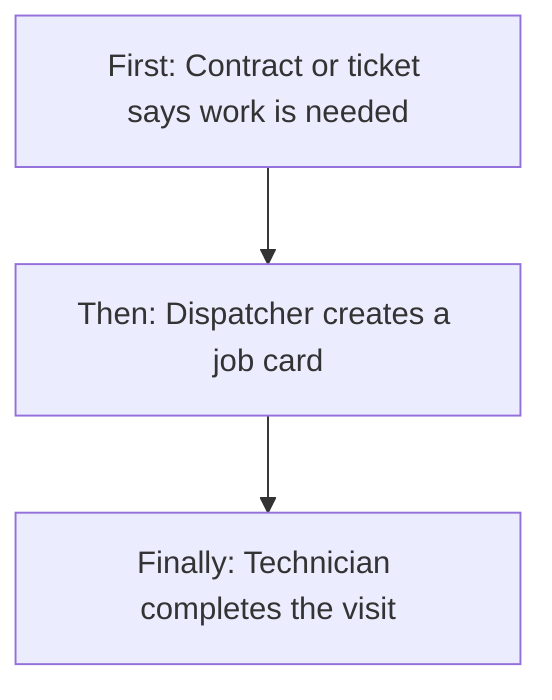


---

### 1.0 Quick visual atlas (read this first)

#### Whole field-ops system (you are here)

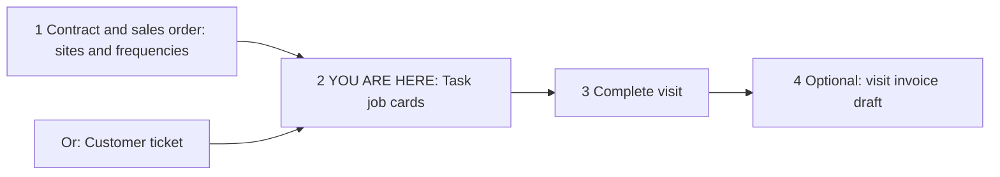


| Step | What it does                                                                                         |
| ---- | ---------------------------------------------------------------------------------------------------- |
| 1    | Contract / GMA / SO store **which services**, **how often**, **how many visits**, **preferred days** |
| 2    | **Tasks** turn that plan (or a ticket) into dated job cards with people and time                     |
| 3    | Complete consumes the visit (non-cancelled tasks count against the SO slot)                          |
| 4    | Invoicing may auto-draft a visit invoice when the contract plan is per-visit                         |


#### How a **new** task is born (two doors)

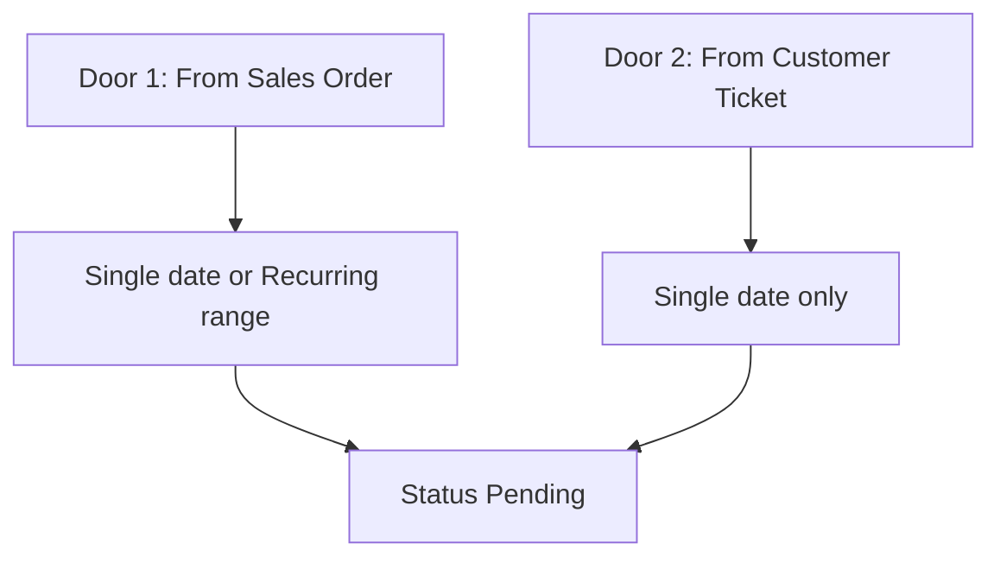


| Door                     | Tab on Add Task       | Source saved      | Recurring?                                | Needs open SO?                          |
| ------------------------ | --------------------- | ----------------- | ----------------------------------------- | --------------------------------------- |
| **From Sales Order**     | From Sales Order (SO) | `SALES_ORDER`     | **Yes** (When to visit = Recurring range) | **Yes** — SO must be **Open**           |
| **From Customer Ticket** | From Customer Tickets | `CUSTOMER_TICKET` | **No**                                    | Only if the ticket already linked an SO |


**There is no third “Manual” create tab.** Pick a ticket; customer, site, and services fill from that ticket. Recurring calendar is **SO tab only**.

*(Old records may still show source **Manual**. The server still allows that value. Add Task cannot create it — leftover loaders never run because the screen never switches off Customer Ticket.)*

#### Yes / No choices

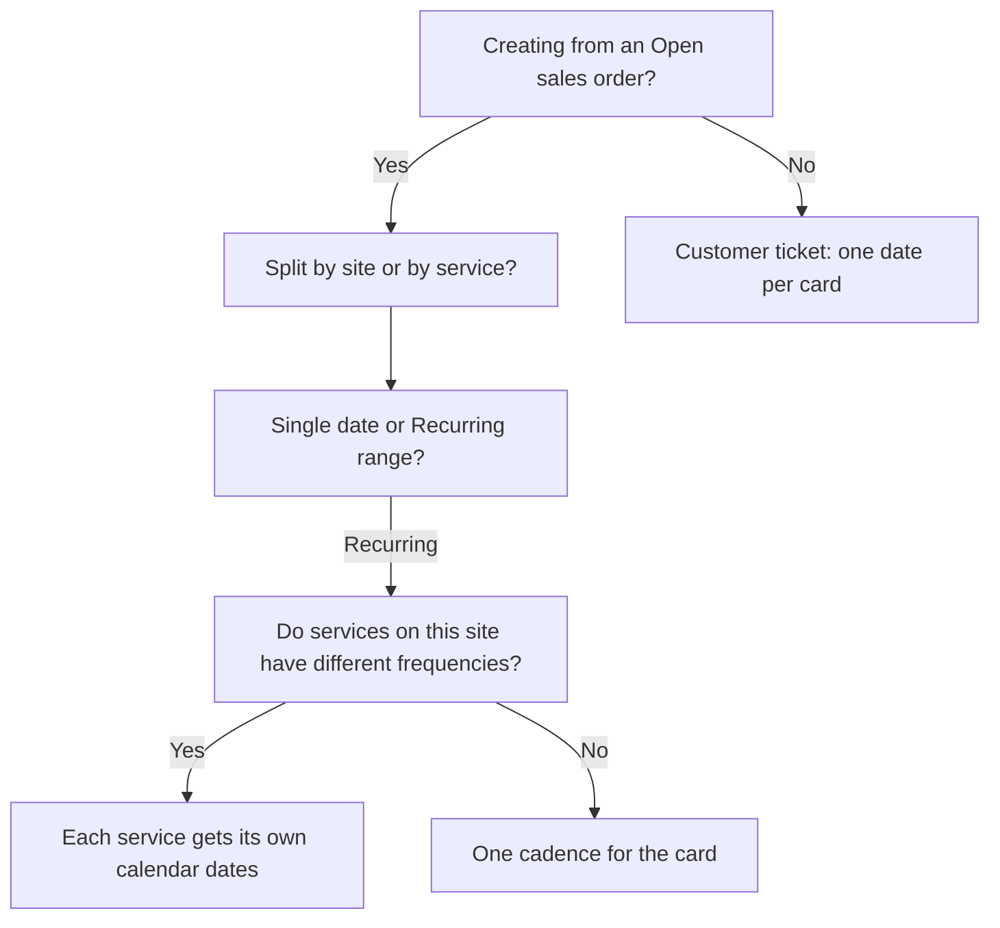


| Question                                | Yes                                                                                            | No                                                                            |
| --------------------------------------- | ---------------------------------------------------------------------------------------------- | ----------------------------------------------------------------------------- |
| From Open SO?                           | Visit slots apply; recurring allowed                                                           | Ticket path; no recurring calendar                                            |
| Split by site?                          | One job card per site; many services can share the visit                                       | —                                                                             |
| Split by service?                       | One job card **per service line**                                                              | Same team would be double-booked if times overlap (preview blocks this)       |
| Recurring range?                        | Calendar + frequency chips + preview                                                           | One scheduled date on each card                                               |
| Mixed frequencies on one site?          | Auto-distribute puts each service on **its** days                                              | All services share the same suggested days                                    |
| Date in the past?                       | **Blocked** on preview                                                                         | Allowed from today                                                            |
| Outside SO billing period?              | **Blocked**                                                                                    | Inside period                                                                 |
| Visit slots used up?                    | **Blocked** (cannot create more than planned visits)                                           | Remaining slots shown                                                         |
| Technician already booked?              | **Blocked**                                                                                    | Available list                                                                |
| Preferred weekday mismatch?             | **Warning** — can still create                                                                 | OK                                                                            |
| Too many dates vs cadence?              | **Warning** (over-dense) — can still create                                                    | OK                                                                            |
| Edit after start?                       | **Only Pending** can be fully edited                                                           | Use reschedule / complete                                                     |
| Assigned technician role is **Robert**? | Creator or CEO can **Manual Complete** from office **before** the job is overdue / in progress | Other office users wait until **Overdue**, or use normal In Progress complete |
| Office Manual Complete allowed?         | Overdue (any office user) **or** Robert assignee + creator/CEO                                 | Field app users: **never** (they must be In Progress)                         |
| Request / approve to create?            | **No**                                                                                         | Save = Pending job cards                                                      |


#### Status map

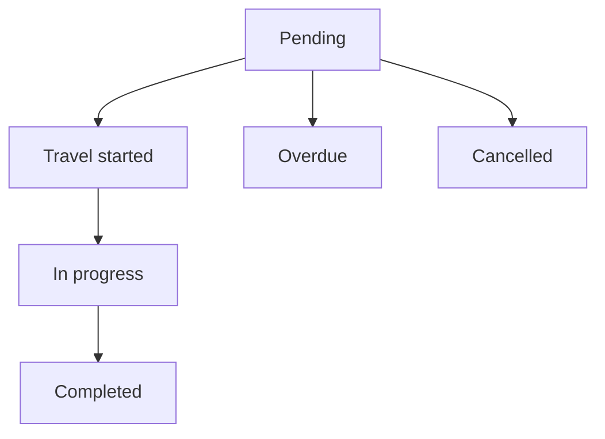


| Status             | Easy meaning             | Typical next                                         |
| ------------------ | ------------------------ | ---------------------------------------------------- |
| **Pending**        | Scheduled, not started   | Edit, reschedule, travel, cancel                     |
| **Travel started** | Technician left for site | Arrival → In progress                                |
| **In progress**    | On site / working        | Complete (field or office)                           |
| **Overdue**        | Date passed, not done    | Reschedule or manual complete (when allowed)         |
| **Completed**      | Finished                 | PDF / email report; slot stays consumed              |
| **Cancelled**      | Stopped                  | Slot **freed** (cancelled does not count as a visit) |


#### Dropdown / enum map


| Field                                                      | Options                                                                         | Quick rule                                                                                          |
| ---------------------------------------------------------- | ------------------------------------------------------------------------------- | --------------------------------------------------------------------------------------------------- |
| Create tab                                                 | **From Sales Order** / **From Customer Tickets**                                | Recurring only on SO                                                                                |
| Task split                                                 | **By site** (default) / **By service**                                          | Site = combined visit; Service = separate cards                                                     |
| When to visit                                              | **Single date** / **Recurring range**                                           | Recurring: one site/service **card** at a time                                                      |
| Recurring frequency chip                                   | **Daily, Weekdays, Weekends, Custom**                                           | Daily/Weekdays only if cadence is very dense (see §4.3)                                             |
| Custom days                                                | Mon–Sun                                                                         | Required when chip is Custom                                                                        |
| Recurring grouping                                         | **SITE** / **SERVICE**                                                          | Same as task split                                                                                  |
| Preview row                                                | **OK / Warning / Blocked**                                                      | Blocked dates cannot be committed                                                                   |
| Task type                                                  | **NORMAL** / **RE_TASK**                                                        | Re-task is a follow-up job                                                                          |
| Source                                                     | **SALES_ORDER** or **CUSTOMER_TICKET**                                          | **MANUAL** is leftover storage only — not a create door                                             |
| Priority                                                   | **Normal, High, Urgent, Critical**                                              |                                                                                                     |
| Contract frequency (on the service, not typed on the task) | **Weekly (52), Fortnightly (26), Monthly (12), Quarterly (4), Custom (N/year)** | Drives suggested calendar                                                                           |
| Technician **role name** on the card                       | Any role from Role Management                                                   | Name **exactly `Robert`** (any case) unlocks **office Manual Complete** for creator/CEO — see §4.10 |


---

### 1.1 What a task is (easy picture)

```text
  CONTRACT / SO                  TASK (job card)                 AFTER COMPLETE
  ─────────────                  ───────────────                 ──────────────
  Site: Warehouse A              Date: 20 Aug                    Slot used
  Service: Cockroach  Weekly     Time: 10:00–12:00               Technician free
  Service: Rodent     Monthly    People: Ravi (primary)          Optional invoice draft
  Visits left: 40 and 8          Services on the card: one or many
```

**By site:** Warehouse A on 20 Aug has **both** cockroach and rodent on **one** card (one visit, one team).  
**By service:** Warehouse A on 20 Aug gets **two** cards (two visits — usually different times, or the preview will block the same technician overlapping).

---

### 1.2 Frequencies in plain

Frequencies live on the **contract site service** (and are copied onto the SO line as planned visits). The task screen **reads** them; it does not invent them.


| Contract frequency | Typical visits / year       | Everyday meaning         |
| ------------------ | --------------------------- | ------------------------ |
| Weekly             | 52                          | About once a week        |
| Fortnightly        | 26                          | About every 14 days      |
| Monthly            | 12                          | About once a month       |
| Quarterly          | 4                           | About once a quarter     |
| Custom             | Whatever number was entered | e.g. 156 = thrice a week |


**Preferred weekdays** (e.g. Mon, Wed, Fri) and **preferred time slot** also come from the service line. Preview **warns** if you pick another day or time; it does **not** block.

**Visit slot:** each **non-cancelled** task on that SO service line uses **one** of the planned visits. Pending future tasks already use slots — you cannot overbook the year by scheduling 60 weeklies if the line only has 52.

---

## 2. Users & Roles (who uses this and why)


| Who                                                  | Why                                                                                                                        |
| ---------------------------------------------------- | -------------------------------------------------------------------------------------------------------------------------- |
| **CEO**                                              | Full access: create, edit, complete, cancel, calendar                                                                      |
| **Dispatcher / branch with Add**                     | Create SO, ticket, and recurring series                                                                                    |
| **Dispatcher with Edit**                             | Edit pending, reschedule, reassign, complete from office, email report                                                     |
| **Dispatcher with View**                             | List, detail, calendar, available technicians, PDF                                                                         |
| **Dispatcher with Delete**                           | Cancel on the server (reason required)                                                                                     |
| **Task creator** (the person who saved the job card) | If a **Robert**-role technician is assigned, this person (or CEO) can **Manual Complete** early from the office            |
| **Technician with role name Robert**                 | Assigned like any tech. Does **not** unlock Manual Complete for themselves. Unlocks it for **creator / CEO** on that card  |
| **Field technician (application user)**              | Can open **assigned** task detail; complete only when **In progress** after arrival. **Never** sees office Manual Complete |
| **No Task rights**                                   | Menu hidden                                                                                                                |


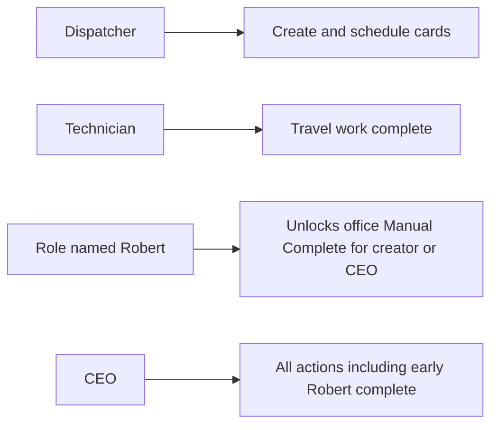


---

## 3. Access Control (RBAC)

Login role plus **Task Management** rights. CEO bypasses.


| Role                     | View list           | View detail  | Add                               | Edit                                                            | Inactive / Delete        | Submit request | Receive / act | Approve | Reject |
| ------------------------ | ------------------- | ------------ | --------------------------------- | --------------------------------------------------------------- | ------------------------ | -------------- | ------------- | ------- | ------ |
| CEO                      | Yes                 | Yes          | Yes                               | Yes                                                             | Cancel                   | No             | No            | No      | No     |
| Task View                | Yes                 | Yes          | No                                | No                                                              | No                       | No             | No            | No      | No     |
| Task Add                 | If also View        | If also View | Yes (single + recurring + ticket) | No                                                              | No                       | No             | No            | No      | No     |
| Task Edit                | —                   | —            | —                                 | Pending full edit; reschedule; reassign; complete; email report | No                       | No             | No            | No      | No     |
| Task Delete              | —                   | —            | —                                 | —                                                               | **Cancel** (API; reason) | No             | No            | No      | No     |
| Application user (field) | Own assigned detail | Own assigned | No                                | Complete if In progress                                         | No                       | No             | No            | No      | No     |
| No rights                | No                  | No           | No                                | No                                                              | No                       | No             | No            | No      | No     |


**Record rules:** field users only see tasks they are assigned to. Office list is company/branch filtered by the list filters, not “own tasks only.”

This module does **not** use request / approve. Create = Pending.

---

## 4. Capabilities & Features

### 4.1 Calendar and day list

Menu: **Task Management**. Calendar month shows counts by type/status. Opening a day opens the **task list** for that date. Columns: Task No., Time slot, Customer, Service, Site, Primary tech, Support tech, Type, Priority, Status, actions (View / Edit / Reschedule / Complete when allowed).

Add Task goes to `/tasks/new`.

### 4.2 Create from Sales Order (single date)

**First:** Branch → Contract(s) → Sales Order(s) that are **eligible** (Open).  
**Then:** Tick services on the site grid. Choose **By site** or **By service**.  
**Then:** On each card: date (not past), start/end, site contact, mobile, role, technicians (at least one; mark primary), optional materials and notes, priority.  
**Finally:** Save creates one Pending task per card. Technicians get a “New Task Assigned” notice.

SO must be **Open**. Each service line must have planned visits > 0. Creating uses one slot per line on that card.

### 4.3 Create recurring series (new calendar-first behaviour)

Only on the **SO tab**, with **When to visit = Recurring range**, and **exactly one** site/service card selected.

**What is new / in depth**

1. User sets **From / To** (clamped to today, SO/contract billing period, and **max 90 days**).
2. System reads **each service’s** contract frequency + planned visits left.
3. **Frequency chips** depend on how dense the **strictest** (lowest annual) service is:
  - Very dense (≥ ~260/year, e.g. daily): Daily, Weekdays, Weekends, Custom
  - High (≥ ~183): Weekends or Custom
  - Weekly / fortnightly / monthly / quarterly / sparse: **Custom only**
4. **Custom days** default from preferred weekdays, or sensible defaults (e.g. Mon/Wed/Fri for ~thrice weekly).
5. **Calendar** shows suggested dates. User clicks a day, then **ticks services** for that day in the side panel.
6. **Auto-distribute** (Reset / apply suggestions) puts each service on **its own** cadence, **capped by visits left**, preferring days where more services overlap.
7. User **Validates** (preview): each date becomes OK / Warning / Blocked.
8. Create sends only **included** dates. Blocked dates cannot commit. Max **120** job cards in one series.

**Calendar-first:** the live save sends the **exact dates** the user selected (`explicitDates` + `includeDates`), not a blind “every weekday for 90 days” dump.

### 4.4 Single site, many services, **same** frequency

Example: Site A, Cockroach Weekly + Ant Weekly, both prefer Monday.

- **By site + Recurring:** one card; Mondays get **both** services (combined visit).
- **By service + Recurring:** two cards per Monday (two job cards). Same technician + overlapping time → preview **Blocked** (“use SITE grouping for combined services”).

### 4.5 Single site, many services, **different** frequencies (mixed)

Example: Site A — **Cockroach Weekly (52)** + **Rodent Monthly (12)** + **Termite Quarterly (4)**.

This is the mixed-frequency overlay:


| Date type       | What the calendar means                                                              | Typical assignment                      |
| --------------- | ------------------------------------------------------------------------------------ | --------------------------------------- |
| **Shared**      | A day that fits **all** cadences (rare; e.g. a Monday that is also the monthly pick) | All services can sit on one site-card   |
| **Denser-only** | A weekly Monday that is **not** a monthly/quarterly day                              | Only weekly service(s)                  |
| **Off cadence** | User forced a service onto a day that is not its schedule                            | Warning (manual); auto mode avoids this |


**Auto-distribute order:** sparsest services first (quarterly, then monthly, then weekly) so the rare visits grab shared Mondays before weekly fills the month.

**By site:** 20 Aug (weekly only) = one task with cockroach. 1 Sep (weekly + monthly) = one task with cockroach **and** rodent.  
**By service:** each assigned service on that date becomes its **own** task.

**Visits left:** if rodent has 2 slots left, auto-assign stops after 2 rodent dates even if the range has 12 Mondays.

### 4.6 Multi-site

Pick several sites/services on the SO grid. **Single date:** many cards, each with its own date/time/people.  
**Recurring:** only **one card at a time** — preview message: “Recurring mode supports one site/service task card at a time.” Do site A series, then site B series.

### 4.7 Create from Customer Ticket

Tab **From Customer Tickets**. Pick branch and search a ticket. Customer, site, linked SO (if any), category, complaint reason fill **locked**. Tick ticket services → cards (By site / By service). Schedule **one date** per card (no recurring bar). Save source = **CUSTOMER_TICKET**. If the ticket id exists, the task is **linked** to that ticket.

Re-task type can be used for a follow-up visit on a ticket.

### 4.8 Edit, reschedule, reassign, complete, cancel


| Action                  | Who                | Rule                                                                                                                                     |
| ----------------------- | ------------------ | ---------------------------------------------------------------------------------------------------------------------------------------- |
| Full edit               | Edit               | **Pending only** (same fields as create)                                                                                                 |
| Reschedule              | Edit               | Pending / Overdue / Travel started (list)                                                                                                |
| Reassign technicians    | Edit               | New people; conflict check                                                                                                               |
| Complete                | Edit or field user | Field: must be **In progress**. Office: In progress, or **Manual Complete** when the row allows — see **§4.10 Robert / Manual Complete** |
| Cancel                  | Delete             | Reason required; frees visit slot                                                                                                        |
| PDF                     | View               | Printable detail                                                                                                                         |
| Email completion report | Edit               | After complete                                                                                                                           |


### 4.9 Field completion extras

Travel start, arrival, service forms per line, photos, materials vs stock, customer sign-off OTP when required, rating. Office **Manual Complete** skips the “fill every service form on mobile” gate (see §4.10). Photos, notes, rating, and stock still apply on the office complete screen.

### 4.10 Robert role — office Manual Complete (not a create door)

This is **not** creating a task by hand. Add Task still has only SO and Ticket. **Manual Complete** means the **office** marks an already-created job **Completed** without the technician finishing the mobile visit flow.

Tenants must create an application-user role whose **name is exactly `Robert`** (any capitalisation: Robert / ROBERT / robert). The system matches that name on the **technician snapshot** stored on the task (`role` chosen on the job card when assigning people). A role named “Robert Tech” or “ROBERTS” does **not** count.

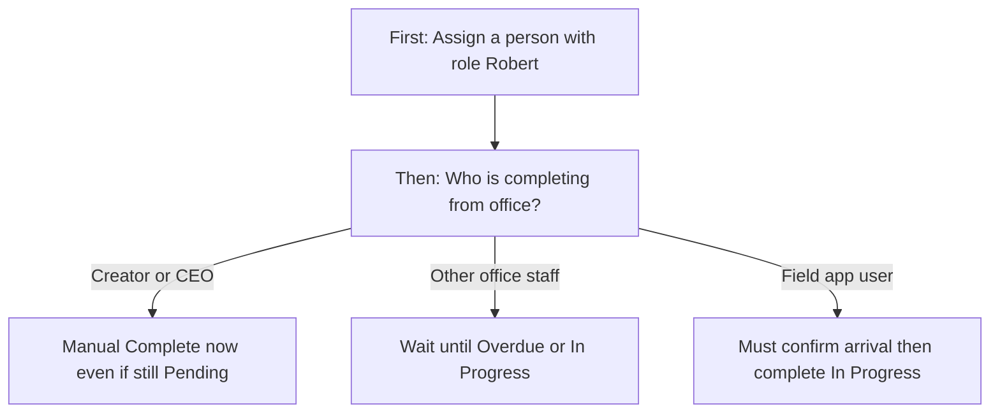


**Who sees the Manual Complete button** (list check icon / complete screen title “Manual Task Completion…”):


| Situation                                                 | Office creator      | Office CEO | Other office user                               | Field app user                                   |
| --------------------------------------------------------- | ------------------- | ---------- | ----------------------------------------------- | ------------------------------------------------ |
| Robert assigned, status **Pending** or **Travel started** | **Yes**             | **Yes**    | No                                              | No                                               |
| Robert assigned, status **In progress**                   | Yes (forms skipped) | Yes        | Yes, office complete allowed; **forms skipped** | Yes if assigned; **forms required** (field path) |
| Status **Overdue** (Robert or not)                        | **Yes**             | **Yes**    | **Yes**                                         | No                                               |
| Status Completed / Cancelled                              | No                  | No         | No                                              | No                                               |
| No Robert, still Pending (not overdue)                    | No                  | No         | No                                              | No                                               |


**What Manual Complete skips:** mobile “complete service forms for all services” check. If the card has a **Robert** assignee, office complete also skips that gate even when the job is already **In progress** (any office Edit user — not only creator/CEO).  
**What it still requires on the office screen:** actual start and end, notes (≥ 10 characters), customer rating 1–5, before and after photos, material quantities (stock is deducted).

**Overdue without Robert:** a night job (scheduled date before today, still Pending or Travel started) is flipped to **Overdue** by the scheduler (business timezone, default India). Then **any** office user with Edit can Manual Complete — creator/CEO restriction applies only to the **early Robert** path.

**If a non-creator office user tries to complete a Robert Pending task:** server: *“Only the task creator or CEO can manually complete a task assigned to a Robert-role technician.”* Screen also blocks unless `allowManualComplete` is true.

---

## 5. CRUD Operations

### 5.1 Create (Add)

**Who:** CEO or Task Add.

**First:** Add Task → choose tab (SO or Ticket).

**Then:** Fill source, services, split, schedule (single or recurring), people, Save.

**Finally:** One or many **Pending** tasks. Recurring: only preview-OK/Warning dates in `includeDates`.

Required (all doors): branch, customer, site name, date, start < end, priority, ≥1 technician.  
SO door: Open SO + ≥1 service line with visits.  
Ticket door: ticket selected (customer-ticket path).  
Recurring: date range, grouping, dates to include.

### 5.2 Read — List

**Who:** Task View or CEO.

Loads for the **calendar date** (query) plus search, branch chips, type, status. Pagination server-side. Empty: no rows. Loading while fetch.

### 5.3 Read — Detail

**Who:** Task View / CEO; field user only if assigned.

Opens by task id. Shows schedule, party, services, people, materials, status, audit. PDF available.

### 5.4 Update (Edit)

**Who:** Task Edit or CEO. **Pending only.** Full replace of lines, materials, technicians. Visit-slot check excludes this task id.

Reschedule / reassign are separate actions (not the full form).

### 5.5 Inactive / Delete

No inactive flag. **Cancel** sets Cancelled + reason in notes. Completed/cancelled SO cancel also mass-cancels open tasks on that SO.

List **Cancel button was not found** on the day list / view screens scanned — cancel is a **server** action (Delete right). Testers: treat missing button as a gap if office must cancel from UI.

---

## 6. Request & Approval Flows

This module does **not** use request / approve / reject.

### 6.1 Submit request

Not used.

### 6.2 Receive / inbox / pending actions

Not used. Assigned technicians get a **notification**, not an approval inbox.

### 6.3 Approve / Reject / Return

Not used. Recurring **Validate** is a dry-run preview, not an approver.

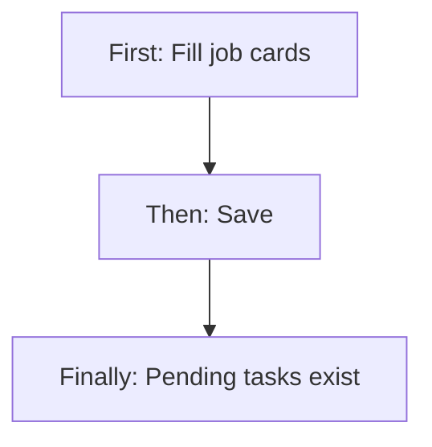


---

## 7. Forms — Add vs Edit Field Access


| Field (business name)           | On Add                  | On Edit (Pending)            | Notes                              |
| ------------------------------- | ----------------------- | ---------------------------- | ---------------------------------- |
| Create tab SO vs Ticket         | Editable                | Locked to existing source    | Recurring hidden on edit           |
| Branch                          | Editable / Required     | Editable                     | Single branch locked display       |
| Contract / SO                   | Required on SO tab      | Prefilled from task          | Eligible Open SOs                  |
| Ticket search                   | Required on ticket path | Prefilled ticket id          | Customer/site locked from ticket   |
| Task split By site / By service | Editable                | Typically not re-split       |                                    |
| When to visit                   | Single / Recurring      | Hidden (single date on card) | Recurring = new series only        |
| Recurring from / to             | Required if recurring   | Hidden                       | Max 90 days; clamped to period     |
| Frequency chips / custom days   | Per cadence             | Hidden                       |                                    |
| Calendar date + service ticks   | Recurring               | Hidden                       |                                    |
| Scheduled date (single)         | Required; not past      | Editable                     |                                    |
| Start / end time                | Required                | Editable                     | End after start; today not in past |
| Site contact / mobile           | Required                | Editable                     |                                    |
| Priority                        | Required                | Editable                     |                                    |
| Technicians + primary           | Required                | Replaced on save             | Conflict check                     |
| Materials                       | Optional                | Replaced                     |                                    |
| Notes                           | Optional                | Editable                     |                                    |
| Task type Normal / Re-task      | Set on create           | Editable                     |                                    |
| Save                            | Add right               | Edit right                   |                                    |


---

## 8. Lists, Dropdowns, Details & Data Rendering

### 8.1 List rendering

Day list columns: Task No., Time slot, Customer (+ branch), Service, Site, Primary tech, Support, Type, Priority, Status, actions.

Edit shown for Pending / In progress / Overdue / Travel started.  
Reschedule: Pending / Overdue / Travel started.  
Complete: In progress, or `allowManualComplete`.

### 8.2 Dropdowns & lookups


| Dropdown            | Source                              | Depends on                                  |
| ------------------- | ----------------------------------- | ------------------------------------------- |
| Branch              | User branches                       | —                                           |
| Contract            | Active contracts eligible for tasks | Branch                                      |
| Sales order         | Eligible **Open** SOs               | Branch + contract (or include non-contract) |
| Service grid        | SO site service lines               | Selected SOs                                |
| Ticket              | Support ticket dropdown             | Branch                                      |
| Ticket services     | Ticket / linked SO lines            | Selected ticket                             |
| Role                | Application user roles              | —                                           |
| Available employees | Free techs for that date/time       | Date + start + end                          |
| Recurring frequency | Filtered by annual cadence          | Strictest service on the card               |
| Custom days         | Mon–Sun                             | Custom chip                                 |
| Priority            | Normal / High / Urgent / Critical   | —                                           |


### 8.3 Detail / get-details

Opening a task loads full header, service lines, technicians, materials, status history. Field user: not assigned → not found. Recurring series are **separate tasks** (no parent series screen) — same SO/site/time pattern.

---

## 9. How It Works (end-to-end user flows)

### 9.1 Dispatcher — Single visit from sales order

**First:** Calendar → Add Task → From Sales Order → branch, contract, Open SO → tick services.

**Then:** By site (default), Single date, fill time and technicians, Save.

**Finally:** Pending card on that date; slot −1; technician notified.

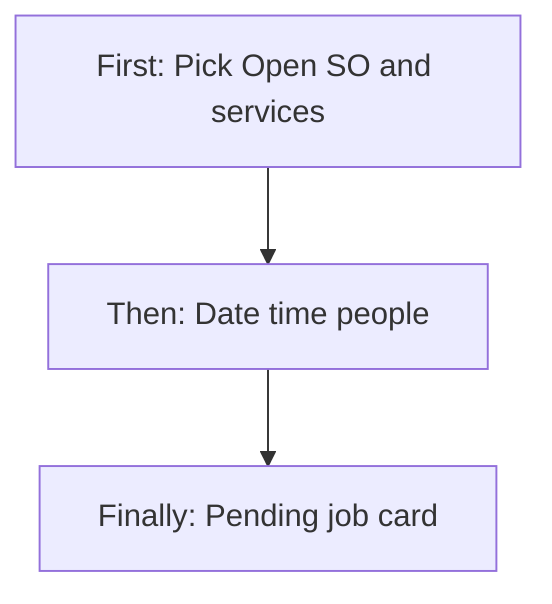


### 9.2 Dispatcher — Recurring mixed frequencies (one site)

**First:** Same SO, one site with Weekly + Monthly services, Recurring range, period dates.

**Then:** Auto-distribute (or click days and tick services) → Validate (fix Blocked) → Create.

**Finally:** Many Pending cards. Weekly-only days have one service; shared days may have both (By site).

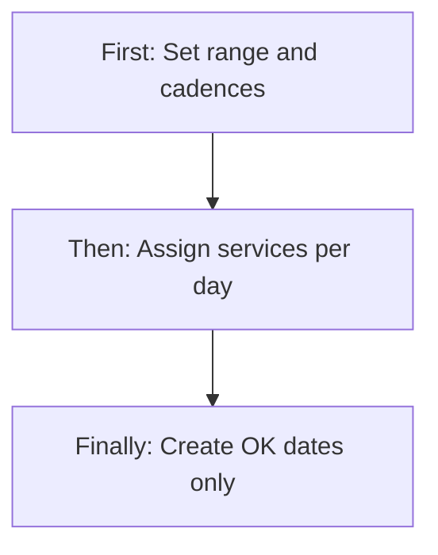


### 9.3 Dispatcher — From customer ticket

**First:** From Customer Tickets → pick ticket.

**Then:** Locked customer/site; tick services; one date/time/people; Save.

**Finally:** Task linked to ticket; source Customer Ticket.

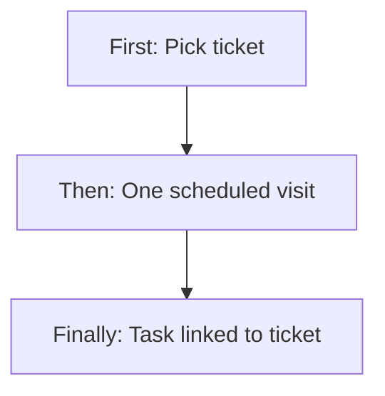


### 9.4 Technician — Do the job

**First:** Notification / mobile list of assigned Pending.

**Then:** Travel → arrive (In progress) → service forms → complete.

**Finally:** Completed; stock/materials as configured; optional customer OTP.

### 9.5 Dispatcher — Fix a pending card

**First:** Open Pending → Edit.

**Then:** Change time/people/services within slot rules.

**Finally:** Updated; if already Travel/In progress, full edit is refused — reschedule instead.

### 9.6 Dispatcher — Robert Manual Complete (early office finish)

**First:** On Add Task, Role = **Robert**, assign that technician, Save (Pending).

**Then:** Same creator (or CEO) opens the day list → Complete (label **Manual Complete**) → fill times, notes, rating, before/after photos → Mark as completed.

**Finally:** Status **Completed** without travel / in-progress / mobile service forms. Slot stays used.

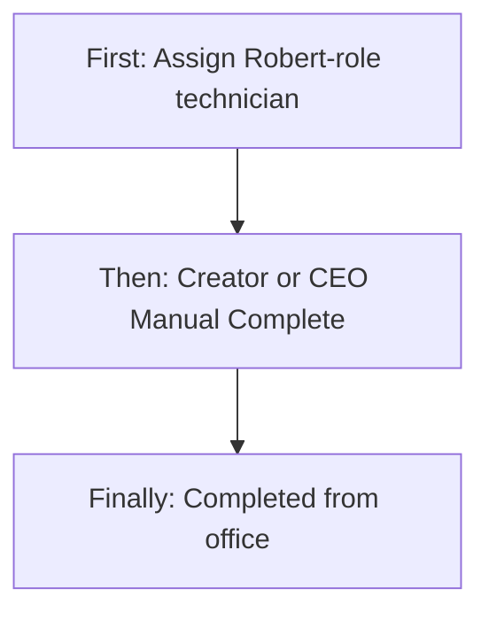


### 9.7 Cancel / SO cancelled

**First:** Cancel with reason (API) or SO cancelled.

**Then:** Status Cancelled.

**Finally:** Visit slot available again. Completed tasks on that SO are left.

---

## 10. Cross-Module Interactions

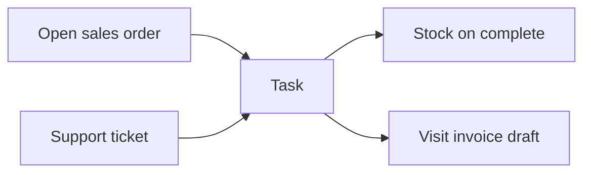


| Other area          | Handoff                                                                            |
| ------------------- | ---------------------------------------------------------------------------------- |
| **Contracts / GMA** | Frequency, annual count, preferred days/time, sites                                |
| **Sales orders**    | Must be **Open**; planned visits = slot cap; billing period bounds recurring dates |
| **Support tickets** | Ticket tab; link row ticket ↔ task                                                 |
| **Users / roles**   | Technician pool and availability                                                   |
| **Stock**           | Materials on complete                                                              |
| **Invoicing**       | Completing a visit can trigger visit-based auto draft                              |
| **Notifications**   | Assigned / completed                                                               |


---

## 11. Data the Business Cares About


| Name                                                 | Meaning                                                                   |
| ---------------------------------------------------- | ------------------------------------------------------------------------- |
| Task number / id                                     | Printed vs internal                                                       |
| Type                                                 | Normal or Re-task                                                         |
| Source                                               | Sales order or Customer ticket (Manual = old data only)                   |
| Status / priority                                    | See atlas                                                                 |
| SO / ticket / site / customer                        | Who and where                                                             |
| Service lines                                        | One or many SO site services on the card                                  |
| Planned visits vs scheduled                          | Slot maths (cancelled ignored)                                            |
| Date / start / end                                   | Window                                                                    |
| Technicians                                          | Primary + support; each row stores **role name** (Robert match uses this) |
| allowManualComplete                                  | List/detail flag: office may Manual Complete this row                     |
| Recurring range / frequency / custom days / grouping | Series create only                                                        |
| Preview status                                       | OK / Warning / Blocked                                                    |
| Completion notes, rating, photos                     | After work                                                                |


---

## 12. Rules, Validations & Constraints


| Rule                                                                                                        | Outcome                                                               |
| ----------------------------------------------------------------------------------------------------------- | --------------------------------------------------------------------- |
| SO not Open                                                                                                 | Cannot create SO tasks                                                |
| No planned visits on line                                                                                   | “No visit frequency on the Sales Order”                               |
| Scheduled count ≥ planned                                                                                   | Visit limit reached                                                   |
| Technician overlap (excluding cancelled/completed)                                                          | Conflict                                                              |
| Recurring range > 90 days                                                                                   | Error                                                                 |
| Recurring payloads > 120                                                                                    | Error                                                                 |
| dateFrom after dateTo                                                                                       | Error                                                                 |
| End time not after start                                                                                    | Error                                                                 |
| No technician                                                                                               | Error                                                                 |
| No service line on recurring                                                                                | Error                                                                 |
| Custom days empty with Custom frequency (and no explicit dates)                                             | Error                                                                 |
| Explicit dates outside range                                                                                | Error                                                                 |
| includeDates empty on create                                                                                | Error                                                                 |
| Any included date Blocked                                                                                   | Whole commit fails                                                    |
| Past date                                                                                                   | Blocked                                                               |
| Outside SO/contract period                                                                                  | Blocked                                                               |
| Preferred day / time mismatch                                                                               | Warning                                                               |
| Over-dense vs annual cadence                                                                                | Warning; create still allowed                                         |
| Edit non-Pending                                                                                            | Refused                                                               |
| Complete already Completed/Cancelled                                                                        | Refused                                                               |
| Field complete not In progress                                                                              | Refused                                                               |
| Duplicate service line on one request                                                                       | Error                                                                 |
| Office Manual Complete, task **Overdue**                                                                    | Any office Edit user; service forms skipped                           |
| Office Manual Complete, assignee role **Robert**, user is **creator or CEO**                                | Allowed even if still Pending / Travel started; service forms skipped |
| Office Manual Complete, assignee role **Robert**, user is **not** creator/CEO, not Overdue, not In Progress | Refused: only creator or CEO                                          |
| Application (field) user + Manual Complete                                                                  | Never — must be In Progress after arrival                             |
| Role name not exactly Robert                                                                                | No early Manual Complete                                              |


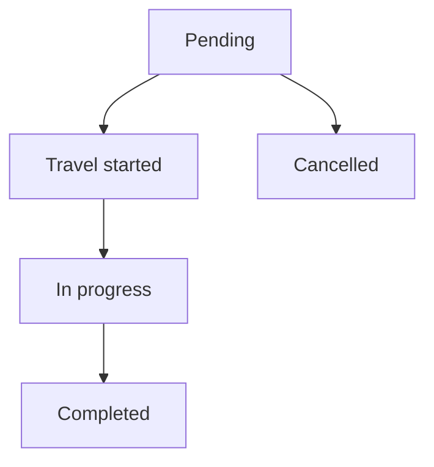


---

## 13. Loopholes, Gaps & Current Limitations

1. **Recurring is one card at a time** — multi-site series must be created separately.
2. **Ticket path has no recurring calendar** (single date only).
3. **Cancel** exists on the server; **day list / view may have no Cancel button**.
4. **No Manual create door.** Add Task has two tabs only. Dead `manualEntry` loaders remain in the form but never run. Old tasks may still display source Manual.
5. **Over-dense warning does not block** — user can still create too-frequent visits (slot cap still blocks).
6. **Preferred day is only a warning.**
7. **Edit only Pending** — list still shows Edit for In progress / Overdue (server will refuse full update).
8. **Void-style undo of a series:** cancel each task; no “delete whole series” button.
9. **120-task / 90-day caps** — year-long weekly (52) needs more than one batch if range is long… 90 days of weekdays can exceed 120 with By-service × many lines.
10. **Field user** cannot create or see others’ tasks.
11. **Placeholder branch options** (Mumbai/Delhi/Bangalore) appear if branch API empty — do not use them as real branches.
12. **Robert Manual Complete** is a **role-name** match (`Robert`), not a permission checkbox. Renaming the role in Role Management silently turns the special path off. The Robert technician cannot Manual Complete their own Pending job from the field app. Only **creator or CEO** get the early office button; other office staff wait for **Overdue**.

---

## 14. Existing Functionality Summary

Fully available: SO single + **recurring calendar-first** with mixed-frequency assign; ticket create; site vs service split; preview OK/Warning/Blocked; slot and conflict checks; pending edit; reschedule; reassign; complete (office/field); **Robert-role office Manual Complete** (creator/CEO early; any office user when Overdue); calendar + day list; PDF; technician notify; ticket link; cancel on API.

Not available: **Manual create tab**; recurring on tickets; multi-card recurring in one save; request/approve; series parent record; guaranteed Cancel button on list.

---

## 15. Reference — APIs, Screens & UI Actions

### 15.1 APIs


| Method | Path                                                   | Purpose (plain language)       | Used by                |
| ------ | ------------------------------------------------------ | ------------------------------ | ---------------------- |
| POST   | `/api/v1/tasks`                                        | Create one task                | Add Task single        |
| POST   | `/api/v1/tasks/multiple`                               | Batch create                   | Multi-card single save |
| POST   | `/api/v1/tasks/recurring/preview`                      | Dry-run dates                  | Recurring Validate     |
| POST   | `/api/v1/tasks/recurring`                              | Create series for includeDates | Recurring Create       |
| PUT    | `/api/v1/tasks`                                        | Full update (Pending)          | Edit Task              |
| GET    | `/api/v1/tasks`                                        | Paginated list                 | Day list               |
| GET    | `/api/v1/tasks` `taskId=`                              | Detail                         | View / edit load       |
| GET    | `/api/v1/tasks/dropdown`                               | Short list                     | Other modules          |
| GET    | `/api/v1/tasks/calendar`                               | Month summary                  | Calendar               |
| GET    | `/api/v1/tasks/available-technician`                   | Free techs for slot            | Add/edit cards         |
| GET    | `/api/v1/tasks/export-pdf`                             | PDF                            | View / list            |
| POST   | `/api/v1/tasks/complete`                               | Complete                       | Complete screen        |
| POST   | `/api/v1/tasks/reschedule`                             | New date/time                  | Reschedule             |
| POST   | `/api/v1/tasks/reassign`                               | New technicians                | Reassign               |
| DELETE | `/api/v1/tasks`                                        | Cancel + reason                | Cancel                 |
| PATCH  | `/api/v1/tasks/status`                                 | Status only                    | Internal / tools       |
| GET    | `/api/v1/tasks/{id}/audit-logs`                        | Audit                          | Detail                 |
| POST   | `/api/v1/tasks/completion-report/email`                | Email PDF                      | After complete         |
| GET    | Eligible contracts / SOs, tickets, branches, inventory | Lookups                        | Add Task               |


### 15.2 Frontend Screen Routes


| Route                                                                      | Screen purpose                                         | Primary users     |
| -------------------------------------------------------------------------- | ------------------------------------------------------ | ----------------- |
| `/task-manage`                                                             | Module home (calendar entry)                           | Dispatcher        |
| `/tasks/calendar`                                                          | Month calendar                                         | Dispatcher        |
| `/tasks`                                                                   | Day list                                               | Dispatcher        |
| `/tasks/new`                                                               | Add Task — SO (single or recurring) or Customer Ticket | Dispatcher        |
| `/tasks/:taskId`                                                           | Detail                                                 | Dispatcher / tech |
| `/tasks/:taskId/edit`                                                      | Edit pending                                           | Dispatcher        |
| `/tasks/:taskId/reschedule`                                                | Reschedule                                             | Dispatcher        |
| `/tasks/:taskId/complete`                                                  | Complete                                               | Dispatcher / tech |
| `/task-manage/view/:taskId`, `/view-task`, `/edit-task`, `/taskcompletion` | Legacy aliases                                         | Same              |


### 15.3 Click Events, Filters, Search & Controls


| Screen / Route | Control                                  | Type       | What happens                                                                                                       |
| -------------- | ---------------------------------------- | ---------- | ------------------------------------------------------------------------------------------------------------------ |
| Calendar       | Month / filters                          | Nav        | Loads summary                                                                                                      |
| Calendar       | Day                                      | Click      | Opens `/tasks?date=`                                                                                               |
| Day list       | Add Task                                 | Button     | `/tasks/new`                                                                                                       |
| Day list       | Search / branch / type / status          | Filter     | Reloads list                                                                                                       |
| Day list       | View / Edit / Reschedule / Complete      | Icons      | Opens that screen. Complete shows when **In progress** or `allowManualComplete` (Robert + creator/CEO, or Overdue) |
| Complete       | Title                                    | Label      | **Manual Task Completion…** when office Manual Complete (not In Progress); else normal complete                    |
| Complete       | Mark as completed                        | Button     | Office Manual Complete skips service-form gate; still needs times, notes ≥ 10, rating, before/after photos         |
| Add Task       | From Sales Order / From Customer Tickets | Tabs       | Switches source                                                                                                    |
| Add Task       | Branch, Contract, SO                     | Selects    | Loads service grid                                                                                                 |
| Add Task       | Service ticks                            | Grid       | Builds cards                                                                                                       |
| Add Task       | By site / By service                     | Chips      | Split mode                                                                                                         |
| Add Task       | Single date / Recurring range            | Chips      | Schedule mode (SO)                                                                                                 |
| Add Task       | Recurring from/to                        | Dates      | Clamped range                                                                                                      |
| Add Task       | Frequency / weekday chips                | Chips      | Cadence                                                                                                            |
| Add Task       | Calendar day                             | Click      | Focus date; toggle services                                                                                        |
| Add Task       | Service ticks on a day                   | Checkboxes | Mixed-frequency assign                                                                                             |
| Add Task       | Validate                                 | Button     | Preview OK/Warning/Blocked                                                                                         |
| Add Task       | Reset / suggested dates                  | Button     | Auto-distribute                                                                                                    |
| Add Task       | Card date/time/contact/tech/materials    | Fields     | Per card                                                                                                           |
| Add Task       | Save / Cancel                            | Buttons    | Create or back                                                                                                     |
| Ticket tab     | Ticket search                            | Select     | Fills locked party + services                                                                                      |
| Edit           | Same fields as add (no recurring)        | Form       | Pending only                                                                                                       |
| Complete       | Forms, photos, OTP, save                 | Form       | Completed                                                                                                          |
| Reschedule     | New slot                                 | Form       | New date/time                                                                                                      |


---

## 16. Real-world scenarios (frequency and split)

### A — One site, one weekly service, single Monday

Open SO, one cockroach line, By site, Single date Monday, one tech. → One Pending card. Slot 51 left if 52 planned.

### B — One site, two weekly services, By site, same Monday

Both on one card. One visit, two services named “Cockroach + Ant”. One slot each line.

### C — Same as B, By service

Two cards same Monday. **Different times** or different techs. Same tech + overlap → preview/create **Blocked**.

### D — Weekly + Monthly mixed, By site, auto-distribute

Range 90 days. Weekly gets ~12–13 Mondays (capped by slots). Monthly gets ~3 first-available preferred days. Shared Mondays combine both on one card; other Mondays weekly only.

### E — Weekly + Fortnightly

Fortnightly every 14 days from first preferred weekday. Weekly every matching weekday. Auto-assign sparsest (fortnightly) first onto shared weekdays.

### F — Monthly + Quarterly + Weekly (three frequencies)

Quarterly takes 1–2 dates; monthly next; weekly fills remaining Mondays. Shared dates are the valuable ones — do not assign weekly-only to the only quarterly Monday if you need them together (auto prefers overlap first).

### G — Custom 156/year (thrice weekly)

Chip often **Custom** with Mon/Wed/Fri. Daily chip hidden. Over-dense if user also ticks Tue/Thu.

### H — Daily / 260+ visits

Weekdays or Daily chips appear. 90-day weekdays ≈ 65 dates — OK under 120 if By site. By service × 3 lines × 65 days = 195 → **exceeds 120** — split the range.

### I — Preferred days Tuesday only, user picks Monday

Preview **Warning**, not Blocked. Create still works.

### J — Visits left = 2, user ticks 5 dates for that service

Screen warns; server **Blocks** extra dates / commit fails visit limit.

### K — Recurring past start of period

Dates before today or before period start **Blocked**.

### L — SO still Draft / not Open

Cannot create. Release/open the period SO first.

### M — Two sites, recurring

Must finish site 1 series, then site 2. Selecting two cards in recurring shows “one site/service task card at a time.”

### N — Ticket complaint, no SO

Customer Ticket tab, one visit, source CUSTOMER_TICKET. No slot maths unless a line from a linked SO is used.

### O — Re-task after a failed visit

Type Re-task, often from ticket. New Pending card; original may stay Completed/Cancelled separately.

### P — Technician clash with another branch job

Available list omits them; if forced, conflict **Blocks** that date.

### Q — Cancel one recurring Monday

That Monday Cancelled; slot returns; other days in the series stay.

### R — Complete visit on per-visit contract

Task Completed can trigger invoicing auto-draft (see Invoicing). Not a task-screen button.

### S — Office completes **Overdue** without mobile forms

Any office user with Edit. Scheduler has already set Overdue (date before today, was Pending or Travel started). Manual Complete screen; service forms skipped.

### T — Field user tries to complete Pending

Refused: must be In progress (confirm arrival). Robert assignment does **not** help the field app.

### U — Robert assigned, creator Manual Complete while still Pending

Role on the card is **Robert**. Creator opens Complete → title “Manual Task Completion…”. Save succeeds. Status Completed. No travel required.

### V — Robert assigned, **another** dispatcher tries Manual Complete while Pending

List may hide Complete (`allowManualComplete` false). If they force the URL: *Only the task creator or CEO can manually complete a task assigned to a Robert-role technician.*

### W — Role named something other than Robert

“Robert Tech”, “ROBERTS”, empty role → **not** Robert. No early Manual Complete. Wait for Overdue or In Progress.

---

## 17. Tester guide — Positive cases (P)

Use: Open SO with known visits, two services (Weekly + Monthly) on one site, preferred days, one ticket, two technicians, Task Add+View+Edit. For **P21–P24 / N41–N45**: a Role Management role named exactly **Robert**, assigned on the job card; plus a second dispatcher who did **not** create the task.


| ID  | What to do                                                                      | Expected                                                                    |
| --- | ------------------------------------------------------------------------------- | --------------------------------------------------------------------------- |
| P1  | Open calendar + day list with View                                              | Rows load                                                                   |
| P2  | Add Task, SO tab, one service, single date, one tech                            | Pending created; notice                                                     |
| P3  | By site, two services same site, single date                                    | One card, both services                                                     |
| P4  | By service, two services, different times                                       | Two cards                                                                   |
| P5  | Recurring Custom Mon, one weekly service, Validate                              | Mondays OK (future, in period)                                              |
| P6  | Create includeDates subset                                                      | Only those dates become tasks                                               |
| P7  | Mixed Weekly+Monthly, auto-distribute                                           | Monthly fewer dates; weekly more; shared days have both (By site)           |
| P8  | Tick/untick a service on one Monday                                             | That day’s card services change after create                                |
| P9  | Preferred-day mismatch date                                                     | Warning; still selectable                                                   |
| P10 | Over-dense extra dates                                                          | Warning; create still works if slots remain                                 |
| P11 | Ticket tab, pick ticket, one date                                               | CUSTOMER_TICKET; linked                                                     |
| P12 | Edit Pending time/tech                                                          | Saved                                                                       |
| P13 | Reschedule Pending                                                              | New slot; old conflict freed                                                |
| P14 | Complete In progress                                                            | Completed                                                                   |
| P15 | Cancel one task (API) then create another on that line                          | Slot freed; new create allowed                                              |
| P16 | PDF from detail                                                                 | File downloads                                                              |
| P17 | Field user opens assigned task                                                  | Detail visible                                                              |
| P18 | Two techs, mark primary                                                         | Primary shows on list                                                       |
| P19 | Re-task type from ticket                                                        | Type RE_TASK                                                                |
| P20 | CEO creates without extra rights                                                | Allowed                                                                     |
| P21 | Role **Robert** on card; **same user who created** opens Complete while Pending | Button **Manual Complete**; screen title Manual Task Completion; can submit |
| P22 | Same Robert task; **CEO** (not creator) Manual Complete while Pending           | Allowed                                                                     |
| P23 | Overdue task (no Robert); any office Edit user Complete                         | Manual Complete allowed; service forms not required                         |
| P24 | Robert task In Progress; assigned field user completes                          | Normal field complete (arrival already done)                                |


---

## 18. Tester guide — Negative cases (N)


| ID  | What to try                                                                            | Expected / watch                                 |
| --- | -------------------------------------------------------------------------------------- | ------------------------------------------------ |
| N1  | No Task module                                                                         | Menu hidden                                      |
| N2  | View-only Save                                                                         | Add refused                                      |
| N3  | Field user opens someone else’s task                                                   | Not found                                        |
| N4  | Create against Draft/Cancelled SO                                                      | Refused: Open only                               |
| N5  | Service line visits = 0                                                                | No visit frequency                               |
| N6  | Already scheduled = planned visits, create one more                                    | Visit limit reached                              |
| N7  | Same tech, overlapping time, two By-service cards                                      | Conflict / Blocked                               |
| N8  | Recurring with two site cards selected                                                 | “One card at a time”                             |
| N9  | Recurring on ticket tab                                                                | No recurring bar                                 |
| N10 | Range 91+ days                                                                         | Range exceeds 90                                 |
| N11 | Recurring with no dates ticked                                                         | Select dates first / includeDates required       |
| N12 | Custom frequency, no weekdays, no explicit dates                                       | customDays required                              |
| N13 | Date yesterday                                                                         | Blocked / min date today                         |
| N14 | Date after contract/SO period end                                                      | Blocked                                          |
| N15 | Commit including a Blocked date                                                        | Commit fails listing blocked dates               |
| N16 | By service × many days > 120 payloads                                                  | Exceeds 120                                      |
| N17 | End time before start                                                                  | Invalid                                          |
| N18 | No technician                                                                          | Required                                         |
| N19 | Duplicate service line on one card                                                     | Duplicate soSiteServiceId                        |
| N20 | Edit In progress via full form                                                         | Only pending can be updated                      |
| N21 | Complete Completed task                                                                | Already final                                    |
| N22 | Field complete while Pending                                                           | Must be in progress                              |
| N23 | Complete without all service forms (normal path)                                       | Complete forms first                             |
| N24 | Expired / wrong customer OTP                                                           | Refused                                          |
| N25 | Ticket path without picking ticket                                                     | Ticket required                                  |
| N26 | Search list by wrong day                                                               | Empty (date scoped)                              |
| N27 | List Edit on Overdue then full save                                                    | Server may refuse (Pending only)                 |
| N28 | Look for Cancel on list                                                                | May be missing — API still cancels               |
| N29 | Manual complete as non-creator on Robert assignee                                      | Refused unless CEO/creator                       |
| N30 | Recurring SO not Open                                                                  | Preview global error                             |
| N31 | Force Monthly service onto a non-monthly day (manual tick)                             | Off-cadence **warning**                          |
| N32 | Assign more dates than visitsLeft                                                      | Screen warning; server blocks limit              |
| N33 | Same UTR-style: two series same Mondays same tech                                      | Second series conflicts                          |
| N34 | Placeholder Mumbai branch if API empty                                                 | Fake options — do not save                       |
| N35 | Daily chip on a monthly-only card                                                      | Chip hidden / not allowed                        |
| N36 | Empty ticket services grid                                                             | Cannot build cards                               |
| N37 | Cancel SO with open tasks                                                              | Open tasks mass-cancelled; completed kept        |
| N38 | Reassign to conflicting tech                                                           | Conflict                                         |
| N39 | Start time in the past **today** (single)                                              | Screen error                                     |
| N40 | Preview then change range without re-validate                                          | Create may use stale dates — re-validate         |
| N41 | Assign role **Robert Tech** (not exactly Robert); creator tries Complete while Pending | No Manual Complete (`allowManualComplete` false) |
| N42 | Robert + Pending; **field app user** (even the Robert person) Complete                 | Refused: must be In progress                     |
| N43 | Robert + Pending; second dispatcher (not creator, not CEO) Complete                    | Hidden / *Only the task creator or CEO…*         |
| N44 | Manual Complete without notes ≥ 10 / rating / photos                                   | Screen/server refuses (forms skip only)          |
| N45 | Wait for Overdue then non-creator office user Complete (no Robert needed)              | Allowed — Overdue path, not Robert path          |


### How testers should read a failure

1. **Screen said no** before Save → validation working.
2. **Preview Blocked** → do not expect Create to include that day.
3. **Preview Warning** → Create **can** succeed; check it was intentional (preferred day / density).
4. **Create succeeded, slots wrong** → count **non-cancelled** tasks per SO line, not calendar ticks.
5. **Mixed frequencies** → open each created task and confirm **which services** landed on that date (not “all services every Monday”).

