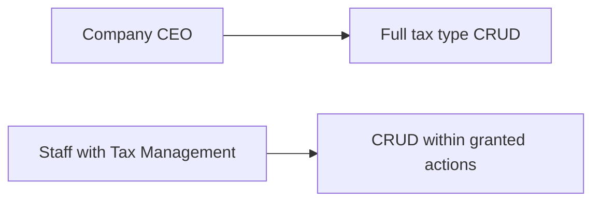
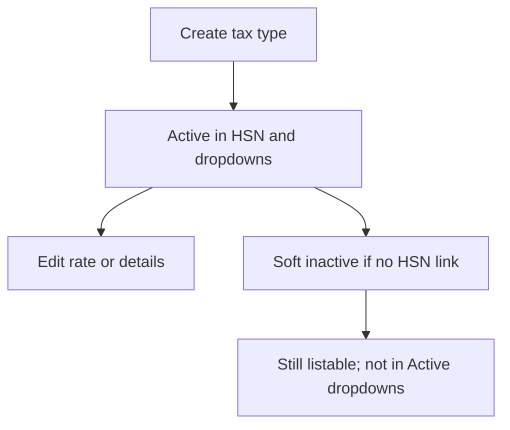
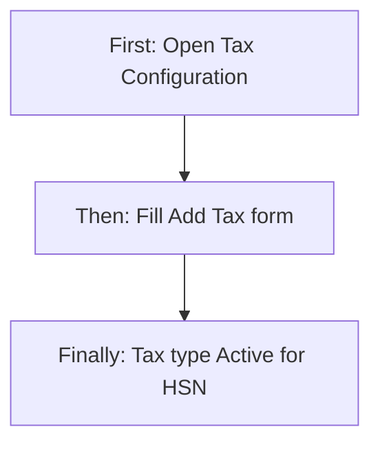
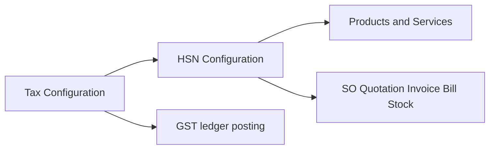

# Tax Configuration — Product & Business Documentation

## 1. Purpose & Business Need

Tax Configuration is the company master for **GST tax types** used across Seravion Connect. Each tax type defines a named rate (for example CGST 9%, SGST 9%, IGST 18%, or a CESS rate), whether it applies to goods, services, or both, and when it becomes effective.

Sales, purchase, stock, and invoicing do **not** pick arbitrary percentages on every line. They resolve tax through **HSN mappings** that link to these tax types. Correct tax types therefore protect GST posting, invoice tax totals, and ledger allocation for output and input tax.

**Outcomes today:** create and maintain active tax types with unique names and system-generated tax IDs; soft-deactivate types that should no longer be offered; keep rates and categories consistent enough for HSN posting rules.

**Sibling module:** [HSN Configuration](./hsn-configuration.md) links tax types to HSN/SAC codes. Both screens share the same **Tax Management** permission module.

**Combined GST guide:** [GST Taxation with Tax & HSN](./gst-hsn-tax-workflow.md) — how CGST / SGST / IGST and HSN/SAC work under Indian norms, and the end-to-end workflow that maps both masters.

**Out of scope of this screen:** customer or company GSTIN registration, branch GST numbers, and payroll/salary tax.

---

## 2. Users & Roles (who uses this and why)

### 2.1 Company CEO / Owner

Has full access to Tax Configuration without needing granular Tax Management permissions. Sets up the company’s GST rate catalogue and keeps inactive types out of day-to-day use.

### 2.2 Finance / setup staff (Tax Management permissions)

Authorized employees with **Tax Management** Read, Add, Edit, and/or Delete maintain tax types under Setup & Configuration. Typical users are accountants or operations leads who also maintain HSN mappings.

---

## 3. Access Control (RBAC)

### 3.1 How access works

- Menu **Setup & Configuration → Tax Configuration** appears when the user has Tax Management access (or CEO bypass).
- **CEO** may perform all tax-type operations.
- Other employees need explicit **Tax Management** actions:
  - **Read** — open list and view details
  - **Add** — create tax types
  - **Edit** — update tax types
  - **Delete** — mark a tax type inactive (soft delete)

### 3.2 Role × action matrix

| Role | View list | View detail | Add | Edit | Inactive / Delete | Submit request | Receive / act | Approve | Reject |
|------|-----------|-------------|-----|------|-------------------|----------------|---------------|---------|--------|
| Company CEO | Yes | Yes | Yes | Yes | Yes | No | No | No | No |
| Staff with Tax Management Read | Yes | Yes | No | No | No | No | No | No | No |
| Staff with Tax Management Add | Yes | Yes | Yes | No | No | No | No | No | No |
| Staff with Tax Management Edit | Yes | Yes | No | Yes | No | No | No | No | No |
| Staff with Tax Management Delete | Yes | Yes | No | No | Yes | No | No | No | No |

**Record-level rules:**
- A tax type **cannot be inactivated** while it is still linked to one or more HSN codes.
- Tax type **dropdowns** used elsewhere return **Active** types only.
- Tax name must be unique across the company.

This module does **not** use request/approve workflows for tax type changes.

---

## 4. Capabilities & Features

### 4.1 Tax type catalogue

Each tax type stores:

- System tax ID (auto-generated)
- Business name (unique)
- Tax category: Central (CGST), State (SGST), Integrated (IGST), or CESS
- Default rate (%)
- Applicability: Goods, Services, or Both
- Optional description
- Effective-from date
- Active / Inactive status
- Optional change reason on update

### 4.2 Ledger posting defaults (system-side)

When a tax type is saved without explicit sales/purchase tax ledgers, the system assigns default GST ledgers by category (output and input). Those ledger fields are **not shown** on the Add/Edit Tax screen today; posting still uses them when invoices and bills allocate GST.

### 4.3 Downstream use

Active tax types appear when configuring HSN codes and when line-level tax options are resolved from an HSN mapping (sales orders, invoices, quotations, products/services via HSN).

---

## 5. CRUD Operations

### 5.1 Create (Add)

**Who:** CEO, or staff with Tax Management Add.

**First:** User opens Tax Configuration and chooses **Add Tax**.  
**Then:** Completes required fields (name, category, rate, applicability, effective from, status) and saves.  
**Finally:** A new tax type is created with a system tax ID (pattern like TX-xxxxx) and appears on the list. If ledgers were not chosen in UI, category-based defaults are applied in the background.

### 5.2 Read — List

**Who:** CEO, or staff with Tax Management Read.

The list loads tax types with search and filters. Columns include Tax Type ID, Tax Name, Tax Category, Default Rate, Applicability, Status, Created By, Created Date, and Last Modified Date. Pagination is server-driven.

Empty state: no matching tax types for the current search/filters.

### 5.3 Read — Detail / Get details

**Who:** same as Read.

Opening **View** on a row navigates to the tax form in view mode. System ID, audit fields (created/modified), and all master fields are shown locked. Change reason is visible when present.

### 5.4 Update (Edit)

**Who:** CEO, or staff with Tax Management Edit.

**First:** User opens Edit from the list.  
**Then:** Changes allowed fields and enters a **Change Reason** (required on edit in the UI).  
**Finally:** Save updates the tax type. Name uniqueness and rate/category rules are re-checked.

### 5.5 Inactive / Delete

**Who:** CEO, or staff with Tax Management Delete.

Delete is a **soft inactive**: status becomes Inactive and the record is retained (not hard-removed). Confirmation runs from the list row action; success messaging refers to making the tax inactive.

**Blocked when:** any HSN still links this tax type — user must remount those HSN codes first.

Status can also be set Active/Inactive on create or edit without using Delete.

There is no separate “reactivate” action beyond editing status back to Active (subject to validation).

---

## 6. Request & Approval Flows

This module does not use request/approve. Tax type create, edit, and inactive apply immediately when the user has permission.

---

## 7. Forms — Add vs Edit Field Access

Add and Edit share one screen (**Add Tax**), switched by navigation mode (add / edit / view).

| Field (business name) | On Add | On Edit | Notes |
|----------------------|--------|---------|-------|
| Tax Type ID | Hidden | Hidden on edit; shown locked on view | System-generated |
| Tax Name | Required, editable | Editable | Unique |
| Tax Category | Required, editable | Editable | Central / State / Integrated / CESS |
| Default Rate (%) | Required, editable | Editable | Greater than 0 and ≤ 100; CGST/SGST capped at 50%; IGST rejects common “half” rates (e.g. 2.5, 9) |
| Applicability | Required, editable | Editable | Goods / Services / Both |
| Description | Optional, editable | Editable | Max length enforced |
| Effective From | Required, editable | Editable | New entries: today or future in UI; server also expects present/future on save |
| Status | Required, editable | Editable | Active / Inactive |
| Change Reason | Hidden | Required (UI) | Server requires at least 10 characters when a reason is sent |
| Created / Modified audit | Hidden | Hidden on edit; shown locked on view | View only |
| Sales output / purchase input ledgers | Hidden | Hidden | Supported by save API; UI does not expose them |

Save is disabled in view mode.

---

## 8. Lists, Dropdowns, Details & Data Rendering

### 8.1 List rendering

- **Columns:** Tax Type ID, Tax Name, Tax Category (display labels), Default Rate, Applicability, Status badge, Created By, Created Date, Last Modified Date.
- **Search:** Debounced text search (meaningful from 3 characters server-side) against name and category.
- **Filters (UI):** Status (Active/Inactive), Applicability (multi), Created Date Range. These are applied mainly on the client against loaded data; the list request currently does not fully drive server filter parameters for every control.
- **Sort:** Newest created first (server default).
- **Actions:** View, Edit, Delete (gated by Read / Edit / Delete permissions). **Add Tax** gated by Add.

### 8.2 Dropdowns & lookups

| Control | Options source | Behavior |
|---------|----------------|----------|
| Tax Category | Fixed list | Central, State, Integrated, CESS |
| Applicability | Fixed list | Goods, Services, Both |
| Tax type dropdown (other modules) | Active tax types | Label shows name with rate; used heavily by HSN Configuration |

### 8.3 Detail / get-details rendering

Edit and View load the tax type by ID and fill the form. Rate, category, applicability, description, effective date, status, and change reason (if any) populate fields. Ledger IDs may be returned by the service but are not displayed.

---

## 9. How It Works (end-to-end user flows)

### 9.1 Setup staff — Create a tax type

**First:** Open Setup → Tax Configuration → Add Tax.  
**Then:** Enter name (e.g. CGST 9%), category Central, rate 9, applicability Both, effective today, status Active; save.  
**Finally:** Tax type is available for HSN mapping and Active dropdowns.

### 9.2 Setup staff — Edit a tax type

**First:** From the list, open Edit.  
**Then:** Adjust rate or description; enter Change Reason; save.  
**Finally:** Updated values apply to new HSN validations and downstream rate resolution that read this master.

### 9.3 Setup staff — Inactivate a tax type

**First:** Ensure no HSN still uses the type (or remount HSNs).  
**Then:** Use Delete on the list (or set Status Inactive on edit).  
**Finally:** Type no longer appears in Active dropdowns; list can still show it when Inactive is included.

### 9.4 CEO — Full catalogue ownership

**First:** CEO opens Tax Configuration.  
**Then:** Creates CGST/SGST/IGST (and CESS if needed) pairs consistent with company GST practice.  
**Finally:** Hands off to HSN Configuration to attach types to codes used by products and services.

---

## 10. Cross-Module Interactions

| Area | Relationship |
|------|----------------|
| HSN Configuration | Many tax types link to each HSN; Active HSN must support CGST+SGST and IGST posting paths |
| Invoicing / Bills | GST amounts posted using tax types (and ledgers) resolved via HSN |
| Sales orders / Quotations | Line tax rates derived from HSN-linked tax types |
| Products / Services | Tax comes through HSN, not a free-standing tax pick on modern product flows |
| Ledgers | Default TAX/INTERNAL ledgers bound by category when not set in UI |

Deleting a tax type is blocked while HSN links remain — see [HSN Configuration](./hsn-configuration.md).

---

## 11. Data the Business Cares About

| Attribute | Meaning |
|-----------|---------|
| Tax Type ID | Stable system code for the type |
| Tax Name | Business label (unique) |
| Tax Category | CGST / SGST / IGST / CESS role in GST |
| Default Rate | Percentage used when this type applies |
| Applicability | Goods, Services, or Both |
| Effective From | Date from which the type is considered in force |
| Status | Active or Inactive |
| Change Reason | Why an update was made |
| Linked HSNs | Business dependency — cannot inactive while linked |

---

## 12. Rules, Validations & Constraints

- Tax name unique; tax ID system-assigned and unique.
- Default rate must be **greater than zero** and **at most 100**.
- Central/State (CGST/SGST) rates **above 50%** are rejected (use full rate on IGST for inter-state).
- Integrated (IGST) rates that look like half GST splits (e.g. 2.5, 6, 9, 14) are rejected — use full GST rate (e.g. 12, 18, 28).
- Effective-from must satisfy present/future rules on save (server validation).
- Soft delete blocked if any HSN references the type.
- Change reason on edit: UI requires a value; server enforces minimum length when provided.
- Active-only tax types appear in operational dropdowns.

---

## 13. Loopholes, Gaps & Current Limitations

1. **Ledger binding is invisible in UI** — sales/purchase tax ledgers exist on the master and are defaulted by category, but Add/Edit Tax does not let users review or override them.
2. **List filters vs server** — Status, Applicability, and date range on the Tax list are largely client-side; server filter parameters are not fully driven by every UI control.
3. **Change reason length mismatch** — UI may accept a short reason; server can reject if under 10 characters.
4. **Effective-from on edit** — Server present/future rule can make it hard to re-save older tax types whose effective date is already in the past.
5. **Inactive rows remain listable** unless the user filters Status to Active.
6. **No approve workflow** — any user with Edit can change rates that affect GST immediately (by design today).

---

## 14. Existing Functionality Summary

Fully available today:

- Tax type list with search, filters, pagination, and RBAC-gated actions
- Add / Edit / View on a shared form
- Soft inactive (Delete) with HSN-link protection
- Active tax type dropdown for other screens
- Category-based GST ledger defaults for posting
- Shared Tax Management permissions with HSN Configuration

Not available on this screen: tax slabs as a separate entity, request/approve for tax changes, payroll tax, GSTIN master, or UI for ledger override.

---

## 15. Reference — APIs, Screens & UI Actions

### 15.1 APIs

| Method | Path | Purpose (plain language) | Used by (screen/flow) |
|--------|------|--------------------------|------------------------|
| POST | `/api/v1/tax-types` | Create tax type | Add Tax |
| PUT | `/api/v1/tax-types/update?id=` | Update tax type | Edit Tax |
| GET | `/api/v1/tax-types/by-id?id=` | Get one tax type | Edit / View Tax |
| GET | `/api/v1/tax-types` | Paginated list with optional filters | Tax Configuration list |
| GET | `/api/v1/tax-types/dropdown` | Active tax types for pickers | HSN form and other tax pickers |
| DELETE | `/api/v1/tax-types?id=` | Soft inactive tax type | List delete |

### 15.2 Frontend Screen Routes

| Route | Screen purpose | Primary users |
|-------|----------------|---------------|
| `/Tax` | Tax type list | CEO, Tax Management users |
| `/add-tax` | Add / Edit / View tax type | Same |

### 15.3 Click Events, Filters, Search & Controls

| Screen / Route | Control | Type | What happens |
|----------------|---------|------|--------------|
| `/Tax` | Add Tax | Button | Opens `/add-tax` in add mode (needs Add) |
| `/Tax` | Search | Text | Debounced search to list API |
| `/Tax` | Status filter | Tags | Narrows to Active / Inactive (client-oriented) |
| `/Tax` | Applicability filter | Multi-select | Goods / Services / Both |
| `/Tax` | Created Date Range | Date range | Filters by created date on client |
| `/Tax` | View | Row action | Opens form in view mode |
| `/Tax` | Edit | Row action | Opens form in edit mode |
| `/Tax` | Delete | Row action | Soft inactive after confirm |
| `/Tax` | Pagination | Pager | Loads next/previous page from server |
| `/add-tax` | Tax Category | Select | Sets CGST/SGST/IGST/CESS category |
| `/add-tax` | Applicability | Select | Goods / Services / Both |
| `/add-tax` | Default Rate | Number | Percent rate |
| `/add-tax` | Effective From | Date | Sets effective date |
| `/add-tax` | Status | Radio | Active / Inactive |
| `/add-tax` | Change Reason | Text | Required on edit |
| `/add-tax` | Save | Button | Create or update; disabled in view |
| `/add-tax` | Cancel / Back | Button | Returns to list |
