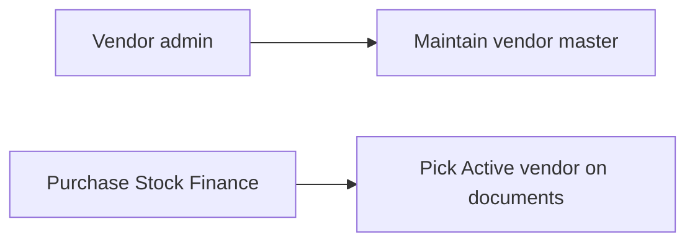
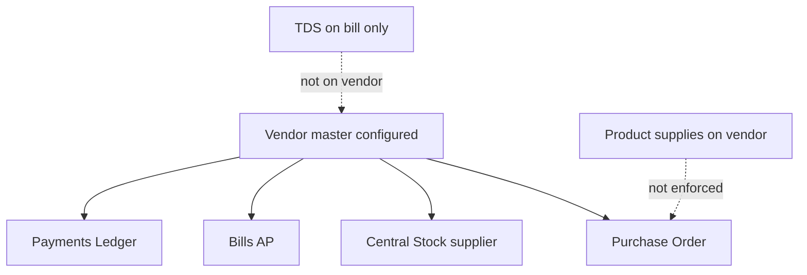
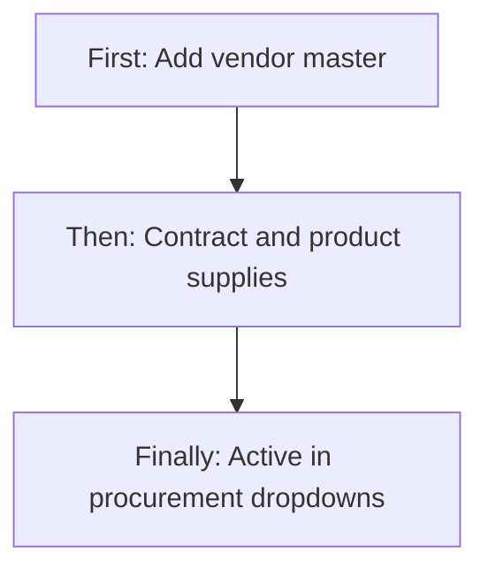
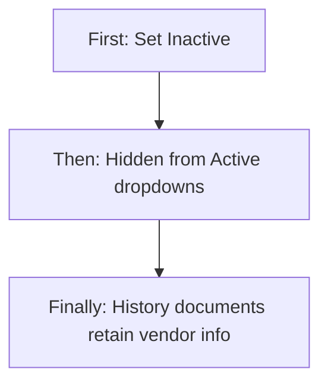
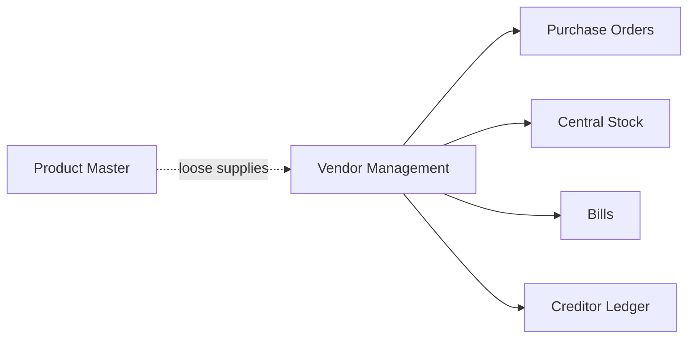
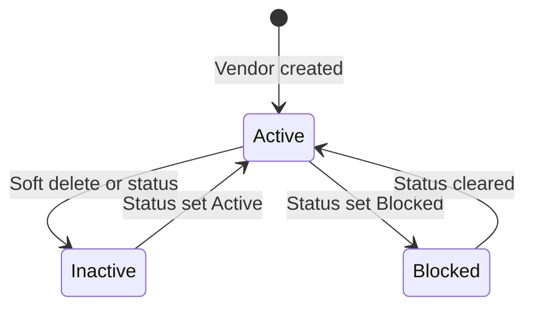

# Vendor Management — Product & Business Documentation

## 1. Purpose & Business Need

Procurement needs a single **supplier / service-provider master** so Purchase Orders, Bills (AP), Central Stock receipts, and Payments know **who** is supplying chemicals, equipment, logistics, or maintenance — with GST, bank, contract, and payment terms.

**Vendor Management** (menu: Procurement → Vendor Management) is that master. It stores vendor identity, tax registration, banking, optional contract/billing terms, a simple product-supply list, rating, and documents. Active vendors appear in dropdowns across Procurement and Finance.

**Outcomes today:**
- Create / update vendors with type, category, contact, address, GST/PAN, bank
- Optional contract block (type, dates, SLA, billing, document)
- Product supplies (product, qty, rate, MOQ, delivery frequency, lead time, tax flag)
- Soft deactivate (Inactive); status can be Active / Inactive / Blocked (Blocked mainly via update/filters)
- Dropdown for PO, Bills, Stock supplier, Payments, Ledger auto-provision for creditors
- List search/filters and document download (permissioned)

**What this module is not:** Vendor onboarding approval, multi-branch vendor registers, enforceable product catalog for POs, TDS master on vendor, or a full supplier-performance suite.

---

## 2. Users & Roles (who uses this and why)

### 2.1 Company CEO / Owner

Full access. Sets up preferred suppliers and contracts.

### 2.2 Procurement / vendor administrators

Staff with **Vendor Management** permissions maintain the vendor master and documents.

### 2.3 Purchase / Stock / Finance users

Select Active vendors on PO, Central Stock supplier, Bills, and Payments — usually without needing Vendor Management write access (dropdown is available when authenticated).

---

## 3. Access Control (RBAC)

### 3.1 How access works

| Permission | Allows |
|------------|--------|
| **Read** | Vendor list, view detail |
| **Add** | **+ Add Vendor** |
| **Edit** | Edit from list |
| **Delete** | Soft-deactivate API (list delete button currently **hidden**) |
| **Export** | Download vendor document |

CEO bypasses granular checks. **Approve / Request** permissions exist in the platform catalog but are **not used** for vendor onboarding.

Sidebar: **Procurement → Vendor Management** with Vendor Management **Read**.

### 3.2 Role × action matrix

| Role | View list | View detail | Add | Edit | Inactive / Delete | Submit request | Receive / act | Approve | Reject |
|------|-----------|-------------|-----|------|-------------------|----------------|---------------|---------|--------|
| Company CEO | Yes | Yes | Yes | Yes | Yes (soft Inactive) | No | No | No | No |
| Staff with Vendor Read | Yes | Yes | No | No | No | No | No | No | No |
| Staff with Vendor Add | Yes | Yes | Yes | No | No | No | No | No | No |
| Staff with Vendor Edit | Yes | Yes | No | Yes | Via status on edit | No | No | No | No |
| Staff with Vendor Delete | Yes | Yes | No | No | API yes; **UI delete hidden** | No | No | No | No |
| Staff without Vendor Management | No list/menu | No | No | No | No | No | No | No | No |

**Record-level:** Dropdowns return **Active** vendors only. Stock rejects Inactive/Blocked suppliers. PO requires Active (+ GST if Registered).

---

## 4. Capabilities & Features

### 4.1 Vendor list

Paginated list with search and filters (status, type, category, contract type, rating, state, contract end date). View / Edit actions. Delete API exists but list delete control is off.

### 4.2 Add / Edit vendor

One form covers identity, contact, address, tax, bank, optional contract/billing, product supplies, payment terms, rating, remarks.

### 4.3 View vendor

Read-only profile, product supply table, audit-style history, document download when permitted.

### 4.4 Configuration model (how vendor is configured)

Configuration is **enum-based + free text**, not a separate vendor-setup admin console.

#### A. Classification enums (fixed lists)

| Setting | Options (as built) | Purpose |
|---------|-------------------|---------|
| Vendor Type | Supplier, Service Provider, Both, Product Provided | What kind of vendor |
| Vendor Category | Chemical, Equipment, Logistics, Maintenance, Other | Procurement segment |
| Status | Active, Inactive, Blocked | Usability / stop-use |
| Registration Type | Registered, Unregistered | GST expectation |
| Contract Type | Annual, Project, One Time | If has contract |
| Billing Type | Per Service, Monthly, Project | Contract billing |
| Billing Cycle | Weekly, Monthly, Quarterly, Custom | Invoice cadence |
| Invoice Submission | Email, Portal, Physical | How invoices arrive |
| Payment Terms | Advance, Net 15/30/45 | Default terms |
| Delivery Frequency (on supplies) | Weekly, Monthly, Quarterly, Custom | Supply cadence |

#### B. Identity & contact

Name, single contact person, phone (10 digits), email, address (city/state/pincode/country).

#### C. Tax & bank

GST (pattern-validated when entered), PAN, bank name/holder/account/IFSC.

#### D. Contract block (when Has Contract = Yes)

Contract type, start/end, SLA Yes/No, contract document upload, billing type/cycle, invoice method, custom billing dates if cycle Custom.

#### E. Product supplies (when Has Contract = Yes in UI)

Lines linked to Product Master dropdown: product, category/UOM hydrated, supply qty, unit rate, MOQ, delivery frequency, lead days, tax applicable.

#### F. Commercial extras

Payment terms, advance %, late penalty text/amount, **vendor rating** (simple integer/stars), remarks.

#### G. System id

Vendor ID auto-generated (e.g. `V-` + short code). No separate “vendor code” field.

### 4.5 Soft inactive / blocked

Delete → status **Inactive** (row kept). Status can also be set on Edit. **Blocked** exists for stop-use (stock rejects); no dedicated blacklist screen or reason workflow.

### 4.6 Ledger side-effect

When a vendor is Active, the system can auto-ensure a **Sundry Creditors** party ledger with GST/PAN/contact copied — for payments/AP compatibility.

---

## 4A. Enterprise Matching & Cross-Compatibility (deep gaps)

This section compares **what is configured today** with what enterprise procurement masters usually enforce, and where Seravion’s modules **do not fully match**.

### Gap map (summary)

| Enterprise expectation | Configured today? | Cross-module match? |
|------------------------|-------------------|---------------------|
| Approved vendor onboarding | No approval/request flow | Anyone with Add can create; no pending vendor |
| Duplicate GST prevented hard | App check only (no DB unique) | Race/dup risk; soft-deleted not uniquely constrained |
| GST mandatory for Registered at master | Pattern only; not forced on create | **PO** later requires GST if Registered — late failure |
| Vendor product catalog drives PO | Supplies list exists | **PO does not enforce** catalog, MOQ, or rates |
| Product supply FK to Product Master | UI picks products | Backend stores loose product id — **no hard FK validation** on save |
| Multi-branch / site vendors | No | Tenant-global vendor; cannot scope by branch |
| Multi-contact / multi-document vault | Single contact + single doc | Insufficient for enterprise KYC packs |
| TDS section/rate on vendor | No | TDS only on **Bills** — not inherited from vendor master |
| Payment terms engine | Basic enum | Copied/snapshotted on bills; no credit calendar |
| Vendor rating / scorecards | Manual stars/integer | No auto score from PO/delivery/quality |
| Blacklist with reason & audit | Blocked status only | No dedicated blacklist UI/API; delete uses Inactive not Blocked |
| PO compliance (contract dates, category) | — | PO checks Active (+ GST if Registered) only |
| Stock supplier vs vendor master | Supplier id/name on central entry | Rejects Inactive/Blocked; no supply-catalog check |
| Bill vendor must match PO vendor | — | **Enforced** on bill–PO link |
| Vendor 360 (PO/Bill/Payment history) | — | **Missing** on Vendor screens |
| Branch/vendor credits in Procurement nav | Credits route exists | Redirects to Bills; not in Procurement sidebar |

### Gap 1 — Catalog matching (Vendor supplies ↔ PO / Stock)

**Configured:** Product supply lines with rate, MOQ, frequency, lead time.  
**Enterprise match:** PO lines should only allow catalog products at agreed rates / MOQ.  
**Reality:** Buyers can create PO lines for any product at any rate. Supplies are informational. Stock central entry picks any Active vendor without checking supplies.

**Cross-compatibility impact:** Master “preferred products” and live purchasing **diverge**.

### Gap 2 — Tax / GST / TDS consistency

| Rule | Vendor master | Downstream |
|------|---------------|------------|
| GST format | Validated if provided | PO requires GST when Registered |
| GST unique | Soft app check | No hard DB unique |
| Registered without GST | Allowed on create | Breaks later at PO |
| TDS | Not on vendor | Set per Bill |
| HSN | Not on vendor/supplies | On PO/bill lines / products |

**Enterprise gap:** No single tax profile (GST + TDS section + default HSN behavior) that documents inherit.

### Gap 3 — Contract & compliance

**Configured:** Has Contract, dates, SLA flag, billing fields, document.  
**Not enforced on PO:** Expired contract still orderable; category/type not checked against PO purpose.  
**Edit locks:** Vendor Type, Registration Type, Has Contract, and most contract start/billing fields lock on edit — end date remains editable — so contract corrections are awkward without data fixes.

### Gap 4 — Multi-branch / multi-entity enterprise model

Vendors are **tenant-global**. There is no vendor–branch mapping, ship-from locations, or plant-specific supplier codes. Multi-branch companies cannot restrict “this branch may only use these vendors.”

### Gap 5 — Onboarding & approval

No Draft → Pending Approval → Approved vendor lifecycle. No KYC checklist, no dual control. Enterprise “approved supplier list” is effectively “anyone Active in the dropdown.”

### Gap 6 — Performance & blacklisting

Rating is manual. No OTIF, quality, or claim metrics from PO/receipts. Blocked exists but without reason codes, expiry of block, or a guided blacklist action (UI emphasizes Inactive).

### Gap 7 — Documents & contacts

One contact person; one primary vendor document (+ contract URL). Enterprise packs (cancelled cheque, GST cert, MSME, multiple AOC contacts) are not modeled.

### Gap 8 — Cross-module UX compatibility

Vendor View/List do **not** link to open POs, bills, payments, or stock lots. Users jump modules manually. Vendor Credits sit under Vendor RBAC but redirect to Bills and are absent from Procurement nav — confusing for AP credit notes.

### Gap 9 — Soft-delete / list hygiene

Inactive vendors remain listable unless filtered. Soft-delete uniqueness for GST/email/name is application-level only — recreating a deactivated GST may conflict or allow duplicates depending on timing.

### Gap 10 — What *does* match reasonably

- Active-only vendor dropdown for operational docs  
- PO: Active + GST-if-Registered  
- Bill vendor must match linked PO vendor  
- Stock rejects Inactive/Blocked suppliers  
- Creditor ledger auto-provision for Active vendors  
- Payment terms enum available to snapshot on bills  

These are **basic** integrity checks, not full enterprise supplier compliance.

---

## 5. CRUD Operations

### 5.1 Create (Add)

**Who:** CEO or Vendor Management **Add**.

**First:** Add Vendor; enter name, type, category, contact, address, registration.  
**Then:** Optionally GST/PAN/bank; if Has Contract, fill contract/billing and product supplies; set payment terms and rating.  
**Finally:** Vendor created Active (typically); appears in dropdowns; creditor ledger may be ensured.

### 5.2 Read — List

**Who:** Read.  
Columns include ID, name, category, type, contract type, linked products, billing, payment terms, status, rating, GST, created info. Search covers name/id/contact/phone/email/GST. Filters as configured. Pagination server-side.

### 5.3 Read — Detail

**Who:** Read.  
View loads full vendor, supplies, documents. Cancel/back only — no Edit CTA on view.

### 5.4 Update (Edit)

**Who:** Edit.  
Same form; Type / Registration / Has Contract largely locked; product lines for old rows lock product picker; can still change rates/status/end date/payment fields. Supplies replaced as a set on save.

### 5.5 Inactive / Delete

**Delete:** Soft → Inactive (API). List delete button hidden — use Edit → Status Inactive (or API).  
**Blocked:** Via status where allowed; used to stop stock supplier use.  
**Reactivate:** Set status Active on edit.

---

## 6. Request & Approval Flows

**This module does not use request/approve** for vendor create/change. There is no onboarding inbox.

---

## 7. Forms — Add vs Edit Field Access

| Field (business name) | On Add | On Edit | Notes |
|----------------------|--------|---------|-------|
| Vendor ID | Locked (auto) | Locked | |
| Vendor Name | Editable / Required | Editable | Unique check |
| Vendor Type | Editable / Required | **Locked** | |
| Vendor Category | Editable / Required | Editable | |
| Product Supplied (summary) | Editable / Required | Editable | |
| Contact Person / Phone / Email | Editable / Required | Editable | Email unique check |
| Vendor Status | Editable | Editable | Active / Inactive |
| Has Contract | Editable | **Locked** | Gates contract/supply sections |
| Address / City / State / Pincode / Country | Editable / Required | Editable | |
| Registration Type | Editable / Required | **Locked** | |
| GST Number | If Registered | Editable if Registered | Unique if set; not forced on create |
| PAN | Optional | Optional | |
| Bank fields | Optional | Optional | |
| Contract Type / Start | If contract | **Locked** | |
| Contract End | If contract | Editable | |
| SLA | If contract | Editable | |
| Contract document | If contract | Replaceable | |
| Product supply lines | If contract | Old product locked; rates editable | UI gated by Has Contract |
| Billing Type | If contract | **Locked** | |
| Billing Cycle / Invoice method | Editable | Editable | |
| Custom billing dates | If Custom cycle | Editable | |
| Payment Terms | Required | Editable | |
| Advance % / Late penalty | Optional | Editable | |
| Vendor Rating | Editable | Editable | Manual |
| Remarks | Editable | Editable | |
| Blocked status | Not on form radios | Filter/API | Enterprise blacklist gap |

---

## 8. Lists, Dropdowns, Details & Data Rendering

### 8.1 List rendering

Vendor Management table with View/Edit; delete hidden; download on list commented out. Empty when no rows.

### 8.2 Dropdowns & lookups

| Control | Source |
|---------|--------|
| Type / Category / Status / Terms / etc. | Fixed enums |
| Indian states / country | Static lists |
| Products on supplies | Inventory products dropdown + by-id hydrate |
| Vendor dropdown (other modules) | Active vendors only |

### 8.3 Detail rendering

View shows profile sections, supply grid, document access, history. No related PO/Bill widgets.

---

## 9. How It Works (end-to-end user flows)

### 9.1 Procurement admin — Onboard a chemical supplier

**First:** Add Vendor as Supplier / Chemical Supplier with GST and bank.  
**Then:** Enable Has Contract; add supply lines for products and rates; set Net 30.  
**Finally:** Vendor Active in PO/Stock/Bill dropdowns (catalog rates still not enforced on PO).

### 9.2 Buyer — Raise PO against vendor

**First:** Open Purchase Order; pick Active vendor.  
**Then:** Add any products/rates (not limited to vendor supplies).  
**Finally:** PO saves if vendor Active and GST rules pass for Registered.

### 9.3 Warehouse — Receive against vendor on Central Stock

**First:** Add to Central Stock; choose Supplier/Vendor.  
**Then:** Enter qty/batch; save.  
**Finally:** Entry linked to vendor if Active (not Blocked/Inactive).

### 9.4 Admin — Deactivate vendor

**First:** Edit → Status Inactive (or Delete API).  
**Then:** Save.  
**Finally:** Drops from Active dropdown; historical PO/bills keep snapshots.

---

## 10. Cross-Module Interactions

| Module | Interaction | Match quality |
|--------|-------------|---------------|
| **Purchase Orders** | vendor id FK; Active + GST-if-Registered | Partial — no catalog/MOQ/rate enforcement |
| **Bills (AP)** | vendor snapshots; PO vendor must match | Good on PO link; TDS not from vendor |
| **Central Stock** | supplier id/name; reject Inactive/Blocked | Basic |
| **Product Master** | Supplies pick products | Weak — no enforced FK/catalog on PO |
| **Payments / Ledger** | Creditor party / vendor id | Basic auto ledger |
| **Tax** | GST/PAN on vendor | No HSN/TDS on master |
| **Notifications** | Vendor added / deactivated | Basic |

---

## 11. Data the Business Cares About

| Attribute | Meaning |
|-----------|---------|
| Vendor ID / Name | Master identity |
| Type / Category | Classification |
| Status | Active / Inactive / Blocked |
| Contact & address | Reachability |
| GST / PAN / Registration | Tax posture |
| Bank details | Payout |
| Contract & billing | Commercial agreement |
| Product supplies | Intended catalog (not enforced) |
| Payment terms / advance / penalty | Default commercial terms |
| Rating / remarks | Manual performance note |
| Documents | Contract / vendor file |
| Audit | Created/updated/deleted |

---

## 12. Rules, Validations & Constraints

- Name, type, category, product supplied text, contact, phone (10 digits), email, address fields, registration type required.
- GST/PAN patterns when provided; GST/email/name uniqueness checked in application.
- Contract end after start if contracted; custom billing dates if cycle Custom.
- Supply lines: product, positive qty/rate, UOM, delivery frequency.
- Documents: image/PDF; size limit (UI/API messaging may disagree 5 vs 10 MB).
- Soft delete → Inactive; no hard delete.
- Type / registration largely immutable on edit.

---

## 13. Loopholes, Gaps & Current Limitations

### Product / UX
1. List delete button hidden despite Delete permission.  
2. View has no Edit button.  
3. Sidebar related-route highlight uses wrong child paths.  
4. Route casing `/Vendors` vs mapped `/vendors`.  
5. Filter options (Blocked, contract NONE) exceed create-form enums.  
6. State filter only a few states vs full form state list.  
7. Reset filters handler unused.  
8. Multipart upload helpers unused; base64 document path used.  
9. File size hint vs error vs API limit inconsistent.  
10. Legacy Account Vendor stubs still routed.  
11. Vendor Credits redirect to Bills; not in Procurement nav.  
12. Orphan Vendor Dashboard unused.  
13. Save/Update on form not separately RBAC-gated.

### Enterprise / cross-compatibility (see §4A)
14. No onboarding approval.  
15. No hard GST uniqueness / Registered-without-GST allowed at create.  
16. Supplies not enforced on PO/Stock.  
17. No multi-branch vendors, multi-contact, document vault.  
18. No TDS on vendor master.  
19. Manual rating only; weak blacklist.  
20. No Vendor 360 (PO/Bill/Payment/Stock history on vendor).  
21. Contract compliance not checked at PO time.

---

## 14. Existing Functionality Summary

**Available today:**
- Vendor CRUD (soft inactive)
- Classification enums + contract/billing/payment configuration
- Product supply lines (informational catalog)
- GST/PAN/bank/document
- Active dropdown for PO, Stock, Bills, Payments
- PO Active + GST-if-Registered checks
- Bill–PO vendor match
- Creditor ledger provisioning
- List search/filters; document download (Export)

**Not available:**
- Enterprise ASL onboarding approval  
- Enforced vendor–product catalog on PO  
- Multi-branch / multi-contact / TDS-on-master  
- Vendor 360 and performance automation  
- Dedicated blacklist workflow  
- Hard delete  

---

## 15. Reference — APIs, Screens & UI Actions

### 15.1 APIs

| Method | Path | Purpose (plain language) | Used by |
|--------|------|--------------------------|---------|
| GET | `/api/v1/vendors` | Paginated vendor list | List |
| GET | `/api/v1/vendors/by-id?id=` | Vendor detail | Add/Edit, View |
| POST | `/api/v1/vendors` | Create vendor | Add |
| PUT | `/api/v1/vendors/update?id=` | Update vendor | Edit |
| DELETE | `/api/v1/vendors/delete?id=` | Soft Inactive | Delete API (UI hidden) |
| GET | `/api/v1/vendors/dropdown` | Active vendors | PO, Bills, Stock, Payments |
| GET | `/api/v1/vendors/download?id=` | Download document | View |

### 15.2 Frontend Screen Routes

| Route | Screen purpose | Primary users |
|-------|----------------|---------------|
| `/Vendors` | Vendor list | Read+ |
| `/add-vendors` | Add or Edit vendor | Add / Edit |
| `/view-vendor/:id` | View vendor | Read |
| `/Vendors-Credit` | Vendor credits (redirects toward Bills) | AP-related |
| `/vendor`, `/addvendor` | Legacy stubs | Avoid |

### 15.3 Click Events, Filters, Search & Controls

| Screen | Control | Type | What happens |
|--------|---------|------|--------------|
| List | Add Vendor | Button | Open add form |
| List | Search | Text | Server search |
| List | Status / Type / Category / Contract / Rating / State / End date | Filters | Refine list |
| List | View / Edit | Row actions | Open view or edit |
| List | Delete | Hidden | Would soft-inactive |
| Add/Edit | Has Contract switch | Toggle | Shows contract + supplies |
| Add/Edit | Registration Type | Select | Shows GST when Registered |
| Add/Edit | Add Product | Button | New supply line |
| Add/Edit | Product select | Dropdown | Hydrate category/UOM |
| Add/Edit | Rating | Stars/control | Manual rating |
| Add/Edit | Save / Update | Button | Persist vendor |
| View | Download document | Action | Export permission |
| View | Cancel | Button | Back |
